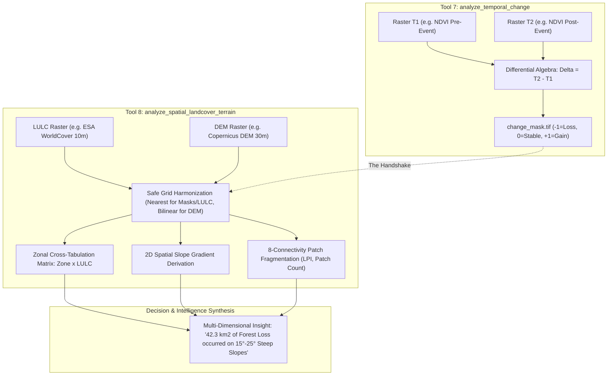

# SatQuery Geospatial Intelligence Tool Suite — Agent & LangGraph Integration Spec

## 1. System Overview

This document specifies the architecture, inter-tool workflows, decision trees, and integration contracts for the complete **11-Tool Geospatial Intelligence Suite (SatQuery)**.

The system is designed with a strict **Separation of Concerns & Single Responsibility Principle**:
- **Tools 1 to 3 (Earth Observation Data Ingestion Providers):** Autonomous micro-services connecting to satellite APIs (Sentinel Hub, Copernicus Sentinel-2 L2A, Sentinel-1 GRD), retrieving imagery, executing server/local processing, validating rasters with `rasterio`, and returning standard GeoTIFF rasters + structured metadata with **AOI-Level SCL Quality Validation** and cloud-penetrating SAR capabilities.
- **Tool 4 (Meteorological & Environmental Context Provider):** Connects to Open-Meteo & ECMWF ERA5 to produce unit-standardized weather time series, hydrological moisture balances, and climatic stress indices.
- **Tool 5 (Spectral & Biophysical Indices Engine):** High-performance local NumPy vectorized calculation of 13+ standard spectral indices (NDVI, NDMI, NDWI, NBR, EVI, SAVI, MSAVI, NDRE, BSI, REIP, SIPI, GNDVI, NDSI) with canopy vigor categorization.
- **Tool 6 (Universal Pre-Flight Quality Assurance & Raster Profiler):** Deep spatial inspection of single and paired GeoTIFFs (CRS, affine bounds, NoData integrity, physical pixel GSD, data types, and structural alignment).
- **Tool 7 (Temporal Change Detection & Continuous Differential Engine):** Production-grade differential algebra engine that aligns $T_1$ and $T_2$ rasters, applies relative/absolute noise thresholds, computes geodesic surface area change, and exports `difference_raster.tif` and integer `change_mask.tif`.
- **Tool 8 (Categorical GIS & Topographical Landscape Profiler):** Categorical biome characterizer that ingests classified LULC rasters (e.g. ESA WorldCover 10m) and DEM rasters (e.g. Copernicus DEM 30m). Performs 8-connectivity patch fragmentation, 2D slope gradient derivation in degrees, and executes the **Tool 7 $\rightarrow$ Tool 8 Handshake** via zonal cross-tabulation.
- **Tool 9 (Ground Truth, Event Context & Geospatial Web Intelligence):** Fills the narrative gap between satellite pixels and real-world facts — event causes, disaster reports, infrastructure project names — via Tavily web search with an automatic keyless DuckDuckGo fail-safe.
- **Tool 10 (Spatial Geocoding & POI Discovery Engine):** Bridges GeoTIFF bounding boxes and human-readable geography: forward/reverse geocoding, scene-identity resolution (bbox → region description + in-scene landmark grounding), and in-AOI POI discovery via LocationIQ/OpenStreetMap.
- **Tool 11 (Deterministic Affine Projector & Markup Engine):** Projects known lat/long features (e.g. from Tool 10) onto a GeoTIFF's exact pixel grid via closed-form inverse affine transform math — zero hallucination, unlike a vision model's guess — and renders badge markup on a preview image.
- **LangGraph / Agent Layer:** Orchestrates multi-step reasoning, selects tools based on user intent, checks quality flags, triggers fallbacks (e.g. SAR when optical cloud cover is excessive), and synthesizes multi-modal geospatial intelligence for downstream LLMs.

---

## 2. Tool Registry Matrix (11-Tool Ecosystem)

| Tool ID | Directory Name | FastMCP Tool Name | Primary Provider / Tech | Input Schema | Output Artifacts & JSON Telemetry |
| :--- | :--- | :--- | :--- | :--- | :--- |
| **Tool 1** | `Tool_1_fetch_optical_imagery` | `fetch_optical_imagery_mcp` | Sentinel-2 L2A (`B04, B03, B02`) | AOI BBox, Date range, Max cloud % | True-Color 3-Band GeoTIFF (UINT16) + AOI Quality JSON |
| **Tool 2** | `Tool_2_fetch_multispectral_imagery` | `fetch_multispectral_imagery_mcp` | Sentinel-2 L2A (`B02-B12`) | AOI BBox, Date range, Selected bands | Multi-Band Surface Reflectance GeoTIFF (FLOAT32) + Band Mapping JSON |
| **Tool 3** | `Tool_3_fetch_sar_imagery` | `fetch_sar_imagery_mcp` | Sentinel-1 GRD (SAR C-Band) | AOI BBox, Date range, Polarization, Strategy | Cloud-penetrating Backscatter GeoTIFF (FLOAT32 in dB) + Geometry Quality JSON |
| **Tool 4** | `Tool_4_fetch_weather_environment` | `fetch_weather_environment_mcp` | Open-Meteo / ECMWF ERA5 | AOI BBox or Point, Date range | Weather & Moisture Balance JSON + Climatic Stress Indicators |
| **Tool 5** | `Tool_5_compute_vegetation_indices` | `compute_vegetation_indices_mcp` | Local Vectorized NumPy / Rasterio | Input GeoTIFF, Requested indices list | Multi-Band Index GeoTIFF (FLOAT32) + Summary Stats & Canopy Area JSON |
| **Tool 6** | `Tool_6_inspect_geotiff_metadata` | `inspect_geotiff_metadata_mcp` | Universal Local Rasterio QA Engine | Input GeoTIFF path, Optional compare path | Structural, Georeferencing, NoData Integrity & Compatibility JSON |
| **Tool 7** | `Tool_7_analyze_temporal_change` | `analyze_temporal_change_mcp` | Local Differential Algebra Engine | $T_1$ and $T_2$ GeoTIFFs, Thresholds | `difference_raster.tif`, `change_mask.tif` + Shift Stats & Area Accounting JSON |
| **Tool 8** | `Tool_8_analyze_spatial_landcover_terrain` | `analyze_spatial_landcover_terrain_mcp` | Local Discrete GIS & DEM Engine | LULC GeoTIFF, Optional DEM, Optional Zone Mask | LULC Composition, Patch Fragmentation, Slope Profiles & Zonal Cross-Tabulation JSON |
| **Tool 9** | `Tool_9_fetch_web_intelligence` | `fetch_web_intelligence` | Tavily Search API (DuckDuckGo fail-safe) | Natural-language query, optional location hint/bbox | Synthesized answer + ranked web results JSON |
| **Tool 10** | `Tool_10_spatial_geocoding_poi` | `spatial_geocoding_poi` | LocationIQ (OpenStreetMap Nominatim/Overpass fallback) | Place name, or lat/lon, or bbox (mode auto-inferred) | Coordinates/address/region-identity/POI-list JSON, depending on mode |
| **Tool 11** | `Tool_11_deterministic_affine_markup` | `deterministic_affine_markup` | Local Closed-Form Affine Math + Pillow Rendering | GeoTIFF path, list of named lat/lon features | Annotated PNG + exact/subpixel coordinate projection JSON |

---

## 3. The Tool 7 $\rightarrow$ Tool 8 Analytical Handshake



### Why Decouple Tool 7 and Tool 8?
1. **Mathematical Separation:**
   - **Continuous Differential Space (Tool 7):** Operates on real-valued floating-point signals ($[-1.0, 1.0]$ for indices, $[-\infty, +\infty]$ for SAR backscatter in dB). Computes $\Delta$, relative shifts, and statistical noise boundaries.
   - **Discrete Spatial / Topographical Space (Tool 8):** Operates on integer category codes (WorldCover classes: 10, 20, 30...) and geometric manifolds (patch adjacency graphs, 2D elevation slope gradients).
2. **Agent Autonomy & Efficiency:**
   - Agents can call Tool 8 standalone (e.g., *"What is the terrain slope and landcover profile of this AOI?"*) without requiring temporal before/after pairs.
   - When change detection is requested, Tool 7 outputs `change_mask.tif`, which seamlessly feeds into Tool 8's `zone_mask_path` parameter to answer *"What landcover classes were destroyed and at what elevation/slope?"*

---

## 4. Primary Workflow Architectures

### Workflow 1: Rapid Disaster & Deforestation Impact Assessment
```text
                  1. User Query ("Analyze deforestation in AOI between 2024 and 2025")
                                         │
                                         ▼
                 2. Tool 2: fetch_multispectral_imagery (T1: 2024, T2: 2025)
                                         │
                                         ▼
                 3. Tool 5: compute_vegetation_indices (Compute NDVI for T1 and T2)
                                         │
                                         ▼
                 4. Tool 6: inspect_geotiff_metadata (Pre-flight QA & Grid Compatibility)
                                         │
                                         ▼
                 5. Tool 7: analyze_temporal_change (Detect NDVI Drop, Export change_mask.tif)
                                         │
                                         ▼
                 6. Tool 8: analyze_spatial_landcover_terrain (Cross-tabulate change_mask against LULC & DEM)
                                         │
                                         ▼
                 7. Tool 4: fetch_weather_environment (Check precipitation anomaly / drought context)
                                         │
                                         ▼
                 8. Agent Synthesizes Comprehensive Geospatial Intelligence Report
```

### Workflow 2: All-Weather Flood Inundation & SAR Backscatter Monitoring
```text
                  1. User Query ("Assess monsoon flooding extent despite 100% cloud cover")
                                         │
                                         ▼
                 2. Tool 1: fetch_optical_imagery (Detects 95% Cloud Obstruction via SCL Quality)
                                         │  [Quality Flag: optical_quality_poor = true]
                                         ▼
                 3. Tool 3: fetch_sar_imagery (Fetch Sentinel-1 C-Band VV/VH for Pre- & Post-Flood)
                                         │
                                         ▼
                 4. Tool 7: analyze_temporal_change (Detect Backscatter Drop in dB -> Water Inundation)
                                         │
                                         ▼
                 5. Tool 8: analyze_spatial_landcover_terrain (Overlay Flood Mask on LULC: Cropland vs Built-up)
                                         │
                                         ▼
                 6. High-Accuracy Damage Assessment Delivered to User
```

---

## 5. Global Geospatial Standards & Quality Contracts

All tools strictly adhere to common conventions to ensure deterministic interoperability:

1. **Bounding Box (`bbox`):** Standard WGS84 coordinates in order: `[min_lon, min_lat, max_lon, max_lat]`.
2. **Date Format:** ISO 8601 Calendar Date: `YYYY-MM-DD`.
3. **Coordinate Reference System (`crs`):** `"EPSG:4326"` standard, with UTM projections supported for raster processing.
4. **Geodesic Surface Accounting:** Latitude-cosine scaling ($\cos(\text{lat}_{\text{mid}})$) applied across Tools 5, 7, and 8 for ground area measurements ($\text{km}^2$ and hectares).
5. **Safe Resampling Principles:**
   - Discrete / Integer Rasters (LULC, Masks): **MUST** use `Resampling.nearest`.
   - Continuous Surface Rasters (Indices, SAR, DEM): **MUST** use `Resampling.bilinear`.

---

## 6. Error Handling & Recovery Protocols for LangGraph

1. **`type: "validation_error"`**: Input parameters (out-of-range bounding box, malformed date string, missing raster file) failed validation. Agent action: Reformat parameters and retry.
2. **`type: "no_suitable_scene"`**: No optical satellite observation met the cloud cover criteria. Agent action:
   - Expand the temporal search window.
   - Fall back to **Tool 3 (`fetch_sar_imagery_mcp`)** for cloud-penetrating radar.
3. **`type: "compatibility_error"`**: Incompatible CRS or non-overlapping bounding boxes in Tool 6/7. Agent action: Harmonize projection using Tool 6 telemetry or check bounds.
4. **`type: "service_error"`**: Remote API rate limiting or temporary network disruption. Built-in exponential backoff retries up to 3 times automatically.
