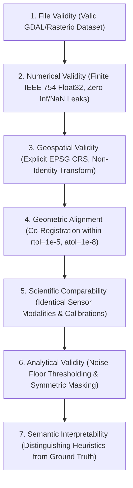

# SatQuery: Production Geospatial AI & Earth Observation Intelligence Suite

[](https://opensource.org/licenses/MIT)
[](https://www.python.org/)
[](https://github.com/jlowin/fastmcp)
[](https://rasterio.readthedocs.io/)
[](https://dataspace.copernicus.eu/)

**SatQuery** is an autonomous, production-grade geospatial Earth Observation (EO) intelligence suite designed specifically for **Model Context Protocol (MCP) servers**, **LangGraph autonomous agents**, and **geospatial machine learning pipelines**.

This README is the 8-tool science suite. The live HTTP API (Tools 1–4, LangGraph) lives in `backend/`; orchestrator docs: [backend/orchestrator/README.md](backend/orchestrator/README.md). Walkthrough PDF: [docs/SatQuery_Orchestration_Guide.pdf](docs/SatQuery_Orchestration_Guide.pdf). From the SatQuery root, launch with the venv interpreter so `--reload` does not drop packages: `.\.venv\Scripts\python.exe -m uvicorn backend.main:app --reload` (Linux/macOS: `.venv/bin/python -m uvicorn backend.main:app --reload`).

SatQuery transforms raw multi-modal satellite observations (Sentinel-2 visual optical, Sentinel-2 8-band surface reflectance, Sentinel-1 synthetic aperture radar, and ECMWF ERA5 reanalysis weather data) into **unit-aware, mathematically validated, deterministic, and ML/LLM-ready analytical telemetry**.

---

```text
                                  SATQUERY SYSTEM ARCHITECTURE
  
       ┌────────────────────────────────────────────────────────────────────────┐
       │                   DATA INGESTION & CONTEXT PROVIDERS                   │
       │                                                                        │
       │  ┌───────────────────────┐  ┌───────────────────────┐  ┌────────────┐  │
       │  │ Tool 1: Visual Optical│  │ Tool 2: Multispectral │  │ Tool 3: SAR│  │
       │  │ (Sentinel-2 TrueColor)│  │ (Sentinel-2 8-Band SR)│  │ (S1 C-Band)│  │
       │  └───────────┬───────────┘  └───────────┬───────────┘  └─────┬──────┘  │
       │              │                          │                    │         │
       │              │                          ▼                    │         │
       │              │              ┌───────────────────────┐        │         │
       │              │              │ Tool 5: Bio-Indices   │        │         │
       │              │              │ (NDVI, NBR, NDMI, etc)│        │         │
       │              │              └───────────┬───────────┘        │         │
       │              │                          │                    │         │
       │  ┌───────────┴───────────┐              │                    │         │
       │  │ Tool 4: Weather/ERA5  │              │                    │         │
       │  │ (Precip, Soil Moist)  │              │                    │         │
       │  └───────────┬───────────┘              │                    │         │
       └──────────────┼──────────────────────────┼────────────────────┼─────────┘
                      │                          ▼                    │
                      │              ┌───────────────────────┐        │
                      │              │ Tool 6: Pre-Flight QA │◄───────┘
                      │              │ (Grid Alignment & QA) │
                      │              └───────────┬───────────┘
                      │                          ▼
                      │              ┌───────────────────────┐
                      │              │ Tool 7: Temporal Diff │ ──► difference_raster.tif
                      │              │ (Change Mask Engine)  │ ──► change_mask.tif
                      │              └───────────┬───────────┘
                      │                          ▼  (The Tool 7 ──► Tool 8 Handshake)
                      │              ┌───────────────────────┐
                      │              │ Tool 8: LULC/Terrain  │ ──► ESA WorldCover Zonal Tabulation
                      │              │ (Patch Frag & DEM)    │ ──► 2D Slope Gradient Profiling
                      │              └───────────┬───────────┘
                      │                          │
                      ▼                          ▼
       ┌────────────────────────────────────────────────────────────────────────┐
       │         AUTONOMOUS AGENT ORCHESTRATION & DECISION SYNTHESIS            │
       │   LangGraph: backend/orchestrator/  ·  MCP: satquery_server.py         │
       └────────────────────────────────────────────────────────────────────────┘
```

---

## 1. Executive Summary & Core Philosophy

### The Core Problem in Geospatial AI
In standard AI pipelines, LLMs attempting to consume satellite data suffer from catastrophic failure modes:
1. **Hallucinated Spatial Validity:** Assuming that two rasters covering roughly the same region have matching coordinate grids, leading to corrupted matrix math.
2. **Context Bloat:** Loading massive raw TIFF arrays directly into LLM prompts instead of structured, statistical, and spatial telemetry.
3. **Invalid Spectral Comparisons:** Treating surface reflectance floating-point numbers ($[0.0, 1.0]$) and logarithmic SAR decibels ($[-\infty, +\infty]\text{ dB}$) identically.
4. **Blind Boundary Changes:** Knowing that an index dropped by $-0.35$, but failing to identify whether the disturbance occurred in dense forest or cropland, or whether it took place on a steep $30^\circ$ mountain slope susceptible to landslides.

### The SatQuery Axiom
> *"A raster that is software-readable is not automatically geometrically compatible; a raster that is geometrically aligned is not automatically scientifically comparable; and an index that is mathematically computable is not automatically semantically interpretable."*

### The 7 Levels of Data Integrity Preserved by SatQuery
Every tool in the SatQuery ecosystem strictly enforces and validates these 7 levels before executing computations:



---

## 2. Repository Directory Map & File Purpose Guide

```text
SatQuery/
├── backend/                            # Live HTTP API + LangGraph orchestrator (Tools 1–4)
│   ├── main.py                         # FastAPI app (uvicorn backend.main:app)
│   └── orchestrator/                   # See backend/orchestrator/README.md
├── satquery_server.py                  # Master FastMCP Server exposing all 8 tools
├── satquery_workflows.py               # Autonomous multi-tool chained scientific pipelines (Pipelines A, B, C)
├── test_phase2_integration.py          # Offline synthetic integration test harness (Zero network quota required)
├── run_phase2.py                       # One-click master verification and demo execution runner
├── AGENT_WORKFLOW_AND_INTEGRATION_SPEC.md # Full LLM agent decision tree and integration specifications
├── .env.example                        # Template environment variables for API credentials
│
├── Tool_1_fetch_optical_imagery/
│   ├── fetch_optical_imagery.py        # Sentinel-2 True-Color RGB engine + AOI SCL micro-inspection
│   ├── fetch_optical_imagery.ipynb     # Interactive Jupyter visual walkthrough
│   ├── README_Tool_1_fetch_optical_imagery.md
│   ├── sample_input.json & sample_output.json
│   └── test_runs/                      # Live/sample raster test runs and outputs
│
├── Tool_2_fetch_multispectral_imagery/
│   ├── fetch_multispectral_imagery.py  # Sentinel-2 8-Band Surface Reflectance engine (FLOAT32 + Band Tags)
│   ├── fetch_multispectral_imagery.ipynb
│   ├── README_Tool_2_fetch_multispectral_imagery.md
│   ├── sample_input.json & sample_output.json
│   └── test_runs/
│
├── Tool_3_fetch_sar_imagery/
│   ├── fetch_sar_imagery.py            # Sentinel-1 GRD C-Band SAR engine (Decibels + DEM Orthorectification)
│   ├── fetch_sar_imagery.ipynb
│   ├── README_Tool_3_fetch_sar_imagery.md
│   ├── sample_input.json & sample_output.json
│   └── test_runs/
│
├── Tool_4_fetch_weather_environment/
│   ├── fetch_weather_environment.py    # Open-Meteo ERA5 / ERA5-Land historical reanalysis engine
│   ├── fetch_weather_environment.ipynb
│   ├── README_Tool_4_fetch_weather_environment.md
│   ├── sample_input.json & sample_output.json
│   └── test_runs/
│
├── Tool_5_compute_vegetation_indices/
│   ├── compute_vegetation_indices.py   # Vectorized NumPy engine for 10 biophysical spectral indices
│   ├── compute_vegetation_indices.ipynb
│   ├── README_Tool_5_compute_vegetation_indices.md
│   ├── sample_input.json & sample_output.json
│   └── test_runs/
│
├── Tool_6_inspect_geotiff_metadata/
│   ├── inspect_geotiff_metadata.py     # Universal pre-flight raster QA, histogram & grid alignment inspector
│   ├── inspect_geotiff_metadata.ipynb
│   ├── README_Tool_6_inspect_geotiff_metadata.md
│   ├── sample_input.json & sample_output.json
│   └── test_runs/
│
├── Tool_7_analyze_temporal_change/
│   ├── analyze_temporal_change.py      # Pixel-wise temporal differential algebra & change mask generator
│   ├── analyze_temporal_change.ipynb
│   ├── README_Tool_7_analyze_temporal_change.md
│   ├── sample_input.json & sample_output.json
│   └── test_runs/
│
└── Tool_8_analyze_spatial_landcover_terrain/
    ├── analyze_spatial_landcover_terrain.py # Categorical GIS, 8-connectivity patch fragmentation & DEM slope
    ├── analyze_spatial_landcover_terrain.ipynb
    ├── README_Tool_8_analyze_spatial_landcover_terrain.md
    ├── sample_input.json & sample_output.json
    └── test_runs/
```

---

## 3. Credentials, Authentication & API Architecture

| Data Provider / Layer | Used By | Required Credentials | Setup Guide & Lifecycle |
| :--- | :--- | :--- | :--- |
| **Sentinel Hub / CDSE (Copernicus Data Space)** | **Tool 1**, **Tool 2**, **Tool 3** | `SENTINEL_CLIENT_ID`<br>`SENTINEL_CLIENT_SECRET` | 1. Register at [Sentinel Hub](https://apps.sentinel-hub.com/dashboard/) or CDSE.<br>2. Add credentials to `.env`.<br>3. Managed automatically via `SentinelHubAuth` (in-memory token caching with auto-refresh 60s prior to expiry, and `SentinelHubHTTPClient` exponential backoff on HTTP 429/5xx). |
| **Open-Meteo & ECMWF ERA5 Reanalysis** | **Tool 4** | **Zero API Keys Required** | Public open-science access. Operational reanalysis data has a ~5-day assimilation latency. |
| **Local Vectorized Scientific & GIS Engines** | **Tool 5**, **Tool 6**, **Tool 7**, **Tool 8** | **100% Offline / Zero API Keys** | Operates strictly locally using high-performance C-accelerated NumPy, Rasterio, and SciPy. Zero network calls or external quotas. |

---

## 4. Master 8-Tool Technical Encyclopedia

### Tool 1: Visual Optical Imagery (`fetch_optical_imagery`)
- **Primary Mission:** Acquires visual True-Color RGB Sentinel-2 L2A GeoTIFF rasters with localized Scene Classification Layer (SCL) quality assurance.
- **Sensor Specification:** Copernicus Sentinel-2 MSI (Multi-Spectral Instrument) Level-2A (Bottom-Of-Atmosphere reflectance).
- **Channels Acquired:** Band 4 (Red, $665\text{ nm}$), Band 3 (Green, $560\text{ nm}$), Band 2 (Blue, $490\text{ nm}$). Native Ground Sampling Distance (GSD): $10\text{ m}$.
- **Core Innovation (AOI-Level SCL Micro-Inspection):** Standard satellite catalogs only report global cloud cover across an entire $100\text{ km} \times 100\text{ km}$ tile ($10,000\text{ km}^2$). A tile might be $80\%$ cloudy while the user's specific $5\text{ km}^2$ farm is completely clear. Tool 1 executes a lightweight, fast $64 \times 64$ SCL pre-flight query to measure true cloud, shadow, and snow obstruction specifically over the requested AOI bounding box:
  $$\text{AOI Obstruction } \% = \left( \frac{\sum \text{Pixels}_{\text{Cloud}} + \sum \text{Pixels}_{\text{Shadow}}}{\sum \text{Pixels}_{\text{Valid AOI}}} \right) \times 100$$
- **Agent Decision Hook:** Emits `flags.sar_recommended: true` and `flags.optical_quality_poor: true` if AOI obstruction exceeds $50\%$, triggering an autonomous fallback to Tool 3 (SAR).

---

### Tool 2: Surface Reflectance Multispectral Imagery (`fetch_multispectral_imagery`)
- **Primary Mission:** Retrieves multi-band calibrated physical surface reflectance Sentinel-2 L2A GeoTIFFs for scientific index modeling.
- **Supported Bands & Native Resolutions:**
  - $10\text{ m}$ VNIR: `B02` (Blue), `B03` (Green), `B04` (Red), `B08` (Broad NIR).
  - $20\text{ m}$ Red Edge / SWIR: `B05` (RE1), `B06` (RE2), `B07` (RE3), `B8A` (Narrow NIR), `B11` (SWIR1), `B12` (SWIR2).
  - $60\text{ m}$ Atmospheric: `B01` (Coastal Aerosol), `B09` (Water Vapor).
- **Physical Calibration:** Returns true physical Bottom-Of-Atmosphere surface reflectance as 32-bit floats ($[0.0, 1.0]$).
- **Metadata Embedding:** Automatically opens the downloaded GeoTIFF in update mode (`"r+"`) and embeds human-readable band tags (`dst.set_band_description(idx, b_name)`) directly into the GeoTIFF headers.

---

### Tool 3: All-Weather Synthetic Aperture Radar (`fetch_sar_imagery`)
- **Primary Mission:** Active microwave radar imaging capable of penetrating 100% cloud cover, dense monsoonal storms, and smoke plumes day or night.
- **Sensor Specification:** Sentinel-1 C-SAR (C-Band, center frequency $5.405\text{ GHz}$, wavelength $\lambda \approx 5.55\text{ cm}$).
- **Polarimetric Modes:**
  - **VV (Vertical-Transmit / Vertical-Receive):** Sensitive to surface roughness and dielectric permittivity (ideal for open water delineation, flood mapping, and soil moisture).
  - **VH (Vertical-Transmit / Horizontal-Receive):** Sensitive to volume scattering and depolarization within complex vegetation canopies (ideal for forest and crop structure).
- **Terrain Correction & Calibration:** Orthorectified against the Copernicus 30m Global DEM using gamma-nought terrain normalization (`GAMMA0_TERRAIN`).
- **Decibel Conversion Physics:**
  $$\sigma^\circ_{\text{dB}} = 10 \cdot \log_{10}\left(\max\left(\text{Power}, 10^{-5}\right)\right)$$
- **Radar Geometry Quality Gate:** Evaluates radar shadow fraction and local incidence angle ($\theta_{\text{inc}}$). If $\theta_{\text{inc}} < 15^\circ$ (steep incidence angle causing layover/foreshortening) or $\theta_{\text{inc}} > 65^\circ$ (grazing angle causing low SNR) or terrain shadow $> 8\%$, flags `radar_geometry_poor: true` and sets `water_mapping_ready: false`.

---

### Tool 4: Meteorological & Environmental Context (`fetch_weather_environment`)
- **Primary Mission:** Queries ECMWF ERA5 and ERA5-Land global atmospheric reanalyses via Open-Meteo to provide causal environmental context for satellite observations.
- **Spatial Resolution & Sampling:** $0.1^\circ \times 0.1^\circ$ (~$9\text{--}11\text{ km}$ meteorological grid cell). Uses centroid sampling for AOIs $\le 0.5^\circ$ and 5-point interior cross-sampling for larger regional AOIs.
- **Observed Metrics:**
  - 2m Mean, Min, and Max Temperature ($^\circ\text{C}$), Apparent Temperature ($^\circ\text{C}$).
  - Total and Daily Peak Precipitation ($\text{mm}$).
  - Reference Evapotranspiration ($\text{ET}_0\text{ mm}$, FAO-56 Penman-Monteith).
  - Volumetric Soil Moisture ($0\text{--}7\text{ cm}$, $\text{m}^3/\text{m}^3$) and Soil Temperature ($^\circ\text{C}$).
  - Net Solar Radiation ($\text{MJ}/\text{m}^2$) and Max Wind Speed ($\text{km}/\text{h}$).
- **Hydrological Water Balance:**
  $$\text{Water Balance } (\text{mm}) = \sum \text{Precipitation} - \sum \text{ET}_0$$
- **Factual Separation & Scientific Guardrails:** Distinguishes measured physical metrics from short-term meteorological rule-based indicators (heavy rain, heat stress, cold stress, moisture deficit). Explicitly enforces `drought_diagnosis_supported: false` (since long-term climatological base periods of 30+ years are required for formal meteorological drought diagnostics like SPI/SPEI).

---

### Tool 5: Biophysical & Spectral Vegetation Indices Engine (`compute_vegetation_indices`)
- **Primary Mission:** High-performance local NumPy vectorized calculation of 10+ standard biophysical and spectral indices.
- **Supported Index Formulations:**

| Index | Formula | Primary Biophysical Application |
| :--- | :--- | :--- |
| **NDVI** | $\frac{\text{NIR} - \text{Red}}{\text{NIR} + \text{Red}}$ | General canopy photosynthetic vigor & chlorophyll absorption. |
| **EVI** | $2.5 \cdot \frac{\text{NIR} - \text{Red}}{\text{NIR} + 6\text{Red} - 7.5\text{Blue} + 1.0}$ | Enhanced vegetation index with atmospheric & canopy saturation suppression. |
| **SAVI** | $\frac{\text{NIR} - \text{Red}}{\text{NIR} + \text{Red} + 0.5} \cdot 1.5$ | Soil-adjusted index minimizing background soil brightness in sparse vegetation. |
| **GNDVI** | $\frac{\text{NIR} - \text{Green}}{\text{NIR} + \text{Green}}$ | Green NDVI sensitive to wide-range chlorophyll concentration. |
| **NDRE_B5** | $\frac{\text{NIR} - \text{B05}}{\text{NIR} + \text{B05}}$ | Red Edge 1 index detecting early cellular nitrogen stress and chlorosis. |
| **NDRE_B7** | $\frac{\text{NIR} - \text{B07}}{\text{NIR} + \text{B07}}$ | Red Edge 3 index penetrating deep, dense multi-layered forest canopies. |
| **NDMI** | $\frac{\text{NIR} - \text{SWIR1}}{\text{NIR} + \text{SWIR1}}$ | Normalized Difference Moisture Index for canopy liquid water thickness. |
| **NDWI** | $\frac{\text{Green} - \text{NIR}}{\text{Green} + \text{NIR}}$ | McFeeters index for open surface water delineation. |
| **MSAVI** | $\frac{2\text{NIR} + 1 - \sqrt{(2\text{NIR} + 1)^2 - 8(\text{NIR} - \text{Red})}}{2}$ | Modified Soil-Adjusted Vegetation Index with dynamic soil line self-adjustment. |
| **NBR** | $\frac{\text{NIR} - \text{SWIR2}}{\text{NIR} + \text{SWIR2}}$ | Normalized Burn Ratio for wildfire burn severity and charcoal/ash mapping. |

- **Geodesic Surface Accounting:** Uses the exact WGS84 ellipsoid polynomial for accurate metric ground sampling distances (GSD) and surface area in $\text{km}^2$ and hectares:
  $$\Delta x_{\text{meters}} = |\text{res}_x| \cdot \Big(111412.84 \cos(\text{lat}_{\text{mid}}) - 93.5 \cos(3\text{lat}_{\text{mid}})\Big)$$
  $$\Delta y_{\text{meters}} = |\text{res}_y| \cdot \Big(111132.954 - 559.822 \cos(2\text{lat}_{\text{mid}}) + 1.175 \cos(4\text{lat}_{\text{mid}})\Big)$$
- **Output:** Multi-band FLOAT32 GeoTIFF (`nodata = -9999.0`), statistical distribution ($p_{10}$ to $p_{90}$), and heuristic canopy vigor classification.

---

### Tool 6: Universal Pre-Flight Raster QA & Metadata Inspector (`inspect_geotiff_metadata`)
- **Primary Mission:** Comprehensive spatial inspection and quality assurance for single and paired GeoTIFFs before analytical execution.
- **Deep Integrity Probing:** Detects discrepancies between metadata NoData definitions, active array NoData pixels, interior missing-data holes, and IEEE 754 NaNs/Infs.
- **Grid Alignment Gatekeeper:** Computes numerical grid equality across CRS, dimensions, resolution, bounding box, and affine transform using strict numerical tolerance:
  $$\text{allclose}\Big(\mathbf{T}_1, \mathbf{T}_2, \text{rtol}=10^{-5}, \text{atol}=10^{-8}\Big)$$
  Emits `compatibility.pixelwise_operation_ready = true` only when rasters are 100% co-registered.
- **Statistical Summarizer:** Generates statistical percentiles ($p_{01}$ to $p_{99}$) and a compact 10-bin frequency histogram, allowing downstream LLM agents to understand data distributions without ingesting full image arrays.

---

### Tool 7: Grid-Aligned Temporal Differential Change Detection (`analyze_temporal_change`)
- **Primary Mission:** Production differential algebra engine comparing two co-registered temporal rasters ($T_1$ and $T_2$).
- **Symmetric Masking:** Eliminates edge artifacts, partial sensor coverage, and cloud masks:
  $$\text{Valid Mask} = \text{Valid}(T_1) \land \text{Valid}(T_2)$$
- **Differential Formulations:**
  - Absolute Delta: $\Delta = T_2 - T_1$
  - Relative Shift: $\Delta\% = \left( \frac{T_2 - T_1}{|T_1| + 10^{-4}} \right) \times 100$
  - *Scientific Guardrail:* $\Delta\%$ is valid for bounded linear indices (NDVI, NBR), but disabled for logarithmic SAR decibels ($\text{dB}$) where division by logarithmic values is physically non-interpretable.
- **Dual Thresholding Modes:**
  - **Absolute Threshold ($\tau$):** Direct numerical cutoff (e.g. $\Delta \le -0.15$).
  - **Statistical Noise Floor:** Detects outliers beyond sensor noise: $\tau = \mu_{\Delta} \pm k \cdot \sigma_{\Delta}$ (where $k \in [1.0, 3.0]$).
- **Exported Products:**
  - `difference_raster.tif`: Continuous 32-bit floating-point raster ($\Delta = T_2 - T_1$).
  - `change_mask.tif`: Integer discrete categorical mask (Bipolar 3-class: `-1`=Loss, `0`=Stable, `+1`=Gain; or Severity 5-class: `-2`=Major Loss, `-1`=Moderate Loss, `0`=Stable, `+1`=Moderate Gain, `+2`=Major Gain).

---

### Tool 8: Categorical GIS & Topographical Landscape Profiler (`analyze_spatial_landcover_terrain`)
- **Primary Mission:** Categorical biome characterizer and topographical slope profiler; downstream recipient of Tool 7's `change_mask.tif` (The Tool 7 $\to$ Tool 8 Handshake).
- **Default Ontology (ESA WorldCover 10m Standard):**

| Code | Name | Code | Name | Code | Name |
| :---: | :--- | :---: | :--- | :---: | :--- |
| **10** | Tree cover | **40** | Cropland | **80** | Permanent water bodies |
| **20** | Shrubland | **50** | Built-up | **90** | Herbaceous wetland |
| **30** | Grassland | **60** | Bare / sparse vegetation | **95** | Mangroves |
| — | — | **70** | Snow and ice | **100** | Moss and lichen |

- **Safe Resampling Enforcements:**
  - Categorical LULC & Masks: **MUST** use `Resampling.nearest` (Nearest Neighbor) to prevent blending discrete integer class IDs into invalid float averages.
  - Continuous DEM: **MUST** use `Resampling.bilinear` for smooth surface interpolation.
- **Landscape Patch Fragmentation Engine (8-Connectivity):**
  Uses `scipy.ndimage.label` with a $3 \times 3$ structuring element to calculate:
  - **Patch Count ($N_p$):** Number of isolated contiguous habitat fragments.
  - **Mean Patch Size ($\bar{A}_p$):** Average area per fragment in $\text{km}^2$ and hectares.
  - **Largest Patch Index ($\text{LPI}\%$):** Proportional dominance of the primary intact core: $\text{LPI} = (\max(A_i) / \sum A_i) \times 100$.
- **2D Spatial Slope Gradient Derivation:**
  $$\text{Slope}^\circ = \arctan\left(\sqrt{\left(\frac{\partial z}{\partial x}\right)^2 + \left(\frac{\partial z}{\partial y}\right)^2}\right) \times \frac{180^\circ}{\pi}$$
  Categorizes terrain into standard FAO/USGS classes: Flat ($0^\circ\text{--}5^\circ$), Moderate ($5^\circ\text{--}15^\circ$), Steep ($15^\circ\text{--}30^\circ$), and Very Steep ($> 30^\circ$).
- **The Zonal Cross-Tabulation Matrix (Tool 7 Handshake):**
  Cross-tabulates detected change zones against LULC classes and DEM slopes:
  $$\mathbf{M}(z, c) = \sum_{(x,y) \in \text{AOI}} \mathbb{I}\Big(\text{Zone}(x,y) = z \;\land\; \text{LULC}(x,y) = c\Big)$$
  Answers questions such as: *"Within the $42.3\text{ km}^2$ deforestation zone, how many hectares were dense tree cover vs. cropland, and what was the average slope?"*

---

## 5. Multi-Tool Chained Scientific Workflows (`satquery_workflows.py`)

SatQuery includes three automated, production-ready scientific pipelines chaining tools sequentially:

```mermaid
flowchart TD
    subgraph Pipeline_A ["Pipeline A: Wildfire Burn Severity & Forest Loss"]
        A1["Pre & Post Multispectral (Tool 2)"] --> A2["Tool 5: Compute NBR (T1 & T2)"]
        A2 --> A3["Tool 6: Pre-Flight Grid QA"]
        A3 --> A4["Tool 7: Delta NBR & 5-Class Burn Mask"]
        A4 --> A5["Tool 8: Zonal LULC & Slope Tabulation"]
        A5 --> A6["Report: Burned Forest Hectares & Landslide Risk Slopes"]
    end

    subgraph Pipeline_B ["Pipeline B: Radar Flood Inundation & LULC Impact"]
        B1["Pre & Post SAR VV/VH (Tool 3)"] --> B2["Tool 6: SAR Geometry & Grid QA"]
        B2 --> B3["Tool 7: VV_dB Drop <= -3.0 dB Change Mask"]
        B4["Tool 4: ERA5 Event Rainfall & Moisture"] --> B5["Tool 8: Zonal Flood Mask on LULC"]
        B3 --> B5
        B5 --> B6["Report: Flooded Cropland/Urban Hectares + Rainfall Driver"]
    end

    subgraph Pipeline_C ["Pipeline C: Agricultural Drought & Canopy Stress"]
        C1["Multispectral Raster (Tool 2)"] --> C2["Tool 5: Compute NDVI, NDMI, EVI"]
        C3["Tool 4: ERA5 Soil Moisture & Water Balance"] --> C4["Agro-Met Correlation Engine"]
        C2 --> C4
        C4 --> C5["Report: Canopy Stress Tier & Soil Moisture Deficit"]
    end
```



---

## 6. FastMCP Server Deployment & Agent Integration

### Running the Unified Server
Launch the master FastMCP server exposing all 8 tools over standard JSON-RPC stdio:

```bash
python satquery_server.py
```

### Connecting to Claude Desktop
Add SatQuery to your `claude_desktop_config.json`:

```json
{
  "mcpServers": {
    "satquery": {
      "command": "python",
      "args": [
        "C:/Users/User/Desktop/Tools/satquery_server.py"
      ],
      "env": {
        "SENTINEL_CLIENT_ID": "your_client_id",
        "SENTINEL_CLIENT_SECRET": "your_client_secret"
      }
    }
  }
}
```

### Programmatic Python / LangGraph Invocation

```python
from satquery_workflows import (
    workflow_wildfire_burn_severity,
    workflow_flood_inundation_impact,
    workflow_agricultural_drought_canopy_stress
)

# Execute Pipeline A (Wildfire Assessment)
results = workflow_wildfire_burn_severity(
    pre_raster_path="phase2_demonstrations/raw_inputs/demo_multispectral_pre.tif",
    post_raster_path="phase2_demonstrations/raw_inputs/demo_multispectral_post.tif",
    lulc_raster_path="phase2_demonstrations/raw_inputs/demo_lulc_worldcover.tif",
    dem_raster_path="phase2_demonstrations/raw_inputs/demo_dem_copernicus.tif"
)

summary = results["executive_summary"]
print(f"Total Burned Area: {summary['total_burned_area_hectares']} ha")
print(f"Impacted Forest Canopy: {summary['affected_forest_hectares']} ha")
print(f"High Severity Burn Mean Slope: {summary['high_burn_mean_slope_deg']}°")
```

---

## 7. Installation, Testing & Master Verification

### Prerequisites
- Python 3.10, 3.11, 3.12, or 3.13
- GDAL-compatible environment (handled automatically via `rasterio` wheels on Windows/Linux/macOS)

### Installation
```bash
# Clone repository
git clone https://github.com/your-org/SatQuery.git
cd SatQuery/Tools

# Install required scientific packages
pip install requests rasterio numpy scipy pydantic fastmcp python-dotenv
```

### Environment Configuration
```bash
cp .env.example .env
# Edit .env and insert SENTINEL_CLIENT_ID and SENTINEL_CLIENT_SECRET if fetching live imagery
```

### Running Master Ecosystem Verification
SatQuery includes a comprehensive offline test harness and demonstration engine that verifies all 8 tools, cross-tool handshakes, and end-to-end pipelines without consuming API quotas:

```bash
python run_phase2.py
```

#### Expected Verification Output:
```text
================================================================================
SATQUERY PHASE 2 MASTER EXECUTION & SCIENTIFIC WORKFLOW RUNNER
================================================================================
[PASS] All 8 Phase 1 Tool Python Engines & Modules Verified.

--- Running Phase 2 Automated Integration Test Suite ---
Ran 8 tests in 2.538s
OK
[PASS] Integration Test Suite Passed (8/8 Tests Successful).

--- Executing Multi-Tool Chained Workflow Demonstrations ---
Executing Pipeline A (Wildfire Burn Severity & Forest Loss)...
  -> Burned Area: 108.404 km2 (10840.4 ha)
  -> Impacted Forest: 10840.4 ha

Executing Pipeline B (Radar Flood Inundation & LULC Footprint)...
  -> Inundated Area: 216.8079 km2 (21680.79 ha)
  -> Flooded Cropland: 14058.64 ha

Executing Pipeline C (Agricultural Drought & Agro-Met Correlation)...
  -> Drought Risk Tier: Moderate Soil Moisture Deficit
  -> Mean NDVI: 0.811 | Soil Moisture: 0.085 m3/m3

--- Running Pre-Flight Quality Assurance on Generated GeoTIFFs ---
  [QA Verified] Product: demo_multispectral_pre_..._NBR_change_mask.tif
  -> CRS: EPSG:4326 | Dimensions: 128x128
  -> ML Readiness: True

================================================================================
SATQUERY PHASE 2 INTEGRATION & WORKFLOW VERIFICATION SUMMARY
================================================================================
[PASS] Unified Server Tool Registration (8/8 Tools Active)
[PASS] Pipeline A: Wildfire Burn Severity & Topographic Risk
[PASS] Pipeline B: Radar Flood Inundation & LULC Impact
[PASS] Pipeline C: Agricultural Drought & Canopy Stress
[PASS] Cross-Tool Handshake: Tool 2 -> Tool 5 -> Tool 6 -> Tool 7 -> Tool 8
[PASS] GeoTIFF Spatial Provenance & Metric Area Verification
================================================================================
STATUS: PHASE 2 COMPLETE — READY FOR AUTONOMOUS AGENT DEPLOYMENT
```

## 8. Performance Benchmarks, Latency Profiling & Test Execution Metrics

SatQuery enforces a strict division between **Network/Cloud API Bound Operations** and **Local CPU-Vectorized Algebraic Operations**.

### 1. Granular Execution Latency Breakdown

| Component / Layer | Modality & Scope | Remote Cloud / Network Time | Local Compute / Array Math | Total Operation Latency | Physical Bottleneck / Scientific Operation |
| :--- | :--- | :---: | :---: | :---: | :--- |
| **OAuth2 Token Cache** | `SentinelHubAuth` (Tools 1, 2, 3) | ~0.35s (Initial) / 0.0s (Cached) | < 0.001s | **0.001s (Cached)** | In-memory token reuse with 60s pre-expiration refresh window. |
| **Tool 1: Optical RGB** | Sentinel-2 L2A (`B04, B03, B02`) | ~3.80s - 4.80s | ~0.12s | **~3.9s - 4.9s** | $64 \times 64$ SCL micro-query + ESA 10m L2A render & download. |
| **Tool 2: Multispectral** | Sentinel-2 L2A (8 Surface Bands) | ~4.20s - 5.50s | ~0.18s | **~4.4s - 5.7s** | Multi-channel spectral extraction + GDAL header band tag injection. |
| **Tool 3: SAR C-Band** | Sentinel-1 GRD (`VV_dB, VH_dB`) | ~4.80s - 6.80s | ~0.15s | **~5.0s - 7.0s** | Remote Copernicus 30m DEM terrain orthorectification (`GAMMA0_TERRAIN`). |
| **Tool 4: Weather/ERA5** | Open-Meteo ERA5 / ERA5-Land | ~0.45s - 0.75s | ~0.08s | **~0.5s - 0.8s** | 11-variable meteorological JSON payload + 5-point spatial averaging. |
| **Tool 5: Bio-Indices** | 10 Spectral Indices (NDVI, NBR, etc.) | **0.00s (Offline)** | **~0.15s - 0.25s** | **~0.15s - 0.25s** | Vectorized NumPy array math, zero-division masking, WGS84 geodesic area. |
| **Tool 6: Pre-Flight QA** | Header & Integrity Profiler | **0.00s (Offline)** | **~0.04s - 0.09s** | **~0.04s - 0.09s** | Affine transform matrix check ($\text{rtol}=10^{-5}$), NaN scan, 10-bin histogram. |
| **Tool 7: Temporal Change** | Differential Algebra Engine | **0.00s (Offline)** | **~0.18s - 0.32s** | **~0.18s - 0.32s** | Symmetric NoData masking, relative shift %, Float32 difference & Int8 mask TIFF. |
| **Tool 8: LULC / Terrain** | Categorical GIS & Topography | **0.00s (Offline)** | **~0.22s - 0.45s** | **~0.22s - 0.45s** | 8-connectivity patch labeling (`scipy.ndimage`), 2D slope angle derivation. |

### 2. End-to-End Pipeline & Workflow Latencies

| Chained Pipeline / Mission | Tools Orchestrated | Offline / Pre-Fetched Mode | Live Remote Execution Mode | Primary Output Delivered |
| :--- | :--- | :---: | :---: | :--- |
| **Pipeline A: Wildfire Assessment** | Tool 5 $\to$ Tool 6 $\to$ Tool 7 $\to$ Tool 8 | **~0.75s** | **~10.5s - 13.5s** | Burn severity distribution, forest loss hectares, slope hazard. |
| **Pipeline B: Radar Flood Mapping** | Tool 6 $\to$ Tool 7 $\to$ Tool 4 $\to$ Tool 8 | **~0.85s** | **~11.0s - 14.5s** | Inundated cropland hectares, SAR dB drop, ERA5 rain correlation. |
| **Pipeline C: Agro-Drought Vigor** | Tool 5 $\to$ Tool 4 $\to$ Agro-Met Engine | **~0.30s** | **~5.5s - 7.5s** | Multi-index canopy stress, root-zone soil moisture deficit. |
| **Integration Test Suite (All Tests)**| Full 8-Tool Synthetic Harness | **~2.5s** (Total 8 Tests) | N/A (Deterministic) | Proves mathematical integrity, memory safety, and schema compliance. |

---

## 9. License & Citation

SatQuery is released under the **MIT License**.

When using SatQuery in academic research, autonomous agent architectures, or production deployments, please cite:
```bibtex
@software{satquery2026,
  author = {SatQuery Development Team},
  title = {SatQuery: Production Geospatial AI & Earth Observation Intelligence Suite},
  year = {2026},
  url = {https://github.com/your-org/SatQuery}
}
```
