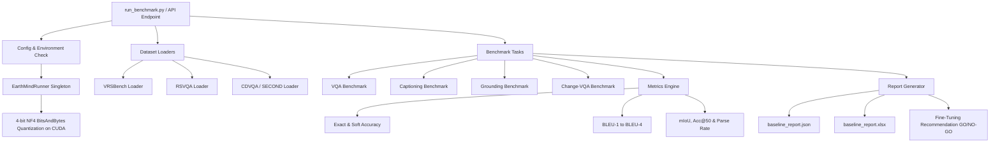

# SatQuery AI — EarthMind-4B Benchmark & Inference Backend

A production-ready benchmarking and inference pipeline for **EarthMind-4B** (4-bit NF4 quantized), built to evaluate and serve Earth Observation capabilities across remote sensing datasets (Optical, SAR, and Bi-Temporal change pairs).

---

## 📌 Architecture Overview



---

## 💾 Storage & Data Architecture

To optimize system resources and ensure **C: Drive** remains clean, all large models, raw datasets, and HuggingFace cache snapshots are housed strictly on the **D: Drive**:

| Component | Path on D: Drive | Description |
| :--- | :--- | :--- |
| **Model Weights** | `D:\models\earthmind\` | Full EarthMind-4B checkpoint (~17.75 GB) |
| **Raw Datasets** | `D:\raw_datasets\` | Uncompressed dataset images & annotations (~16.6 GB) |
| **HuggingFace Cache** | `D:\hf_cache\` | Downloaded hub snapshots & dataset cache (`HF_HOME`) |
| **Project Code & Reports** | `C:\Users\karan\...\satquery-benchmark\` | Lightweight code, benchmark reports & logs |

> [!NOTE]
> `config.py` automatically configures `HF_HOME="D:/hf_cache"` at startup, ensuring no intermediate data or cache files are written to the C: drive.

---

## 🗂️ Project Structure

```text
satquery-benchmark/
├── config.py                     # Central configuration (paths, HF_HOME, tasks, model params)
├── run_benchmark.py              # Main benchmark orchestrator & CLI entry point
├── download_datasets.py          # Pre-download script for remote datasets to D:/raw_datasets
├── prompts.md                    # Comprehensive prompt templates & question patterns reference
├── requirements.txt              # Environment dependencies
├── README.md                     # Complete project documentation
│
├── models/
│   └── earthmind_runner.py       # Unified EarthMind-4B loader, VRAM manager & inference engine
│
├── dataset_loaders/
│   ├── vrsbench_loader.py        # VRSBench loader (VQA, captioning, grounding splits)
│   ├── rsvqa_loader.py           # RSVQA-HR-2k loader (Presence, Comparison, Counting, Area VQA)
│   └── cdvqa_loader.py           # SECOND dataset loader (Bi-temporal change pairs)
│
├── benchmarks/
│   ├── vqa_benchmark.py          # Single-image Visual Question Answering evaluation
│   ├── captioning_benchmark.py   # Scene description & text generation evaluation
│   ├── grounding_benchmark.py    # Spatial region grounding & bounding box evaluation
│   └── change_vqa_benchmark.py   # Bi-temporal change detection & reasoning evaluation
│
├── metrics/
│   ├── accuracy.py               # Exact match, soft semantic containment, token F1
│   ├── bleu.py                   # N-gram BLEU (1-4) with smoothing for captions
│   └── miou.py                   # Normalized BBox Intersection-over-Union & Acc@50
│
├── api/
│   └── endpoint.py               # FastAPI REST service serving EarthMind endpoints
│
└── reports/
    ├── benchmark.log             # Execution and evaluation log
    └── results/                  # Generated JSONs, Excel summaries, and failure logs
```

---

## 📊 Datasets & Tasks Matrix

| Dataset | Hugging Face Repository | Tasks Evaluated | Input Modality | Ground Truth Format |
| :--- | :--- | :--- | :--- | :--- |
| **VRSBench** | `xiang709/VRSBench` | VQA, Captioning, Grounding | Single Optical High-Res | Answers (str), Descriptions (str), BBoxes `[x1, y1, x2, y2]` |
| **RSVQA-HR** | `dmarsili/RSVQA-HR-2k` | VQA (Presence, Count, Comp, Area) | Single High-Res Aerial | Binary (`yes`/`no`), integer counts, area (`m²`) |
| **CDVQA / SECOND** | `EVER-Z/torchange_second` | Bi-temporal Change VQA | Image Pair ($T_1$ Before + $T_2$ After) | Binary change detection & dominant class labels |

### RSVQA Question Types & Patterns
For full breakdown of prompts, see [prompts.md](file:///c:/Users/karan/OneDrive/Desktop/satquery-benchmark/prompts.md):

| Question Type | Answer Pattern | Example Question |
| :--- | :--- | :--- |
| **Comparison** | Yes or No | *"Are there more roads than buildings?"* |
| **Presence** | Yes or No | *"Is there a water area in the image?"* |
| **Count** | Whole number (e.g. 3, 7, 12) | *"How many buildings are visible?"* |
| **Area** | Number + m² (e.g. 495m2, 0m2) | *"What area do the roads cover?"* |
| **Total** | **Mixed** | **-** |

---

## 📐 Evaluation Metrics Explained

### 1. **Visual Question Answering (VQA)**
- **Exact Accuracy**: Case-insensitive exact string match.
- **Soft Accuracy**: Normalized token overlap and semantic substring containment (handles answer variations like `"building"` vs `"buildings"`).
- **Token F1**: Harmonic mean of token precision and recall against ground truth.

### 2. **Captioning**
- **BLEU-1 to BLEU-4**: Cumulative n-gram overlap between generated description and ground truth reference using standard smoothing (Method 1).

### 3. **Grounding**
- **Bounding Box Parser**: Robust regex-based extraction of `[x1, y1, x2, y2]` normalized coordinates from free-text outputs.
- **mIoU (Mean Intersection over Union)**: Overlap area divided by union area between predicted and ground truth boxes.
- **Acc@50**: Percentage of predictions achieving $\text{IoU} \ge 0.50$.
- **Parse Success Rate**: Percentage of model responses successfully parsed into 4 valid coordinates $[0.0, 1.0]$.

### 4. **Change VQA**
- **Binary Change Accuracy**: Evaluates presence/absence detection of changes across time ($T_1 \to T_2$).
- **Per-Class Breakdown**: Measures accuracy categorized by dominant land-cover change types (`water`, `buildings`, `tree`, `low_vegetation`, `non_vegetated_ground`).

---

## ⚙️ Key Configuration (`config.py`)

All global parameters are managed inside [config.py](file:///c:/Users/karan/OneDrive/Desktop/satquery-benchmark/config.py):
- **Model**: `sy1998/EarthMind-4B` loaded from `D:/models/earthmind`
- **Cache**: `HF_HOME = "D:/hf_cache"`
- **Device**: `cuda` (quantized using NF4 4-bit + double quantization for 8GB VRAM RTX 4060)
- **Generation**: `max_new_tokens: 128`, `temperature: 0.0` (Greedy for reproducibility)
- **Image Preprocessing**: Auto-resized to max $512 \times 512$ to prevent GPU out-of-memory errors during multi-image reasoning.

---

## 🚀 How to Run

### 1. **Run Full Benchmark**
```powershell
$env:PYTHONIOENCODING="utf-8"
.venv\Scripts\python.exe run_benchmark.py
```

### 2. **Run Specific Tasks & Custom Sample Count**
```powershell
# Run Grounding and Change VQA only on 20 samples
.venv\Scripts\python.exe run_benchmark.py --tasks grounding change_vqa --samples 20

# Run VQA on RSVQA dataset only
.venv\Scripts\python.exe run_benchmark.py --tasks vqa --datasets rsvqa --samples 50
```

### 3. **Start FastAPI Inference Server (Sprint 4)**
```powershell
.venv\Scripts\uvicorn.exe api.endpoint:app --host 0.0.0.0 --port 8001 --reload
```
Interactive Swagger API documentation is available at `http://localhost:8001/docs`.

---

## 📈 Reports & Output Artifacts

After benchmarking finishes, results are saved in `reports/results/`:
- **`baseline_report.json`**: Structured benchmark metrics and failure patterns used directly by downstream fine-tuning scripts.
- **`baseline_report.xlsx`**: Formatted Excel workbook containing summary tables and task-by-task metrics.
- **`vqa_*.json`, `captioning_*.json`, `grounding_*.json`, `change_vqa_*.json`**: Per-sample inputs, predictions, ground truths, and confidence scores.
