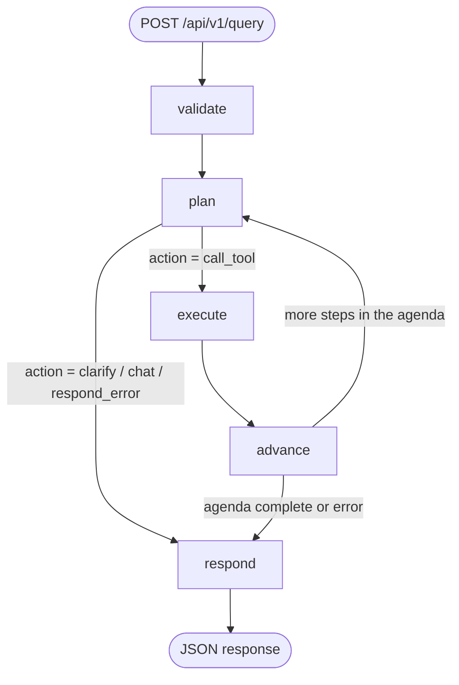

# SatQuery: Production Geospatial AI & Earth Observation Intelligence Suite

[](https://opensource.org/licenses/MIT)
[](https://www.python.org/)
[](https://nodejs.org/)
[](https://rasterio.readthedocs.io/)
[](https://dataspace.copernicus.eu/)
[](https://docs.docker.com/compose/)

## What is SatQuery, in plain English?

SatQuery answers natural-language questions about a piece of land using real satellite
data. You ask something like *"Map wildfire burn severity for this area"* or *"Compute
NDVI for this GeoTIFF"*, and SatQuery:

1. **Understands the request** — a planner (either a simple keyword matcher, or a real
   LLM like GPT-5.2 or Claude Sonnet 5) figures out which scientific tool(s) the
   request needs, and — for a single-tool question — can call more than one tool in
   sequence, gathering grounding facts or recovering from a failed call, before
   answering (see §2).
2. **Fetches or reads the data** — pulls fresh Sentinel-1/Sentinel-2 satellite imagery,
   ERA5 historical *or live/forecast* weather data from public APIs, or reads a GeoTIFF
   file you already have.
3. **Runs the science** — vegetation indices, change detection, land-cover/terrain
   analysis, burn severity, flood mapping, drought stress — all deterministic,
   unit-aware numerical computation (no LLM guessing at numbers).
4. **Optionally looks at the picture** — an on-demand vision-language model (VLM) can
   describe a rendered image in plain language, mark/locate a specific region with an
   approximate bounding box, or qualitatively compare two images that aren't grid-
   aligned — via an API (OpenAI) or a model running entirely on your own machine
   (InternVL / EarthMind).
5. **Answers you** — either a templated summary, or (if an LLM orchestrator is
   configured) a short narrative answer synthesized from the actual numbers.

There are three ways to run it: a **web UI** (React), a **REST API** (FastAPI), and a
**Model Context Protocol (MCP) server** for Claude Desktop / other MCP clients. All
three sit on top of the same 8 science tools and the same LangGraph orchestrator.

Everything that could change between machines or deployments — which LLM to use, which
vision model to use, API keys, ports, CORS origins, output directories — is an
environment variable with a documented default. Nothing is hardcoded.

---

## Table of contents

1. [Architecture at a glance](#1-architecture-at-a-glance)
2. [The agent flow graph (how one request is processed)](#2-the-agent-flow-graph-how-one-request-is-processed)
3. [Model roles: what LLMs and VLMs are supported](#3-model-roles-what-llms-and-vlms-are-supported)
4. [Configuration reference (every env var, every default)](#4-configuration-reference-every-env-var-every-default)
5. [Repository map](#5-repository-map)
6. [The 8 science tools + the vision tools](#6-the-8-science-tools--the-vision-tools)
7. [Multi-tool missions (Pipelines A/B/C) and handshake chains](#7-multi-tool-missions-pipelines-abc-and-handshake-chains)
8. [HTTP API reference](#8-http-api-reference)
9. [The frontend (chat UI)](#9-the-frontend-chat-ui)
10. [Running the project](#10-running-the-project)
11. [Testing](#11-testing)
12. [Security notes](#12-security-notes)
13. [License & citation](#13-license--citation)

---

## 1. Architecture at a glance

```text
┌──────────────────────────────────────────────────────────────────────────────┐
│                        BROWSER (React chat UI, §9)                           │
│   frontend/  — nginx (Docker) or `vite dev` (native), port 3000              │
│   Talks to the backend over HTTP; the API base URL is injected at container  │
│   start (env-config.js), never baked into the build.                        │
└───────────────────────────────────┬────────────────────────────────────────┘
                                     │  POST /api/v1/query(/stream), POST /api/v1/
                                     │  upload-raster, GET /api/v1/raster-preview,
                                     │  GET /api/v1/models, GET /health
                                     ▼
┌──────────────────────────────────────────────────────────────────────────────┐
│                      BACKEND — FastAPI + LangGraph (port 8000)               │
│                                                                              │
│  backend/orchestrator/  — the "brain": validate → plan → execute → advance   │
│                            → respond (see §2). Two independent, swappable    │
│                            model roles live here:                           │
│      • Orchestrator role  — picks the next tool, optionally writes the      │
│                              final narrative answer. mock | openai | anthropic│
│      • Vision-tool role   — analyze_imagery_vlm, called like any other tool  │
│                              to interpret a rendered image. openai | local   │
│                                                                              │
│  backend/tools/executor.py — dispatches to the 8 science tools below, the   │
│                               vision tool, and the 3 mission pipelines       │
└───────┬───────────┬───────────┬───────────┬─────────────────────┬──────────┘
        │           │           │           │                     │
        ▼           ▼           ▼           ▼                     ▼
   Tool_1..3    Tool_4       Tool_5..8   backend/vision/     backend/rendering/
   (Sentinel    (Open-Meteo  (offline    (OpenAI vision API  raster_preview.py
   Hub API)     ERA5, no     NumPy /     OR HTTP call to     (GeoTIFF → PNG,
                API key)     rasterio)   local_model_server) shared by vision
                                              │               tool + UI viewer)
                                              ▼
                                  ┌───────────────────────────┐
                                  │  local_model_server/       │
                                  │  (separate FastAPI service,│
                                  │  optional Docker Compose   │
                                  │  profile "local-models")   │
                                  │  Serves InternVL-1B OR     │
                                  │  EarthMind-4B via           │
                                  │  transformers, port 8080   │
                                  └───────────────────────────┘
```

Three independent containers (backend, frontend, and the optional local-model
sidecar) plus a completely offline half of the science tools (5–8 never touch the
network) is the whole system. Nothing about which LLM/VLM is active changes any of
this — it's all env-var configuration read once at process startup.

---

## 2. The agent flow graph (how one request is processed)

The backend is a [LangGraph](https://langchain-ai.github.io/langgraph/) state machine
— a small graph of Python functions ("nodes") that pass a shared state dict ("clipboard")
between each other. Every `POST /api/v1/query` runs one pass through this graph.



| Node | What it does |
| :--- | :--- |
| **validate** | Checks the query isn't empty and that `bbox` / `latitude` / `longitude` are well-formed. Any problem here short-circuits straight to `respond` with an error. |
| **plan** | On the **first** hop, classifies intent from the query text (single tool? a multi-step "chain"? a named "mission" like wildfire/flood/drought?) and builds a step-by-step **agenda**. On **later** hops for a mission/chain it just reads the next step off that agenda; for `single_tool` intent it may instead re-consult the LLM planner — see "Multi-hop continuation" below. |
| **execute** | Calls exactly one tool with backend-computed ("trusted") arguments — the LLM planner (when enabled) only ever picks *which* tool, never fabricates coordinates, dates, thresholds, or file paths. |
| **advance** | Records the tool's output (e.g. the GeoTIFF path it just wrote) onto the state, runs a couple of safety gates (e.g. "don't run change-detection on two rasters that aren't grid-aligned" — see Tool 6), and decides whether the agenda has another step. |
| **respond** | Builds the final `status` + `final_answer` — either a templated string, or (when the orchestrator role is a live LLM) a short narrative synthesized from the actual tool output. |

This loop is capped at **10 tool hops** (`MAX_HANDSHAKE_HOPS`) so a misconfigured
agenda can never spin forever.

### Why "agenda" instead of "re-plan every step"?

Missions like wildfire/flood/drought need several tools to run in a fixed order (e.g.
fetch → compute index → QA-check alignment → diff → zonal breakdown). Building the
whole agenda once up front — instead of asking an LLM "what's next?" after every single
step — means a multi-step mission is **deterministic and auditable**, and the mock
(no-LLM) planner can run missions exactly the same way a live GPT-5.2 orchestrator
would. The LLM planner is only ever consulted for the `single_tool` / `chat` case.

### Multi-hop continuation (`single_tool` intent only)

Unlike missions/chains, a `single_tool` request isn't locked into a fixed-length
agenda. After a tool call, `handshake.py` may re-consult the LLM planner with
everything gathered so far (`tool_results_so_far`, including a failed call's own
error message) before finishing, so the agent can:

- **Gather more grounding before answering** — e.g. for "what place is this?", call
  `analyze_imagery_vlm` for a visual guess, then also call `inspect_geotiff_metadata`
  to check that guess against the file's real coordinates, rather than trusting an
  ungrounded vision-model description on its own.
- **Recover from a tool failure instead of giving up** — e.g. `analyze_temporal_change`
  refuses two rasters that aren't grid-aligned; the planner sees that specific failure
  reason on the next consultation and can fall back to `compare_images_visually`
  (a qualitative comparison that needs no alignment) instead of just erroring out.

Missions and chains keep their original fixed-agenda behavior unchanged — this
continuation logic only applies to `single_tool` intent. It's bounded by the same
`MAX_HANDSHAKE_HOPS` cap as everything else.

A successful `inspect_geotiff_metadata` call also writes its derived `bbox` (and a
centroid `latitude`/`longitude`) back onto the shared state if nothing more specific
was already provided (`registry.py::derive_grounding_fields`) — so a later step in the
same request (e.g. `fetch_weather_environment`) can use a location the request never
explicitly gave it, derived instead from a file's own georeferencing.

---

## 3. Model roles: what LLMs and VLMs are supported

SatQuery has **two independent, separately configurable "model roles."** Neither one
automatically fails over to the other at runtime — which backend is active for each
role is a **static choice you make at deployment time** via environment variables (this
is a deliberate design decision, not a limitation — it keeps behavior predictable and
auditable). The only automatic fallback that exists is a *reliability* one: if a live
LLM call throws an exception, that single request falls back to deterministic
keyword/template logic rather than hard-failing.

### Role 1 — Orchestrator (`backend/orchestrator/llm.py`, `synthesis.py`)

Decides which tool to call for a `single_tool` / `chat` request, and (optionally)
writes the final narrative answer instead of a templated string.

| `SATQUERY_ORCHESTRATOR_PROVIDER` | Backend | Needs an API key? | Notes |
| :--- | :--- | :--- | :--- |
| `mock` **(default)** | Deterministic keyword matcher (`registry.py`) | No | Used in all automated tests. Zero network calls, zero cost, fully reproducible. |
| `openai` | `ChatOpenAI` (LangChain) | Yes — `SATQUERY_ORCHESTRATOR_API_KEY` or `OPENAI_API_KEY` | Model name is configurable — set `SATQUERY_ORCHESTRATOR_MODEL=gpt-5.2` (the target model) or any other OpenAI-compatible chat model. |
| `anthropic` | `ChatAnthropic` (LangChain) | Yes — `SATQUERY_ORCHESTRATOR_API_KEY` or `ANTHROPIC_API_KEY` | Set `SATQUERY_ORCHESTRATOR_MODEL` to a Claude model name. |

`SATQUERY_ORCHESTRATOR_SYNTHESIZE_ANSWER=true` (default, only takes effect when the
provider isn't `mock`) makes `respond()` ask the same LLM to write a short 2–4 sentence
factual answer from the tool's structured output, instead of the templated
`"Optical imagery fetched successfully: <path>"` style string. If synthesis throws for
any reason, the template is used instead — this is a safety net, not mode-switching.

### Role 2 — Vision tool (`backend/vision/`) — three planner-facing tools, one backend

An on-demand capability (only runs when the query or agenda calls for it) that looks at
a **rendered PNG preview** of a GeoTIFF (or any image) and answers a question about it
in natural language. It's exposed to the planner as three distinct tool names sharing
the same underlying provider call:

| Tool | When it's chosen | What it adds |
| :--- | :--- | :--- |
| `analyze_imagery_vlm` | General description/interpretation ("describe this image", "what do you see") | Plain-language answer only |
| `mark_region_in_image` | Locate/mark/highlight/circle a specific region or feature ("mark the flooded area", "where is the river") | Same answer, **plus** an approximate bounding box (`bbox`, fractions 0–1 of image width/height) for where that thing is — the OpenAI provider's own system prompt decides whether to include one, based on the query wording, not which tool name was used to call it |
| `compare_images_visually` | A general "what's different / how do these compare" question, especially when the two rasters might not be grid-aligned (different sensor, resolution, or even location) | Qualitative side-by-side description; explicitly told not to assume the two images show the same place unless the evidence supports it |

`bbox` is a rough visual estimate from a general vision-chat model, not a dedicated
grounding model — treat it as approximate, not pixel-precise. `compare_images_visually`
is also the planner's fallback when `analyze_temporal_change` fails because the two
rasters aren't grid-aligned (see "Multi-hop continuation" above) — a qualitative
comparison never requires that alignment.

| `SATQUERY_VISION_TOOL_ENABLED` | Default: `false`. Must be explicitly turned on. |
| :--- | :--- |
| `SATQUERY_VISION_TOOL_PROVIDER=openai` **(default when enabled)** | Hosted OpenAI-compatible vision model (default `SATQUERY_VISION_TOOL_MODEL=gpt-4o-mini`). Needs `SATQUERY_VISION_TOOL_API_KEY` or `OPENAI_API_KEY`. |
| `SATQUERY_VISION_TOOL_PROVIDER=local` | Talks over HTTP (`POST /infer`) to `local_model_server/`, a separate FastAPI service running **InternVL-1B** or **EarthMind-4B** on your own hardware. |

Switching between InternVL and EarthMind for the local path is done by restarting
`local_model_server` with a different `LOCAL_VLM_MODEL_ID` — the main backend never
loads model weights itself and doesn't need to know which model is behind the URL it's
calling.

| Local model | Hugging Face repo | Disk size | Realistic hardware |
| :--- | :--- | :--- | :--- |
| `internvl-1b` **(default)** | `OpenGVLab/InternVL3_5-1B` | ~2–3 GB | Most laptops, CPU included — "should just work." |
| `earthmind-4b` | `sy1998/EarthMind-4B` | ~15 GB | Needs a real GPU or large unified memory; CPU inference is very slow. |

Both are loaded via Hugging Face `transformers` with `trust_remote_code=True` (they
ship custom model code and cannot be served by Ollama or llama.cpp). Text/VQA output
only — segmentation-mask output (EarthMind also has a SAM2-based segmentation head) is
not wired up in this version.

### Why API-first?

Both roles default to **no local model running** (`orchestrator_provider=mock`,
`vision_tool_enabled=false`) — the fastest path to a working deployment on any machine.
Turning on a hosted API (OpenAI/Anthropic) is one env var and a key. Local models are
there for offline/air-gapped use or experimentation, understanding they need real
compute.

---

## 4. Configuration reference (every env var, every default)

Copy `.env.example` → `.env` for a native/bare-metal run, or `.env.docker.example` →
`.env.docker` for `docker compose` (they're nearly identical — `.env.docker` just uses
Compose's internal service DNS names instead of `localhost`). **Never commit either
real file.**

### 4.1 Sentinel Hub / Copernicus credentials — Tools 1, 2, 3

| Variable | Default | Purpose |
| :--- | :--- | :--- |
| `SENTINEL_CLIENT_ID` | *(empty)* | OAuth2 client ID from [Sentinel Hub](https://apps.sentinel-hub.com/dashboard/) or [Copernicus Data Space](https://dataspace.copernicus.eu/). |
| `SENTINEL_CLIENT_SECRET` | *(empty)* | Matching OAuth2 secret. |

Tools 4–8 need **no credentials at all** (Tool 4 is Open-Meteo's free public API; Tools
5–8 are pure offline computation).

### 4.2 Orchestrator role

| Variable | Default | Options |
| :--- | :--- | :--- |
| `SATQUERY_ORCHESTRATOR_PROVIDER` | `mock` | `mock` \| `openai` \| `anthropic` |
| `SATQUERY_ORCHESTRATOR_MODEL` | `gpt-5.2` | Any model name your provider accepts |
| `SATQUERY_ORCHESTRATOR_API_KEY` | *(empty → falls back to `OPENAI_API_KEY` / `ANTHROPIC_API_KEY`)* | |
| `SATQUERY_ORCHESTRATOR_BASE_URL` | *(empty)* | Optional proxy / Azure-style endpoint override |
| `SATQUERY_ORCHESTRATOR_SYNTHESIZE_ANSWER` | `true` | Only takes effect when provider ≠ `mock` |
| `OPENAI_API_KEY` / `ANTHROPIC_API_KEY` | *(empty)* | Shared fallback keys, also used by the vision tool's `openai` provider |

### 4.3 Vision-tool role

| Variable | Default | Options |
| :--- | :--- | :--- |
| `SATQUERY_VISION_TOOL_ENABLED` | `false` | `true` \| `false` |
| `SATQUERY_VISION_TOOL_PROVIDER` | `openai` | `openai` \| `local` |
| `SATQUERY_VISION_TOOL_MODEL` | `gpt-4o-mini` | Any OpenAI-compatible vision model name |
| `SATQUERY_VISION_TOOL_API_KEY` | *(empty → falls back to `OPENAI_API_KEY`)* | |
| `SATQUERY_VISION_TOOL_BASE_URL` | *(empty)* | For `openai`: optional endpoint override. For `local`: the `local_model_server` URL (`http://localhost:8080` native, `http://local-vlm:8080` in Compose) |
| `SATQUERY_VISION_TOOL_TIMEOUT_S` | `60` | Request timeout in seconds |

### 4.4 Networking / deployment

| Variable | Default | Purpose |
| :--- | :--- | :--- |
| `SATQUERY_BACKEND_PORT` | `8000` | Uvicorn listen port |
| `SATQUERY_CORS_ALLOWED_ORIGINS` | `*` | Comma-separated allow-list. Restrict this in production. |
| `SATQUERY_TOOL_OUTPUT_DIR` | `sih_satellite_data` | Reserved for future use — **not currently wired into Tools 1–3**. Today those tools each hardcode their own output folder relative to the process working directory (`./output_optical/`, `./output_multispectral/`, `./output_sar/` — see §6), so fetched imagery in Docker lands at `/app/output_*/` inside the container rather than the `raster-data` volume, and does not survive a container recreate. Tools 5/7/8 *do* honor a per-request `output_dir`/`analysis_output_dir` argument. |
| `PROJ_NETWORK` | `OFF` | Stops GDAL/PROJ from trying to fetch grid files over the network on the first CRS operation — avoids a multi-minute hang on machines with no route to `proj.org` |

### 4.5 Optional memory / state persistence (LangMem)

| Variable | Default | Purpose |
| :--- | :--- | :--- |
| `SATQUERY_MEMORY_BACKEND` | `none` | `none` \| `in_memory` \| `postgres` |
| `SATQUERY_MEMORY_DB_URL` | *(empty)* | Required if backend is `postgres` |
| `SATQUERY_MEMORY_EMBED_MODEL` | `openai:text-embedding-3-small` | Embedding model for memory search |

### 4.6 Request defaults (used when a query omits them)

These live in `backend/config/settings.py` and are not currently overridable by env
var — they're the fallback values `trusted_args_for_tool()` uses per request:

| Setting | Default |
| :--- | :--- |
| `default_start_date` / `default_end_date` | `2025-01-01` / `2025-01-31` — **except** `fetch_weather_environment`, which defaults to the last 7 days through today instead (see Tool 4, §6) |
| `default_max_cloud_cover` | `30.0` (%) |
| `default_width` / `default_height` | `512` / `512` px |
| `default_crs` | `EPSG:4326` |

### 4.7 Docker-Compose-only variables (`.env.docker` / shell env when running `docker compose`)

| Variable | Default | Purpose |
| :--- | :--- | :--- |
| `FRONTEND_API_BASE_URL` | `http://localhost:8000` | The URL the **browser** uses to reach the backend — must be host-reachable, not the Compose-internal `backend` hostname |
| `FRONTEND_PORT` | `3000` | Host port the frontend container is published on |
| `SATQUERY_TOOL_OUTPUT_DIR` (in `.env.docker`) | `/app/data/rasters` | Matches the `raster-data` named volume so fetched imagery survives container restarts |

### 4.8 Frontend-only (`frontend/.env.example`, native `vite dev` only)

| Variable | Default | Purpose |
| :--- | :--- | :--- |
| `VITE_API_BASE_URL` | *(empty)* | Build-time override for plain `vite dev`/`vite build`. **Not used in Docker** — the deployed API endpoint there is injected at container *start* (see §9), so it can change per-deployment without a rebuild. |

### 4.9 `local_model_server/.env.example` (only relevant if `SATQUERY_VISION_TOOL_PROVIDER=local`)

| Variable | Default | Purpose |
| :--- | :--- | :--- |
| `LOCAL_VLM_MODEL_ID` | `internvl-1b` | `internvl-1b` \| `earthmind-4b` |
| `LOCAL_VLM_HF_REPO` | *(empty → derived from `LOCAL_VLM_MODEL_ID`)* | Override to point at a different Hugging Face checkpoint without touching code |
| `LOCAL_VLM_DEVICE` | `auto` | `auto` \| `cpu` \| `cuda` \| `mps` |
| `LOCAL_VLM_HF_CACHE_DIR` / `HF_HOME` | `./.hf-cache` | Must be a persistent volume in Docker — EarthMind alone is ~15 GB |
| `LOCAL_VLM_PORT` | `8080` | |
| `HF_TOKEN` | *(empty)* | Only needed for a gated Hugging Face repo |

---

## 5. Repository map

```text
SatQuery/
├── backend/                              # FastAPI app + LangGraph orchestrator
│   ├── main.py                           # App factory, CORS, router mounting, static frontend serving
│   ├── config/settings.py                # All env-var-driven configuration (§4)
│   ├── orchestrator/                     # The agent graph — see §2 and backend/orchestrator/README.md
│   │   ├── graph.py                      # Graph wiring + invoke_satquery()
│   │   ├── state.py                      # SatQueryState "clipboard" TypedDict
│   │   ├── handshake.py                  # Intent classification, agendas, mission/chain logic
│   │   ├── registry.py                   # Tool names, keywords, trusted-arg builders
│   │   ├── llm.py                        # Keyword or LLM single-tool planner
│   │   ├── synthesis.py                  # Optional LLM-written narrative final answer
│   │   ├── nodes.py                      # validate / plan / execute / advance / respond
│   │   └── router.py                     # Conditional-edge routing logic
│   ├── tools/executor.py                 # Dispatches to Tools 1-8, the vision tool, and the 3 pipelines
│   ├── vision/                           # Vision-tool provider interface (§3)
│   │   ├── base.py, factory.py
│   │   ├── openai_provider.py            # Hosted OpenAI-compatible vision model
│   │   └── local_provider.py             # HTTP client for local_model_server
│   ├── rendering/raster_preview.py       # GeoTIFF → PNG (shared by the raster viewer + vision tool)
│   ├── api/
│   │   ├── models.py                     # Pydantic request/response models, path resolution
│   │   ├── routes/query.py               # POST /api/v1/query, GET /health
│   │   ├── routes/models.py              # GET /api/v1/models (read-only config reflection)
│   │   └── routes/rasters.py             # GET /api/v1/raster-preview, GET /api/v1/raster-file
│   └── Dockerfile
│
├── frontend/                              # React 19 + Vite chat UI — see §9
│   ├── src/
│   │   ├── App.jsx                        # Mode toggle, image slots, chat log, SSE streaming, session state
│   │   ├── api/
│   │   │   ├── satqueryApi.js             # runQuery / runQueryStream (SSE), health check
│   │   │   └── rasters.js                 # Upload, raster-preview/-file URLs, tool_results raster discovery
│   │   ├── components/
│   │   │   ├── ImageSlot.jsx              # Upload + preview + draggable ROI + AI-marked-region overlay
│   │   │   ├── ChatMessage.jsx            # One chat bubble (user or assistant) + raster thumbnails
│   │   │   └── StepTimeline.jsx           # Live/final execution_trace as connected step nodes
│   │   ├── lib/
│   │   │   ├── geo.js                     # ROI-box <-> real-world bbox conversion
│   │   │   ├── executionSteps.js          # execution_trace entry -> short step label + ok/fail/pending
│   │   │   ├── toolLabels.js              # tool name -> display label
│   │   │   └── storage.js                 # localStorage session persistence
│   │   └── index.css
│   ├── Dockerfile, nginx.conf, docker-entrypoint.sh
│   └── .env.example
│
├── local_model_server/                    # Optional standalone service for the local vision-tool backend
│   ├── server.py                          # FastAPI app: POST /infer, GET /health
│   ├── model_adapters.py                  # InternVL/EarthMind loading + preprocessing
│   ├── requirements.txt, Dockerfile, README.md, .env.example
│
├── satquery_server.py                     # FastMCP server exposing all 8 tools over stdio (Claude Desktop, etc.)
├── satquery_workflows.py                  # Pipelines A/B/C (wildfire, flood, drought) — see §7
│
├── Tool_1_fetch_optical_imagery/          # Sentinel-2 true-color RGB
├── Tool_2_fetch_multispectral_imagery/    # Sentinel-2 8-band surface reflectance
├── Tool_3_fetch_sar_imagery/              # Sentinel-1 SAR/radar
├── Tool_4_fetch_weather_environment/      # Open-Meteo ERA5 weather
├── Tool_5_compute_vegetation_indices/     # NDVI/EVI/SAVI/... (offline)
├── Tool_6_inspect_geotiff_metadata/       # Raster QA / grid-alignment gate (offline)
├── Tool_7_analyze_temporal_change/        # Before/after change detection (offline)
├── Tool_8_analyze_spatial_landcover_terrain/  # LULC + DEM + zonal stats (offline)
│   (each Tool_N/ folder: the engine .py, a .ipynb walkthrough, its own README, sample I/O, test_runs/)
│
├── nepal_flood_case/                      # Real Sentinel-1 pre/post scenes, 2026 Nepal-Tibet floods (Trishuli
│                                           # valley) — fetched with Tool 3; the playground's default before/after pair
├── walkthrough.ipynb                      # Guided, pre-executed tour: tool reference + 5 real orchestrator examples
├── playground.ipynb                       # Scratch notebook: free-text query cell + direct Tool 6/7 two-file compare cell
│
├── skills/                                # SkillKit definitions the LLM planner can optionally reference
├── scripts/                               # run_phase2.py, verify_all_tools.py, preflight_release_audit.py, tiff_file_viewer.py
├── tests/                                 # pytest suite — offline, stubs execute_tool, never hits live APIs
├── docker-compose.yml                     # backend + frontend + optional local-vlm (profile "local-models")
├── .dockerignore
├── .env.example / .env.docker.example     # Configuration templates — see §4
└── requirements.txt
```

---

## 6. The 8 science tools + the vision tools

Every tool is a self-contained Pydantic-in/Pydantic-out Python module — it can be
called directly in Python, via the FastMCP server, or via the LangGraph orchestrator
(which is what the HTTP API and the frontend use). Tools 1–4 talk to a live external
API; Tools 5–8 are 100% offline vectorized NumPy/rasterio/SciPy — no network, no quota,
fully deterministic.

### Tool 1 — Visual Optical Imagery (`fetch_optical_imagery`)
Fetches a Sentinel-2 L2A true-color RGB GeoTIFF (bands B04/B03/B02, 10 m resolution)
for a bounding box and date range. Runs a fast 64×64 pre-flight cloud/shadow/snow check
scoped to the *exact* AOI (not the whole 100×100 km satellite tile), and flags
`optical_quality_poor` / `sar_recommended` when obstruction exceeds 50% — the
orchestrator automatically appends a Tool 3 (SAR) fetch when this happens.
- **Requires:** `bbox`. **Defaults:** `start_date`/`end_date` = `2025-01-01`/`2025-01-31`, `max_cloud_cover` = `30%`, `width`×`height` = `512×512`, `crs` = `EPSG:4326`.
- **Output:** 3-band GeoTIFF (`B04`/`B03`/`B02`) written to `./output_optical/` (relative to the process working directory — not currently configurable via `SATQUERY_TOOL_OUTPUT_DIR`), plus a JSON metadata dict.
- **External dependency:** Sentinel Hub / Copernicus Data Space.

### Tool 2 — Multispectral Surface Reflectance (`fetch_multispectral_imagery`)
Fetches calibrated Sentinel-2 L2A surface reflectance as 32-bit floats (`[0.0, 1.0]`)
across up to 10 bands (10 m VNIR, 20 m red-edge/SWIR, 60 m atmospheric), with
human-readable band tags embedded directly in the GeoTIFF header. This is the required
input for vegetation indices (Tool 5) — Tool 1's RGB export cannot be used for index
math.
- **Requires:** `bbox`. **Default bands:** `B02, B03, B04, B05, B07, B08, B11, B12` (the 8 bands Tool 5's default 10-index set needs).
- **Output:** written to `./output_multispectral/` (same working-directory caveat as Tool 1).
- **External dependency:** Sentinel Hub / Copernicus Data Space.

### Tool 3 — All-Weather SAR Imagery (`fetch_sar_imagery`)
Fetches Sentinel-1 C-band SAR backscatter (VV/VH polarization), orthorectified against
the Copernicus 30 m DEM, converted to decibels. Penetrates cloud cover, storms, and
smoke — the fallback for Tool 1 when optical is unusable, and the primary input for
flood mapping.
- **Requires:** `bbox`. **Defaults:** `polarization` = `["VV", "VH"]`, `orbit_direction` = `BOTH`, `scene_selection` = `most_recent` (or `closest_to_start_date`/`closest_to_end_date` for building a matched before/after pair).
- **Output:** written to `./output_sar/` (same working-directory caveat as Tool 1).
- **Quality gate:** flags `radar_geometry_poor` / `water_mapping_ready: false` when incidence angle is outside 15°–65° or terrain shadow exceeds 8%.
- **External dependency:** Sentinel Hub / Copernicus Data Space.

### Tool 4 — Weather & Environmental Context (`fetch_weather_environment`)
Queries ECMWF ERA5 / ERA5-Land reanalysis, **or Open-Meteo's live forecast API**, via
the free, keyless Open-Meteo platform: temperature, precipitation, reference
evapotranspiration, soil moisture/temperature, solar radiation, wind. Provides the
causal context behind a satellite observation (e.g. "was there a big rain event before
this flood scene?") *or* current/near-future conditions ("what's the weather right now
/ over the next few days").
- **Requires:** `bbox` **or** `latitude`+`longitude`. **Defaults:** if no dates are given, the last 7 days through today (not the fixed historical demo window fetch imagery tools use) — "no dates" for weather most plausibly means "conditions right now."
- **Historical vs. live, chosen automatically per request, not a config toggle:** any day older than `ARCHIVE_LATENCY_DAYS` (5) is served from the ERA5 archive; any day from then through ~16 days ahead is served from the forecast API instead (real current conditions + a genuine short-range forecast, not archive-only). A request spanning both calls both endpoints and concatenates the daily series. The response's `source.data_sources_used` says which were used, and `warnings` flags any day that's a forecast rather than a confirmed observation, or a seam between the two products.
- **External dependency:** Open-Meteo (no API key required, both endpoints). Explicitly does *not* claim formal drought diagnosis (`drought_diagnosis_supported: false`) — that needs 30+ year climatological baselines.

### Tool 5 — Vegetation & Biophysical Indices (`compute_vegetation_indices`)
Offline vectorized computation of 10 standard spectral indices from a Tool 2 GeoTIFF:
NDVI, EVI, SAVI, GNDVI, NDRE (two variants), NDMI, NDWI, MSAVI, NBR. Also produces
percentile statistics and an optional heuristic canopy-vigor classification.
- **Requires:** `file_path` (a multispectral GeoTIFF). **Default indices:** all 10, listed above. **Output:** multi-band FLOAT32 GeoTIFF (`nodata = -9999.0`), written to `output_dir` if given (the orchestrator passes `analysis_output_dir` through), else `./output_indices/`.
- **Offline** — pure NumPy, zero network calls.

### Tool 6 — Universal Raster QA & Metadata Inspector (`inspect_geotiff_metadata`)
The pre-flight gatekeeper: checks CRS validity, NoData consistency, NaN/Inf leaks, and
— when given `compare_with` — whether two rasters are numerically co-registered
(`np.allclose` on the affine transform, `rtol=1e-5, atol=1e-8`). Emits
`compatibility.pixelwise_operation_ready`; the orchestrator refuses to run Tool 7 on
two rasters that fail this check.
- **Requires:** `file_path`. **Optional:** `compare_with` for the alignment check.
- **Offline.**

### Tool 7 — Temporal Change Detection (`analyze_temporal_change`)
Pixel-wise differential algebra between two co-registered rasters (T1 vs T2):
absolute delta, optional relative-percent shift (disabled for SAR dB — division on
logarithmic values isn't physically meaningful), and a discrete change mask (3-class
bipolar or 5-class severity).
- **Requires:** `raster_before_path`, `raster_after_path`. **Defaults:** `threshold_type` = `absolute`, `mask_encoding` = `bipolar_3class`. `threshold_value`, if not given explicitly, is chosen automatically from the file names (`registry.py::_default_change_threshold`): `0.15` (suits a -1..1 vegetation index) normally, or `3.0` dB if either path contains `"sar"` — SAR backscatter noise alone is several dB, so the index-tuned default would flag nearly every pixel as "changed."
- **Output:** `difference_raster.tif` (continuous) + `change_mask.tif` (categorical).
- **Offline.**

### Tool 8 — Land Cover & Terrain Analysis (`analyze_spatial_landcover_terrain`)
Categorical land-cover composition (ESA WorldCover 10 m classes: tree cover, cropland,
built-up, water, etc.), optional DEM slope profiling (Flat/Moderate/Steep/Very Steep),
8-connectivity patch-fragmentation metrics, and — when given Tool 7's `change_mask.tif`
— a zonal cross-tabulation ("how many hectares of the deforestation zone were dense
forest vs. cropland, and how steep?").
- **Requires:** `lulc_raster_path`. **Optional:** `dem_raster_path`, `zone_mask_path`.
- **Safe resampling rule:** LULC/masks always use nearest-neighbor (never blend integer class codes); DEM uses bilinear.
- **Offline.**

### The vision tools — `analyze_imagery_vlm`, `mark_region_in_image`, `compare_images_visually`
Not numbered "Tool_N" packages (they live in `backend/vision/` — orchestration
infrastructure, not self-contained science engines). Render whatever GeoTIFF/image
you point them at to a PNG (via `backend/rendering/raster_preview.py`) and ask the
configured VLM (§3) a question about it in plain language. See §3's table for what
distinguishes the three — one general description, one that also returns an
approximate region bounding box, one that qualitatively compares two images without
needing them grid-aligned.
- **Requires:** `analyze_imagery_vlm`/`mark_region_in_image`: `image_path` + `query`. `compare_images_visually`: `image_path_a` + `image_path_b` + `query`.
- **Off by default** (`SATQUERY_VISION_TOOL_ENABLED=false`) — on-demand only, never runs automatically after a fetch.

---

## 7. Multi-tool missions (Pipelines A/B/C) and handshake chains

Beyond calling one tool at a time, the orchestrator recognizes **named missions**
(`satquery_workflows.py`) and generic **chains** — multi-step agendas built once by
`backend/orchestrator/handshake.py` before any tool runs (see §2). Each pipeline
returns an `executive_summary`, detailed breakdowns, generated raster paths, and a
step-by-step `audit_trail`; run standalone (outside the orchestrator) they default to
writing intermediate artifacts under `phase2_demonstrations/<pipeline_name>/`, unless
`output_dir` is supplied.

```mermaid
flowchart TD
    subgraph A["Pipeline A — Wildfire Burn Severity"]
        A1["Pre/Post multispectral (Tool 2)"] --> A2["Tool 5: NBR, T1 & T2"]
        A2 --> A3["Tool 6: grid-alignment QA"]
        A3 --> A4["Tool 7: ΔNBR, 5-class burn mask"]
        A4 --> A5["Tool 8: zonal LULC + slope"]
        A5 --> A6["Burned hectares + landslide-risk slopes"]
    end
    subgraph B["Pipeline B — Flood Inundation"]
        B1["Pre/Post SAR VV/VH (Tool 3)"] --> B2["Tool 6: SAR geometry + grid QA"]
        B2 --> B3["Tool 7: VV_dB drop change mask"]
        B4["Tool 4: ERA5 rainfall"] --> B5["Tool 8: zonal flood mask on LULC"]
        B3 --> B5
        B5 --> B6["Flooded cropland/urban hectares + rain driver"]
    end
    subgraph C["Pipeline C — Agricultural Drought"]
        C1["Multispectral (Tool 2)"] --> C2["Tool 5: NDVI/NDMI/EVI"]
        C3["Tool 4: ERA5 soil moisture"] --> C4["Agro-met correlation"]
        C2 --> C4
        C4 --> C5["Canopy stress tier + soil moisture deficit"]
    end
```



| Query classified as… | Trigger keywords | Agenda |
| :--- | :--- | :--- |
| `mission_wildfire` | wildfire, burn severity, fire scar | Tool 2 (T1/T2 if not already fetched) → Pipeline A (needs `lulc_raster_path`) |
| `mission_flood` | flood, inundation | Tool 3 (T1/T2) → Pipeline B (needs `lulc_raster_path`) |
| `mission_drought` | drought, canopy stress | Tool 2 (if no `input_file`) → Pipeline C (needs a weather location) |
| `chain_temporal` | change detection, deforestation, before/after | Tool 2 → Tool 5 (both scenes) → Tool 6 (gate) → Tool 7 → Tool 8 (if LULC provided) |
| `chain_indices` | NDVI, EVI, vegetation indices | Tool 2 (if no `input_file`) → Tool 5 |
| `single_tool` | Everything else | Keyword match, or the LLM planner if enabled |

Missions and chains are classified **before** single-tool keywords, so a query
containing "flood" always routes to the full flood pipeline, never a bare Tool 3 fetch.
If a mission needs something you haven't provided (e.g. no `lulc_raster_path`), the
graph responds with `status: clarify` instead of guessing.

`chain_temporal`'s Tool 6 gate still hard-stops the mission/chain on grid misalignment,
unchanged. A `single_tool`-classified change question, though, can recover from that
same failure by falling back to `compare_images_visually` instead of erroring out — see
"Multi-hop continuation" in §2.

---

## 8. HTTP API reference

| Endpoint | Method | Purpose |
| :--- | :--- | :--- |
| `/health` | GET | Liveness check — `{"status": "ok"}` |
| `/api/v1/query` | POST | The main entry point — natural-language `query` + location/file parameters → tool execution → `final_answer`. Full field list and per-tool examples in `backend/api/models.py` / the `/docs` Swagger UI. |
| `/api/v1/query/stream` | POST | Same request body as `/api/v1/query`; responds as **Server-Sent Events** instead of one JSON blob — one `{"type":"step","step":{node,timestamp,summary}}` event per LangGraph node *as it actually completes* (built on `satquery_graph.stream(..., stream_mode="updates")`), then a closing `{"type":"final",...}` event with the same fields `/api/v1/query` returns. What the frontend's live Steps panel consumes. |
| `/api/v1/upload-raster` | POST | `multipart/form-data`, field `file` — accepts only `.tif`/`.tiff`. Saves under `uploads/` with a generated filename (no path-traversal from the original name) and returns `{"path": "uploads/<uuid>.tif", ...}`, a project-relative path usable directly as `input_file`/`raster_before_path`/etc. in a later `/api/v1/query` call. |
| `/api/v1/models` | GET | Read-only reflection of the current orchestrator/vision-tool configuration (no live model ping). |
| `/api/v1/raster-preview` | GET | `?path=<geotiff>&size=<px>` → a rendered PNG preview (percentile-stretched, or nearest-neighbor + palette for categorical rasters). |
| `/api/v1/raster-file` | GET | `?path=<raster>` → the raw file for download. Both raster endpoints refuse any path that resolves outside the project root (see §12). |

Example:

```bash
curl -s http://127.0.0.1:8000/api/v1/query -H "Content-Type: application/json" -d '{
  "query": "Fetch Sentinel-2 optical imagery for Delhi",
  "bbox": [77.1, 28.5, 77.3, 28.7],
  "start_date": "2025-01-01",
  "end_date": "2025-01-31"
}'
```

`status` in the JSON body is semantic (`success`/`ok`/`clarify`/`error`); HTTP status
codes follow: `200` success, `400` invalid/missing input, `404` no matching
scene/data, `502` upstream provider (Sentinel Hub/Open-Meteo) failure, `500` internal
error.

Open `/docs` on a running backend for the full interactive Swagger UI, with one
worked example per tool and mission pre-filled.

---

## 9. The frontend (chat UI)

`frontend/` is a React 19 + Vite **single-page chat interface** — a light theme, a
left panel for image input/task state, and a chat log on the right. No route/navbar
(no separate Analyze/Results/Trace/Models/About views) — everything happens in one
continuous conversation.

**Left panel:**
- **Mode toggle** — *Single image* or *Two images*. Switching modes fully resets both
  image slots, the conversation, and the steps panel (they're different tasks; a file
  left over from one mode showing up paired against a fresh upload in the other is
  exactly the kind of mix-up this prevents).
- **Image slot(s)** (`ImageSlot.jsx`) — pick a `.tif`/`.tiff`, it uploads via
  `POST /api/v1/upload-raster`, previews via `/api/v1/raster-preview`, and a quiet
  background `inspect_geotiff_metadata` call runs automatically (shown as a small green
  info chip: dimensions, band count, CRS, georeferenced) — both for the info chip
  itself and to get the file's real `bounds_wgs84`, which the frontend then includes as
  `bbox` in every subsequent request for that image (so e.g. a weather question about
  an uploaded file doesn't need its location asked for separately).
  - **Drag on the preview to mark a region** — converts the drawn box into a real
    lat/lon sub-bbox (using that same `bounds_wgs84`) and appends it to the question
    text sent to the vision tool, e.g. *"(Focus specifically on the region roughly
    bounded by 85.15–85.21°E, 27.95–28.01°N.)"* — a visual "point at this" affordance
    for a backend that has no native concept of a pixel region.
  - **The AI's own answer can mark a region back** — when `mark_region_in_image`
    returns a `bbox` (see §3), it's drawn as a second, visually distinct (solid violet,
    tagged "AI") overlay box — suppressed for a turn where you already drew your own
    region for that image, since your precise selection is authoritative and a second,
    rougher AI guess for the same spot would just contradict it.
- **Steps** — the current turn's `execution_trace`, rendered as a vertical, animated
  chain of connected step nodes (green/red/amber by outcome) — see the streaming note
  below. Structured labels only (e.g. "Plan: use Vision analysis", "Run GeoTIFF
  inspection"), never the raw LLM planner-reasoning text.

**Chat log (right):** a normal message thread. Two-image mode's general questions are
answered using image B (the "after"/comparison slot); explicit before/after wording
routes through `analyze_temporal_change` (or its `compare_images_visually` fallback,
§7). Each assistant message shows the final answer plus any output rasters as
downloadable preview thumbnails.

**Session "memory," honestly described:** `/api/v1/query` is stateless — a fresh
`empty_state()` every call, no server-side thread/session concept at all (§2). The chat
history and image slots persist to `localStorage` so a page refresh doesn't lose them,
and a **short recap of the last 2 exchanges** gets prepended to the outgoing query text
for a follow-up question (`App.jsx::buildRecap`) — this is client-side context-stuffing
into the same stateless request, not real server-side conversational state.

**Live steps via SSE:** the chat request goes to `POST /api/v1/query/stream` (§8), and
the left panel's Steps section grows in real time as each event arrives — a
`runQueryStream` helper in `api/satqueryApi.js` parses the `text/event-stream` body by
hand (native `EventSource` can't send a POST body).

**How the frontend finds the backend:** `frontend/src/api/satqueryApi.js` and
`rasters.js` check, in order: (1) `window.__SATQUERY_CONFIG__.API_BASE_URL` — a value
injected into `env-config.js` by `frontend/docker-entrypoint.sh` at **container start**
from the `API_BASE_URL` env var, so the same built image can point at a different
backend in every deployment without a rebuild; (2) same-origin, if that config object
exists but is empty; (3) a `localhost:8000` heuristic as a last resort for plain
`vite dev` with no injected config at all.

**Known trade-off:** there's no bbox/lat-lon input for fetching *new* imagery from a
location — this UI assumes you're analyzing images you already have (upload, or one
already on the server's filesystem). Fetching Tools 1–3 from a location is still fully
reachable via the raw `/api/v1/query` API (§8) or the Swagger UI at `/docs`, just not
from this frontend yet.

---

## 10. Running the project

### Option A — Docker (recommended: no local Python/Node install needed)

```bash
cp .env.docker.example .env.docker
# Edit .env.docker: add SENTINEL_CLIENT_ID/SECRET for live imagery, and set the
# orchestrator/vision-tool provider if you want a live LLM/VLM instead of mock/disabled.

docker compose up -d --build backend frontend
```

- Backend: `http://localhost:8000` (Swagger docs at `/docs`)
- Frontend: `http://localhost:3000`

Enable the optional local-model sidecar for the vision tool (InternVL-1B or
EarthMind-4B) — CPU-only on Docker Desktop for Mac/Windows, real GPU acceleration on a
Linux host with the NVIDIA Container Toolkit:

```bash
cp local_model_server/.env.example local_model_server/.env
docker compose --profile local-models up -d local-vlm
```

Then set `SATQUERY_VISION_TOOL_ENABLED=true`, `SATQUERY_VISION_TOOL_PROVIDER=local` in
`.env.docker` and rebuild the backend.

### Option B — Native (bare-metal), useful for Apple Silicon / GPU-accelerated local models

Docker Desktop cannot pass Metal/CUDA through to Linux containers, so for real local-model
speed on a Mac, run the pieces directly.

**Backend:**
```bash
python -m venv .venv && source .venv/bin/activate   # Windows: .venv\Scripts\activate
pip install -r requirements.txt
cp .env.example .env   # fill in SENTINEL_CLIENT_ID/SECRET, choose model roles
uvicorn backend.main:app --reload --host 127.0.0.1 --port 8000
```

**Frontend** (separate terminal):
```bash
cd frontend
npm install
npm run dev   # http://localhost:3000, proxies to localhost:8000
```

**Local model server** (only if `SATQUERY_VISION_TOOL_PROVIDER=local`, separate terminal):
```bash
cd local_model_server
python -m venv .venv && source .venv/bin/activate
pip install -r requirements.txt
cp .env.example .env   # set LOCAL_VLM_DEVICE=mps on Apple Silicon
uvicorn server:app --host 0.0.0.0 --port 8080
```
First start downloads model weights into `LOCAL_VLM_HF_CACHE_DIR` — this can take a
while for EarthMind-4B (~15 GB).

### Master offline verification (no API calls, no keys needed)

```bash
python scripts/run_phase2.py
```
Runs all 8 tools' synthetic integration tests plus all 3 pipelines end-to-end against
bundled sample rasters — a good smoke test that the install itself is healthy before
you touch any live credentials.

### MCP server (Claude Desktop or any MCP client)

```bash
python satquery_server.py
```
Add it to your MCP client's config, pointing `command`/`args` at this script and
setting `SENTINEL_CLIENT_ID`/`SENTINEL_CLIENT_SECRET` in its `env` block.

---

## 11. Testing

```bash
python -m pytest tests -q
```

The suite is fully offline: `tests/conftest.py` globally stubs `execute_tool` so tool
tests never hit Sentinel Hub/Open-Meteo, and `SATQUERY_ORCHESTRATOR_PROVIDER=mock` is
forced for the whole session so planner tests are deterministic and free. Tests cover
graph routing, the handshake/agenda logic, registry keyword matching, the vision tool's
dispatch and error paths (with a stubbed provider), and GeoTIFF-preview rendering.

---

## 12. Security notes

- `GET /api/v1/raster-preview` and `/raster-file` are **unauthenticated** file-serving
  endpoints by design (so the frontend can render previews without a login flow) —
  they resolve every path and reject anything outside the SatQuery project root
  (`backend/api/routes/rasters.py::_resolve_safe_path`) to prevent path traversal to
  arbitrary filesystem locations.
- `SATQUERY_CORS_ALLOWED_ORIGINS` defaults to `*` for zero-friction local development.
  **Set this to your actual frontend origin(s) in any internet-facing deployment.**
- API keys (`SATQUERY_ORCHESTRATOR_API_KEY`, `SATQUERY_VISION_TOOL_API_KEY`,
  `SENTINEL_CLIENT_ID`/`SECRET`, `OPENAI_API_KEY`, `ANTHROPIC_API_KEY`, `HF_TOKEN`) only
  ever belong in `.env` / `.env.docker` / `local_model_server/.env` — never commit
  these files (they're already `.gitignore`d and `.dockerignore`d).

---

## 13. License & citation

SatQuery is released under the **MIT License**.

```bibtex
@software{satquery2026,
  author = {SatQuery Development Team},
  title = {SatQuery: Production Geospatial AI & Earth Observation Intelligence Suite},
  year = {2026},
  url = {https://github.com/your-org/SatQuery}
}
```

Further reading: [backend/orchestrator/README.md](backend/orchestrator/README.md) (deep
dive on the graph/handshake internals), [local_model_server/README.md](local_model_server/README.md)
(local VLM hardware/setup details), `docs/SatQuery_Orchestration_Guide.pdf` (walkthrough),
and each `Tool_N_.../README_Tool_N_....md` for that tool's full scientific formulas and
sample I/O.
