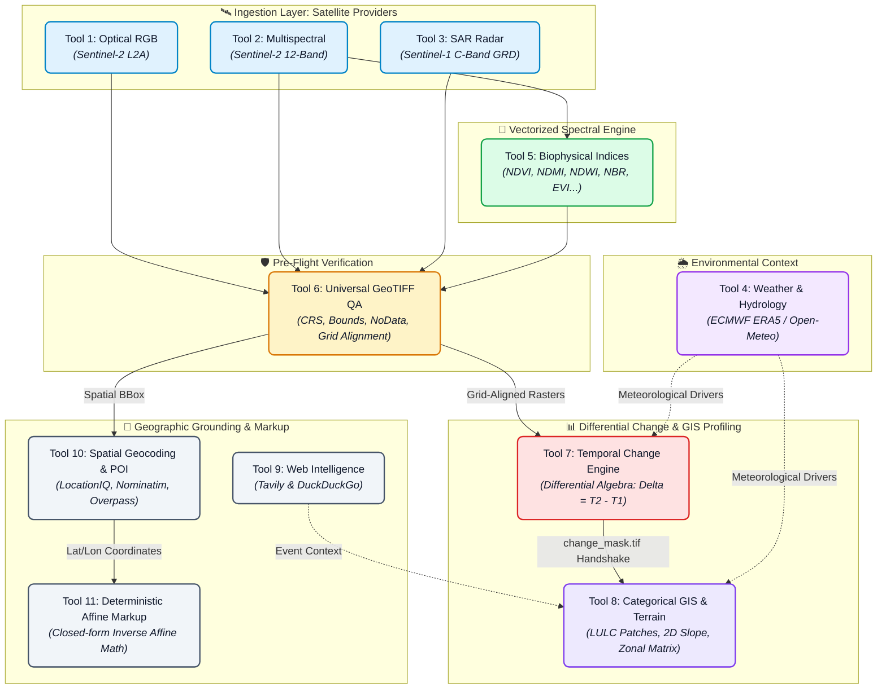
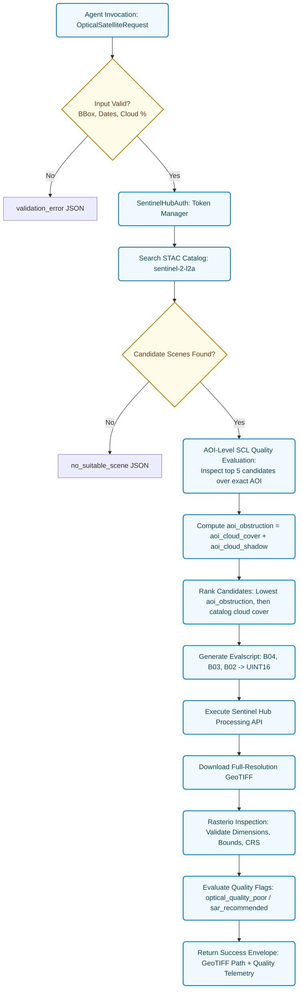
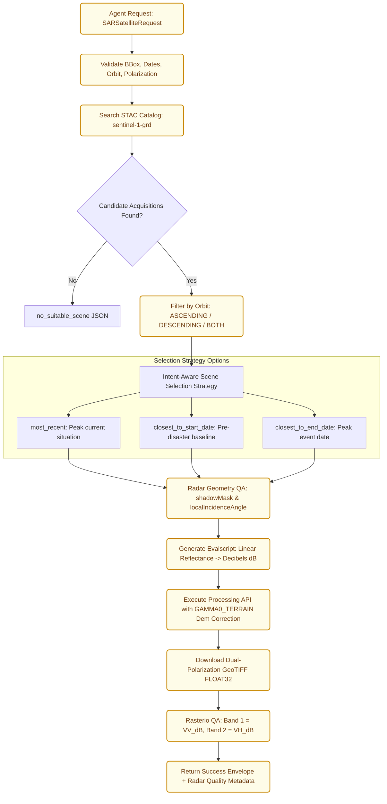
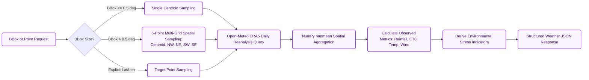
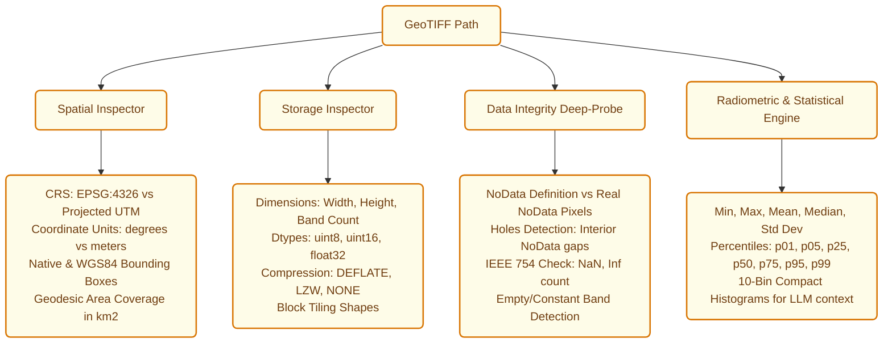
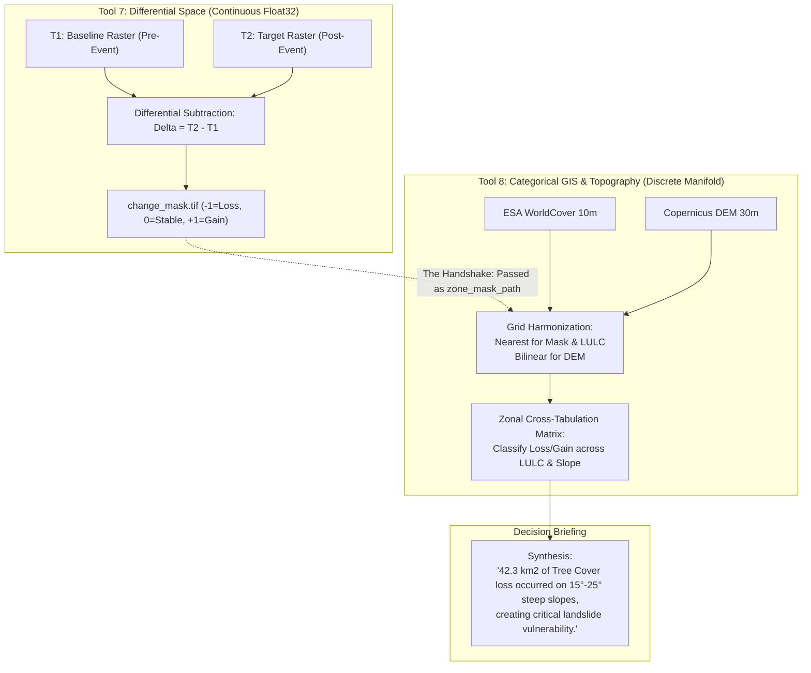

# SatQuery Geospatial Intelligence Suite — Complete Tools & Mission Specification

> **Comprehensive Technical Reference, Mathematical Formulations, Flowcharts, and Schemas for Tools 1 through 11 and Autonomous Scientific Missions**

---

## 1. System Overview & Suite Architecture

The **SatQuery Geospatial Intelligence Suite** is a modular collection of 11 high-performance Earth Observation (EO) tools, computer vision grounders, and autonomous scientific pipelines. The suite operates on a strict **Separation of Concerns & Single Responsibility Principle**:

- **Data Ingestion Engines (Tools 1–3):** Autonomous micro-services connecting to satellite constellations (Sentinel-2 optical/multispectral and Sentinel-1 C-band SAR), enforcing AOI-level Scene Classification Layer (SCL) quality gates and radar orthorectification.
- **Environmental Context Engine (Tool 4):** Connects to ECMWF ERA5 and ERA5-Land reanalysis via Open-Meteo to provide thermal, moisture, and atmospheric drivers.
- **Biophysical Index Engine (Tool 5):** Vectorized NumPy computation of 10+ standard optical indices with safe zero-division masking and canopy vigor categorization.
- **Universal QA & Profiler (Tool 6):** Deep spatial inspection of single and paired GeoTIFFs (CRS, affine bounds, NoData integrity, physical pixel GSD, data types, and structural alignment).
- **Differential Change Engine (Tool 7):** Production-grade differential algebra engine that aligns $T_1$ and $T_2$ rasters, computes relative/absolute shifts, and exports continuous delta and discrete change masks.
- **Categorical GIS & Terrain Profiler (Tool 8):** Ingests discrete LULC rasters (ESA WorldCover 10m) and DEM elevation grids (Copernicus DEM 30m) to calculate 8-connectivity patch fragmentation and 2D spatial slope gradients.
- **Ground Truth & Web Intel (Tool 9):** Bridges satellite pixels and real-world facts via Tavily search with a DuckDuckGo keyless fail-safe.
- **Spatial Geocoding & POI (Tool 10):** Translates bounding boxes and coordinates into structured administrative addresses, multi-scale scene identities, and in-AOI Points of Interest via LocationIQ, OSM Nominatim, and Overpass QL.
- **Deterministic Affine Projector (Tool 11):** Closed-form inverse affine transform that projects geographic coordinates onto exact pixel grids with zero hallucination, generating high-contrast pill-badge markup.
- **Autonomous Mission Pipelines:** Chained workflows orchestrating Tools 1–8 for Wildfire Burn Severity, Radar Flood Inundation, and Agricultural Drought.

---

### 1.1 Master Tool Suite Workflow Diagram



---

### 1.2 Master Tool Suite Matrix (11 Tools)

| Tool ID | Directory Name | FastMCP Tool Name | Core Technology / Provider | Input Schema Summary | Output Artifacts & Formats |
| :---: | :--- | :--- | :--- | :--- | :--- |
| **Tool 1** | `Tool_1_fetch_optical_imagery` | `fetch_optical_imagery_mcp` | Sentinel-2 L2A / Sentinel Hub | AOI BBox, Dates, Max cloud % | True-Color 3-Band GeoTIFF (UINT16) + AOI Quality JSON |
| **Tool 2** | `Tool_2_fetch_multispectral_imagery` | `fetch_multispectral_imagery_mcp` | Sentinel-2 L2A / Sentinel Hub | AOI BBox, Dates, Band list | Surface Reflectance GeoTIFF (FLOAT32) + Band Mapping JSON |
| **Tool 3** | `Tool_3_fetch_sar_imagery` | `fetch_sar_imagery_mcp` | Sentinel-1 GRD C-Band SAR | AOI BBox, Dates, Polarizations, Orbit | Orthorectified Backscatter GeoTIFF (FLOAT32 in dB) + Telemetry |
| **Tool 4** | `Tool_4_fetch_weather_environment` | `fetch_weather_environment_mcp` | Open-Meteo & ECMWF ERA5 | AOI BBox or Point, Dates | Weather & Moisture Balance JSON + Stress Indicators |
| **Tool 5** | `compute_vegetation_indices` | `compute_vegetation_indices_mcp` | Vectorized NumPy / Rasterio | Input GeoTIFF, List of indices | Multi-Band Index GeoTIFF (FLOAT32) + Canopy Area JSON |
| **Tool 6** | `inspect_geotiff_metadata` | `inspect_geotiff_metadata_mcp` | Local Rasterio Profiler | File path, Optional compare path | Structural, CRS, GSD, NoData Integrity & QA JSON |
| **Tool 7** | `analyze_temporal_change` | `analyze_temporal_change_mcp` | Local Differential Algebra | $T_1$ & $T_2$ GeoTIFFs, Thresholds | `difference_raster.tif`, `change_mask.tif` + Area JSON |
| **Tool 8** | `analyze_spatial_landcover_terrain` | `analyze_spatial_landcover_terrain_mcp` | WorldCover & Copernicus DEM | LULC GeoTIFF, DEM, Zone Mask | LULC Composition, Patch Fragmentation, Slope Profiles JSON |
| **Tool 9** | `fetch_web_intelligence` | `fetch_web_intelligence` | Tavily API (DuckDuckGo fallback) | Query string, optional location hint | Synthesized ground-truth answer + Ranked citations JSON |
| **Tool 10**| `Tool_10_spatial_geocoding_poi` | `spatial_geocoding_poi` | LocationIQ, Nominatim, Overpass | Query, Lat/Lon, or BBox | Coordinates, Addresses, Scene Identity, In-AOI POIs JSON |
| **Tool 11**| `Tool_11_deterministic_affine_markup` | `deterministic_affine_markup` | Closed-Form Affine Math & Pillow | GeoTIFF path, Named features | Annotated PNG preview + Subpixel coordinate projection JSON |

---

## 2. Tool 1: Visual Optical Imagery (`fetch_optical_imagery`)

### 2.1 Purpose & Architectural Role
**Tool 1** discovers, validates, and packages **True-Color RGB optical satellite imagery** from the **ESA Sentinel-2 constellation** (Level-2A Bottom-Of-Atmosphere reflectance) scaled to 16-bit unsigned integers (`UINT16`, surface reflectance multiplied by 10,000).

> [!IMPORTANT]
> **AOI-Level SCL Quality Validation**: Unlike generic satellite search tools that rely on global catalog cloud metadata covering an entire $100\text{ km} \times 100\text{ km}$ tile, Tool 1 evaluates the Sentinel-2 **Scene Classification Layer (SCL)** specifically over the user's requested AOI bounds. A tile with 40% global cloud cover can be retrieved if the requested AOI is completely unobstructed.

### 2.2 End-to-End Execution Flowchart



### 2.3 Mathematical Formulations & Quality Metrics

1. **AOI SCL Quality Aggregation**:
   The Scene Classification Layer classifies pixels into integer flags:
   - `SCL == 3`: Cloud Shadows (`aoi_cloud_shadow`)
   - `SCL in [8, 9, 10]`: Cloud Medium/High Probability & Thin Cirrus (`aoi_cloud_cover`)
   - `SCL == 11`: Snow / Ice (`aoi_snow_ice`)
   $$\text{aoi\_obstruction} = \text{aoi\_cloud\_cover} + \text{aoi\_cloud\_shadow}$$

2. **Multi-Candidate Deterministic Ranking Key**:
   $$\text{Rank Key} = \Big(\text{aoi\_obstruction}, \;\text{catalog\_cloud\_cover}, \;\text{acquisition\_time}\Big)$$

3. **Fallback Triggers**:
   If $\text{aoi\_obstruction} > 40.0\%$, Tool 1 flags `optical_quality_poor = true` and `sar_recommended = true`, prompting LangGraph to fall back to **Tool 3 (SAR Radar)**.

### 2.4 Input & Output Parameter Reference

| Parameter | Type | Required | Default | Range / Description |
| :--- | :--- | :---: | :---: | :--- |
| `bbox` | `list[float]` | **Yes** | — | `[min_lon, min_lat, max_lon, max_lat]` in WGS84 ($[-180, 180], [-90, 90]$). |
| `start_date` | `str` | **Yes** | — | `YYYY-MM-DD` start date. |
| `end_date` | `str` | **Yes** | — | `YYYY-MM-DD` end date. |
| `max_cloud_cover` | `float` | No | `30.0` | Maximum catalog cloud percentage threshold ($0.0 \dots 100.0$). |
| `width` / `height` | `int` | No | `512` | Pixel dimensions ($1 \dots 4096$). |
| `crs` | `str` | No | `"EPSG:4326"` | Target coordinate reference system. |

---

## 3. Tool 2: Multispectral Surface Reflectance (`fetch_multispectral_imagery`)

### 3.1 Purpose & Specifications
**Tool 2** discovers, retrieves, and validates calibrated **Bottom-Of-Atmosphere (BOA) Surface Reflectance imagery** across any combination of Sentinel-2 spectral bands. Data is returned as physical floating-point surface reflectance values ($[0.0, 1.0]$, `FLOAT32`).

### 3.2 Supported Sentinel-2 L2A Spectral Bands Reference

| Band Code | Spectral Description | Central $\lambda$ ($\text{nm}$) | Native GSD | Primary Remote Sensing Application |
| :--- | :--- | :---: | :---: | :--- |
| **`B01`** | Coastal Aerosol | 443 | 60 m | Coastal bathymetry, aerosol retrieval |
| **`B02`** | Blue | 490 | 10 m | Soil/vegetation differentiation, atmospheric correction |
| **`B03`** | Green | 560 | 10 m | Peak green reflectance, McFeeters water index (NDWI) |
| **`B04`** | Red | 665 | 10 m | Chlorophyll absorption, vegetation vigor (NDVI) |
| **`B05`** | Vegetation Red Edge 1 | 705 | 20 m | Chlorophyll boundary transition, early canopy stress |
| **`B06`** | Vegetation Red Edge 2 | 740 | 20 m | Crop phenology, leaf area index estimation |
| **`B07`** | Vegetation Red Edge 3 | 783 | 20 m | Red edge plateau, dense canopy biomass (NDRE) |
| **`B08`** | Broad Near-Infrared (NIR) | 842 | 10 m | High-resolution biomass, structural vigor, water boundary |
| **`B8A`** | Narrow Near-Infrared (NIR) | 865 | 20 m | Atmospheric water vapor correction, biophysical modeling |
| **`B09`** | Water Vapour | 945 | 60 m | Atmospheric absorption, cloud screening |
| **`B11`** | Shortwave Infrared 1 (SWIR-1) | 1610 | 20 m | Leaf canopy water content (NDMI), snow/cloud separation |
| **`B12`** | Shortwave Infrared 2 (SWIR-2) | 2190 | 20 m | Burn scar mapping (NBR), mineral & soil characterization |

### 3.3 Dynamic Multi-Band Evalscript Architecture
Tool 2 dynamically generates JavaScript Evalscripts for Sentinel Hub's Processing API:

```javascript
// Dynamic Evalscript Template for Tool 2
function setup() {
  return {
    input: [{ bands: ["B02", "B03", "B04", "B08", "B11", "B12"], units: "REFLECTANCE" }],
    output: { id: "default", bands: 6, sampleType: "FLOAT32" }
  };
}
function evaluatePixel(sample) {
  return [sample.B02, sample.B03, sample.B04, sample.B08, sample.B11, sample.B12];
}
```

---

## 4. Tool 3: SAR Microwave Radar (`fetch_sar_imagery`)

### 4.1 Purpose & The All-Weather Radar Superpower
Optical sensors are completely blind in the presence of clouds, monsoons, smoke, and darkness. **Sentinel-1 C-band Synthetic Aperture Radar (SAR)** transmits active microwave pulses (~5.405 GHz, $\lambda \approx 5.6\text{ cm}$) that pass through clouds with zero attenuation.

Tool 3 orthorectifies SAR Ground Range Detected (`GRD`) acquisitions using Copernicus DEM terrain correction (`GAMMA0_TERRAIN`) and exports backscatter coefficients in **Decibels ($\text{dB}$)**:

$$\gamma^\circ_{\text{dB}} = 10 \cdot \log_{10}(\gamma^\circ_{\text{linear}})$$

### 4.2 Constellation Status & Archive Lifecycle
- **Active Operational Fleet:** **Sentinel-1C** and **Sentinel-1D** deliver active operational C-SAR data.
- **Historical Global Archive:** Complete access to the 12-year archive of **Sentinel-1A** (2014–2026) and **Sentinel-1B** (2016–2021) via the unified `sentinel-1-grd` collection.

### 4.3 End-to-End SAR Ingestion Flowchart



### 4.4 Polarization Characteristics & Applications

| Polarization | Mode | Physical Interaction | Primary Geospatial Application |
| :--- | :--- | :--- | :--- |
| **`VV`** | Co-polarized (Vertical Tx, Vertical Rx) | Sensitive to surface roughness, calm water specular reflection | **Open flood water mapping** ($\le -18\,\text{dB}$), soil moisture |
| **`VH`** | Cross-polarized (Vertical Tx, Horizontal Rx) | Sensitive to volume scattering in vegetation canopies | Crop biomass, forest volume, structural change |

---

## 5. Tool 4: Meteorological & Environmental Context (`fetch_weather_environment`)

### 5.1 Purpose: Explaining the "Why" Behind the "What"
When satellite sensors detect an NDVI drop or water expansion, **Tool 4 provides the causal atmospheric context**:
- *Did vegetation decline due to harvesting or due to an extreme precipitation deficit ($\text{Precip} \ll \text{ET0}$ with sustained heat $>35^\circ\text{C}$)?*
- *Did water bodies expand due to upstream reservoir releases or a local $100\text{ mm}$ cloudburst?*

### 5.2 Meteorological Grid Resolution & Sampling Flowchart
Tool 4 accesses the **ECMWF ERA5 & ERA5-Land Atmospheric Reanalysis** model via Open-Meteo ($\sim 0.1^\circ \times 0.1^\circ \approx 9\text{ km} \times 11\text{ km}$ grid):



### 5.3 Scientific Variables & Stress Indicator Thresholds

1. **Hydrological Water Balance**:
   $$\text{water\_balance\_mm} = \sum_{t} \text{precipitation\_sum}_t - \sum_{t} \text{et0\_fao\_evapotranspiration}_t$$
2. **Stress Indicators**:
   - `heavy_rainfall_detected`: $\text{max\_daily\_rainfall} \ge 25.0\text{ mm}$ or $\text{total\_rainfall} \ge 100.0\text{ mm}$.
   - `heat_stress_detected`: Any day $\text{max\_temp} \ge 35.0^\circ\text{C}$ or mean $\ge 32.0^\circ\text{C}$.
   - `moisture_deficit_detected`: $\text{water\_balance\_mm} < 0.0\text{ mm}$.

---

## 6. Tool 5: Biophysical & Vegetation Index Engine (`compute_vegetation_indices`)

### 6.1 Purpose & Execution Pipeline
**Tool 5** takes multi-band surface reflectance rasters and computes **calibrated biophysical spectral index GeoTIFFs** using vectorized NumPy floating-point operations.

### 6.2 The Complete 10-Index Scientific Equations Table

| Index | Canonical Name | Mathematical Formulation | Required Bands | Biophysical Interpretation |
| :--- | :--- | :---: | :---: | :--- |
| **`NDVI`** | Normalized Difference Vegetation Index | $\frac{\text{NIR} - \text{Red}}{\text{NIR} + \text{Red}}$ | `B08`, `B04` | Chlorophyll absorption, green biomass density, canopy vigor. |
| **`EVI`** | Enhanced Vegetation Index | $2.5 \times \frac{\text{NIR} - \text{Red}}{\text{NIR} + 6\text{Red} - 7.5\text{Blue} + 1}$ | `B08`, `B04`, `B02` | High-biomass regions; decouples canopy and atmospheric background noise. |
| **`SAVI`** | Soil-Adjusted Vegetation Index | $\frac{\text{NIR} - \text{Red}}{\text{NIR} + \text{Red} + 0.5} \times 1.5$ | `B08`, `B04` | Arid & semi-arid zones; suppresses background soil brightness. |
| **`GNDVI`** | Green NDVI | $\frac{\text{NIR} - \text{Green}}{\text{NIR} + \text{Green}}$ | `B08`, `B03` | Wide dynamic range; sensitive to nitrogen and late-stage maturity. |
| **`NDRE_B5`** | Normalized Difference Red Edge 1 | $\frac{\text{NIR} - \text{B05}}{\text{NIR} + \text{B05}}$ | `B08`, `B05` | Red Edge 1 ($705\text{ nm}$); detects early cellular stress before visible browning. |
| **`NDRE_B7`** | Normalized Difference Red Edge 3 | $\frac{\text{NIR} - \text{B07}}{\text{NIR} + \text{B07}}$ | `B08`, `B07` | Red Edge 3 ($783\text{ nm}$); deep canopy penetration for mature crop biomass. |
| **`NDMI`** | Normalized Difference Moisture Index | $\frac{\text{NIR} - \text{SWIR1}}{\text{NIR} + \text{SWIR1}}$ | `B08`, `B11` | Leaf water content, plant moisture stress, drought monitoring. |
| **`NDWI`** | Normalized Difference Water Index | $\frac{\text{Green} - \text{NIR}}{\text{Green} + \text{NIR}}$ | `B03`, `B08` | Delineates open water bodies from terrestrial features. |
| **`MSAVI`** | Modified Soil-Adjusted Vegetation Index | $\frac{2\text{NIR} + 1 - \sqrt{(2\text{NIR} + 1)^2 - 8(\text{NIR} - \text{Red})}}{2}$ | `B08`, `B04` | Self-adjusting soil factor; ideal for emerging crops. |
| **`NBR`** | Normalized Burn Ratio | $\frac{\text{NIR} - \text{SWIR2}}{\text{NIR} + \text{SWIR2}}$ | `B08`, `B12` | Wildfire burn scar delineation, fire severity, post-fire recovery. |

### 6.3 Vectorized Zero-Division & NaN Safeguards
All formulas are computed using NumPy masked arrays:
$$\text{Denominator} = \text{NIR} + \text{Red}$$
$$\text{Mask} = (\text{Denominator} == 0) \;\lor\; \text{isnan}(\text{NIR}) \;\lor\; \text{isnan}(\text{Red})$$
$$\text{Index}[\text{Mask}] = -9999.0 \quad (\text{NoData})$$

---

## 7. Tool 6: Universal GeoTIFF QA & Profiler (`inspect_geotiff_metadata`)

### 7.1 Purpose & The Dual-Workflow Role
Tool 6 inspects, validates, and profiles **any GeoTIFF raster**, whether retrieved internally by Tools 1–3 or uploaded directly by the user:
- **Workflow A (Internal QA Gate):** Confirms grid alignment and compatibility before Tool 7 executes subtraction.
- **Workflow B (External Upload Profiler):** Ingests raw GeoTIFFs, discovers bounding boxes, and checks data integrity.

### 7.2 Core QA Checks & Output Telemetry



---

## 8. Tool 7: Multi-Temporal Differential Engine (`analyze_temporal_change`)

### 8.1 Purpose & Differential Math
Tool 7 calculates pixel-level temporal changes between a baseline acquisition ($T_1$) and a target acquisition ($T_2$). It outputs:
1. `difference_raster.tif`: Continuous Float32 delta array.
2. `change_mask.tif`: Discrete Int8 classified change mask (-1, 0, +1).

### 8.2 Differential Formulations

1. **Continuous Delta ($\Delta$):**
   $$\Delta = T_2 - T_1$$
2. **Relative Shift Percentage ($\Delta\%$):**
   $$\Delta\% = \left( \frac{T_2 - T_1}{|T_1| + \epsilon} \right) \times 100 \quad (\text{Linear products only; omitted for SAR dB})$$
3. **Statistical Standard Deviation Thresholding:**
   $$\tau_{\text{loss}} = \mu_\Delta - k \cdot \sigma_\Delta, \quad \tau_{\text{gain}} = \mu_\Delta + k \cdot \sigma_\Delta \quad (k = 2.0 \text{ default})$$

### 8.3 Change Mask Encodings

| Value | Bipolar 3-Class (`bipolar_3class`) | Severity 5-Class (`severity_5class`) | Visual Color Code |
| :---: | :--- | :--- | :---: |
| **`-2`** | — | Major Loss / Severe Disturbance ($\Delta \le 2\tau$) | Dark Red |
| **`-1`** | Significant Loss ($\Delta \le \tau_{\text{loss}}$) | Moderate Loss / Disturbance | Red |
| **`0`** | Stable / Insignificant Variation | Stable / Unaltered | Transparent |
| **`+1`** | Significant Gain ($\Delta \ge \tau_{\text{gain}}$) | Moderate Regrowth / Recovery | Light Green |
| **`+2`** | — | Major Gain / Rapid Emergence ($\Delta \ge 2\tau$) | Dark Green |
| **`-128`**| Masked NoData | Masked NoData | Gray / Transparent |

---

## 9. Tool 8: Categorical GIS & Terrain Profiler (`analyze_spatial_landcover_terrain`)

### 9.1 Purpose: Characterizing the Underlying Biome
Tool 8 answers: *What was destroyed, at what slope, and how fragmented was the landscape?* It ingests classified integer LULC rasters (ESA WorldCover 10m) and DEM elevation models (Copernicus DEM 30m).

### 9.2 ESA WorldCover 10m Standard Legend

| Class Code | Land Cover Category | Description |
| :---: | :--- | :--- |
| **`10`** | **Tree cover** | Any canopy cover $>10\%$ by trees $\ge 5\text{ m}$ height. |
| **`20`** | **Shrubland** | Woody vegetation $<5\text{ m}$ height with canopy $>10\%$. |
| **`30`** | **Grassland** | Natural herbaceous vegetation and unmanaged rangeland. |
| **`40`** | **Cropland** | Herbaceous crops, arable farmland, and irrigated fields. |
| **`50`** | **Built-up** | Man-made structures, buildings, and paved infrastructure. |
| **`60`** | **Bare / sparse vegetation** | Unconsolidated soil, gravel, rocky outcrops, and deserts. |
| **`70`** | **Snow and ice** | Permanent glaciers and perennial snow fields. |
| **`80`** | **Permanent water bodies** | Rivers, lakes, reservoirs, estuaries, and oceans. |
| **`90`** | **Herbaceous wetland** | Periodically inundated wetlands with emergent plants. |
| **`95`** | **Mangroves** | Coastal mangrove ecosystems and tidal saline wetlands. |

### 9.3 8-Connectivity Patch Fragmentation Math
Using an 8-connectivity structuring element:
$$\mathbf{S} = \begin{bmatrix} 1 & 1 & 1 \\ 1 & 1 & 1 \\ 1 & 1 & 1 \end{bmatrix}$$
1. **Patch Count ($N_p$):** Number of contiguous habitat patches.
2. **Mean Patch Size ($\bar{A}_p$):** $\bar{A}_p = \frac{\sum A_i}{N_p}$ (in $\text{km}^2$).
3. **Largest Patch Index ($\text{LPI}\%$):** Proportional area of the single largest contiguous core patch:
   $$\text{LPI} = \left( \frac{\max(A_i)}{\sum A_i} \right) \times 100$$

### 9.4 2D Spatial Slope Gradient Math
Slope in degrees is derived from DEM elevation grids:
$$\text{Slope}^\circ = \arctan\left( \sqrt{ \left(\frac{\partial z}{\partial x}\right)^2 + \left(\frac{\partial z}{\partial y}\right)^2 } \right) \times \frac{180^\circ}{\pi}$$
- **Flat ($0^\circ - 5^\circ$):** Valley bottoms, floodplains.
- **Moderate ($5^\circ - 15^\circ$):** Rolling hills, terraces.
- **Steep ($15^\circ - 30^\circ$):** High runoff, erosion-vulnerable zones.
- **Very Steep / Cliff ($> 30^\circ$):** Severe landslide risk zones.

---

## 10. The Tool 7 $\rightarrow$ Tool 8 Analytical Handshake



---

## 11. Tool 9: Ground Truth & Web Intelligence (`fetch_web_intelligence`)

Tool 9 connects numerical pixel observations with real-world events via **Tavily Search** (primary) and an automatic keyless **DuckDuckGo** fail-safe:
- Explains flood causes (e.g. *Hathnikund barrage released 3.59 lakh cusecs*).
- Identifies newly constructed infrastructure projects (e.g. *Dwarka Expressway*).

---

## 12. Tool 10: Spatial Geocoding & POI (`spatial_geocoding_poi`)

### 12.1 Four Operational Modes
1. **`forward`**: Place name $\rightarrow$ WGS84 coordinates $(\text{Lat}, \text{Lon})$ with optional viewbox clamping.
2. **`reverse`**: WGS84 point $\rightarrow$ structured hierarchical address.
3. **`scene_identity`**: Bounding box $\rightarrow$ multi-zoom reverse lookup (zoom 8, 10, 14) returning administrative identity.
4. **`poi_discovery`**: Clamped Overpass QL extraction of in-AOI POIs (tourism, historic, amenity, natural, infrastructure).

---

## 13. Tool 11: Deterministic Affine Markup (`deterministic_affine_markup`)

### 13.1 Closed-Form Inverse Affine Equations
Tool 11 solves the inverse 2D linear system directly from the GeoTIFF header:

$$\begin{bmatrix} a & b \\ d & e \end{bmatrix} \begin{bmatrix} C \\ R \end{bmatrix} = \begin{bmatrix} X - c \\ Y - f \end{bmatrix}$$

$$\det(A) = a \cdot e - b \cdot d$$

$$C = \text{round}\left( \frac{(X - c) \cdot e - (Y - f) \cdot b}{a \cdot e - b \cdot d} \right), \quad R = \text{round}\left( \frac{(Y - f) \cdot a - (X - c) \cdot d}{a \cdot e - b \cdot d} \right)$$

Where $C$ is pixel column, $R$ is pixel row, and $X, Y$ are projected world coordinates.

---

## 14. Autonomous Scientific Missions (`satquery_workflows.py`)

### 14.1 Pipeline A: Wildfire Burn Severity & Slope Risk
- **Step 1:** Tool 5 computes NBR on $T_1$ (pre-fire) and $T_2$ (post-fire).
- **Step 2:** Tool 6 validates grid compatibility.
- **Step 3:** Tool 7 performs differential algebra ($\Delta\text{NBR} = \text{NBR}_{T_1} - \text{NBR}_{T_2}$) with 5-class severity zoning.
- **Step 4:** Tool 8 cross-tabulates burn severity against ESA WorldCover and DEM slope.

### 14.2 Pipeline B: Radar Flood Inundation Assessment
- **Step 1:** Tool 6 validates pre- and post-flood Sentinel-1 SAR rasters.
- **Step 2:** Tool 7 detects water inundation via backscatter drop ($\Delta \le -3.0\,\text{dB}$).
- **Step 3:** Tool 4 validates precipitation context.
- **Step 4:** Tool 8 calculates flooded cropland and built-up infrastructure area.

### 14.3 Pipeline C: Agricultural Drought & Canopy Stress
- **Step 1:** Tool 5 computes NDMI (water content) and NDVI (vigor).
- **Step 2:** Tool 4 retrieves ERA5 soil moisture (0–7cm volumetric water content).
- **Step 3:** Correlation engine assesses drought stress intensity.

---

## 15. Global Standards & Error Recovery Protocols

### 15.1 Geospatial Conventions
- **Bounding Box (`bbox`):** WGS84 `[min_lon, min_lat, max_lon, max_lat]`.
- **Date Format:** ISO 8601 `YYYY-MM-DD`.
- **Geodesic Pixel Area Scaling:** Latitude-cosine scaling ($\cos(\text{lat}_{\text{mid}})$) applied across Tools 5, 7, and 8.
- **Safe Resampling**:
  - Discrete/Integer Rasters (LULC, Change Masks): `Resampling.nearest`.
  - Continuous Rasters (Indices, SAR, DEM): `Resampling.bilinear`.

### 15.2 LangGraph Error Recovery Matrix

| Error Type | Trigger Condition | Agent / Orchestrator Action |
| :--- | :--- | :--- |
| `validation_error` | Malformed parameters, out-of-bounds coordinates | Reformat parameters and retry. |
| `no_suitable_scene` | Cloud cover exceeded across search dates | Expand temporal window or fall back to Tool 3 (SAR Radar). |
| `compatibility_error` | Mismatched CRS or bounds in Tool 6/7 | Harmonize projection or fall back to `compare_images_visually`. |
| `service_error` | Remote API rate limit (429) or temporary outage | Exponential backoff retry (up to 3 attempts). |
