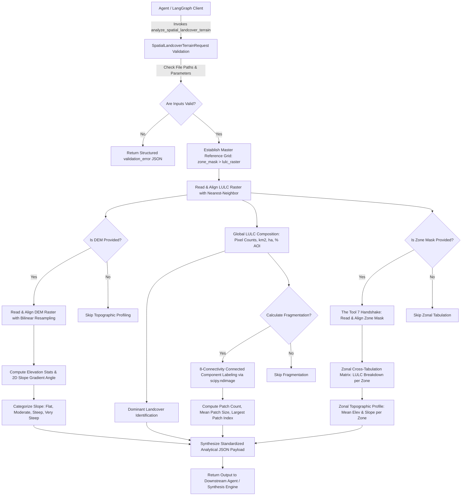

# Tool 8: analyze_spatial_landcover_terrain (Categorical LULC & Topographic Landscape Engine)

## 1. Executive Summary & Core Motivation

**`analyze_spatial_landcover_terrain`** is a production-grade categorical Geographic Information System (GIS) and topographical terrain profiler built for Model Context Protocol (MCP) clients and LangGraph autonomous agents. While Tool 7 (`analyze_temporal_change`) operates on continuous floating-point differential algebra ($T_2 - T_1$) to detect **phenomenon boundaries** (e.g., where NDVI dropped or SAR backscatter surged), **Tool 8 characterizes the physical biome and geomorphology beneath that boundary**.

```text
The SatQuery Analytical Pipeline:
┌──────────────────────────────────────────────┐
│ Tool 1 / 2 / 3 (Optical, Multi, SAR)        │
│ Tool 4 (Weather / ERA5 Environmental Context)│
│ Tool 5 (Vegetation & Spectral Indices)       │
└──────────────────────┬───────────────────────┘
                       ▼
┌──────────────────────────────────────────────┐
│ Tool 6: Universal Pre-Flight Raster QA       │
└──────────────────────┬───────────────────────┘
                       ▼
┌──────────────────────────────────────────────┐
│ Tool 7: Temporal Change Detection Engine     │ ──► Generates change_mask.tif
└──────────────────────┬───────────────────────┘
                       ▼  (The Tool 7 ──► Tool 8 Handshake)
┌──────────────────────────────────────────────┐
│ Tool 8: Spatial Landcover & Terrain Engine   │ ──► Profiles Biome, Patches & Slope
└──────────────────────┬───────────────────────┘
                       ▼
┌──────────────────────────────────────────────┐
│ Downstream AI Report & Decision Synthesis    │
└──────────────────────────────────────────────┘
```

---

## 2. Why is Tool 8 Necessary? (The Core Problem Solved)

In automated Earth Observation (EO) and geospatial agent workflows, detecting that a vegetation index dropped by $-0.35$ is only half the answer. A decision-maker or downstream LLM needs to know:
1. **What was destroyed?** Did the disturbance occur in dense natural forest, agricultural cropland, shrubland, or urban built-up areas?
2. **What is the terrain risk?** Did the clearing happen on a steep $25^\circ$ mountain slope (high landslide/erosion hazard) or on a flat $1^\circ$ floodplain?
3. **What is the ecological structure?** Was a continuous forest fractured into fragmented patches, or was it a localized clearing?

Tool 8 answers all three questions in a single, high-performance, deterministic execution pass.

---

## 3. Core Architectural Features & Mathematical Formulations

### 1. Categorical LULC Composition Accounting
Tool 8 ingests classified discrete integer rasters. By default, it adheres to the global **ESA WorldCover 10m Standard Legend**:

| Class ID | Land Cover Name | Description & Spectral Characteristics |
| :---: | :--- | :--- |
| **10** | **Tree cover** | Any canopy cover $>10\%$ by trees $\ge 5\text{ m}$ in height (native forests, plantations). |
| **20** | **Shrubland** | Woody vegetation $<5\text{ m}$ height with canopy cover $>10\%$. |
| **30** | **Grassland** | Natural herbaceous vegetation, rangelands, and unmanaged pastures. |
| **40** | **Cropland** | Herbaceous crops, irrigated agriculture, and arable farmland. |
| **50** | **Built-up** | Man-made structures, buildings, paved roads, and urban surfaces. |
| **60** | **Bare / sparse vegetation** | Unconsolidated soil, gravel, rocky outcrops, and deserts. |
| **70** | **Snow and ice** | Permanent glaciers, perennial snow cover, and ice fields. |
| **80** | **Permanent water bodies** | Rivers, lakes, reservoirs, estuaries, and oceans. |
| **90** | **Herbaceous wetland** | Areas with permanent or periodic water saturation and emergent plants. |
| **95** | **Mangroves** | Coastal mangrove ecosystems and tidal saline wetlands. |
| **100** | **Moss and lichen** | Alpine and Arctic tundra vegetation carpets. |

The tool computes the exact pixel count, surface area in $\text{km}^2$, surface area in hectares ($\text{ha}$), and percentage of valid AOI for every class present.

---

### 2. Landscape Patch Fragmentation & Spatial Structure (8-Connectivity)
To evaluate habitat fragmentation and biome connectivity, Tool 8 isolates binary masks for natural vegetation classes (Tree Cover, Shrubland, Grassland, Cropland, Wetlands) and executes **8-connectivity connected component labeling** via `scipy.ndimage.label`:

$$\text{Structuring Element } \mathbf{S} = \begin{bmatrix} 1 & 1 & 1 \\ 1 & 1 & 1 \\ 1 & 1 & 1 \end{bmatrix}$$

From the labeled component graph, Tool 8 computes:
1. **Patch Count ($N_p$):** Total number of isolated, contiguous patches.
2. **Mean Patch Size ($\bar{A}_p$):**
   $$\bar{A}_p = \frac{\sum_{i=1}^{N_p} A_i}{N_p} \quad (\text{reported in } \text{km}^2 \text{ and hectares})$$
3. **Largest Patch Index ($\text{LPI}\%$):** Proportional dominance of the primary intact core patch:
   $$\text{LPI} = \left( \frac{\max_{i} (A_i)}{\sum_{i=1}^{N_p} A_i} \right) \times 100$$
4. **Qualitative Fragmentation Tier:**
   - **Continuous / Low Fragmentation:** $N_p = 1$ or $\text{LPI} > 75\%$.
   - **Moderately Fragmented:** $35\% < \text{LPI} \le 75\%$.
   - **Highly Fragmented / Dispersed:** $\text{LPI} \le 35\%$.

---

### 3. Topographic Elevation & 2D Spatial Slope Gradient Math
When a Digital Elevation Model (DEM) is provided (e.g. Copernicus DEM 30m or SRTM 30m), Tool 8 extracts:
- **Elevation Statistics:** Min, max, mean, median, standard deviation, and statistical percentiles ($p_{05}, p_{25}, p_{75}, p_{95}$) in meters.
- **Physical Terrain Slope in Degrees:**
  Slope is calculated using central difference spatial gradients converted to physical ground meters ($\Delta x, \Delta y$):
  $$\frac{\partial z}{\partial x} \approx \frac{z_{i, j+1} - z_{i, j-1}}{2 \cdot \Delta x}, \quad \frac{\partial z}{\partial y} \approx \frac{z_{i+1, j} - z_{i-1, j}}{2 \cdot \Delta y}$$
  $$\text{Slope}^\circ = \arctan\left( \sqrt{ \left(\frac{\partial z}{\partial x}\right)^2 + \left(\frac{\partial z}{\partial y}\right)^2 } \right) \times \frac{180^\circ}{\pi}$$

- **Standardized Slope Categorization (FAO / USGS Standard):**
  - **Flat to Gentle ($0^\circ - 5^\circ$):** Arable plains, floodplains, valley bottoms.
  - **Moderate ($5^\circ - 15^\circ$):** Rolling hills, gentle terraces, low erosion susceptibility.
  - **Steep ($15^\circ - 30^\circ$):** Hillslopes, high soil runoff, vulnerable canopy zones.
  - **Very Steep / Cliff ($> 30^\circ$):** Mountain escarpments, severe landslide and mass wasting hazard.

---

### 4. The Zonal Cross-Tabulation Engine (The Tool 7 Handshake)
When `zone_mask_path` is passed (such as `change_mask.tif` generated by Tool 7 with values `-1` = Loss, `0` = Stable, `+1` = Gain), Tool 8 performs a matrix cross-tabulation:

$$\mathbf{M}(z, c) = \sum_{(x,y) \in \text{AOI}} \mathbb{I}\Big(\text{Zone}(x,y) = z \;\land\; \text{LULC}(x,y) = c\Big)$$

For every zone, Tool 8 computes:
- Total impacted area ($\text{km}^2$ and $\text{ha}$).
- Exact breakdown by landcover type (e.g., *"Within the 42.32 $\text{km}^2$ vegetation loss zone, 100% occurred on Tree Cover (Class 10)"*).
- Topographic context: Mean elevation and mean slope specific to that zone!

---

### 5. Resampling & Spatial Grid Harmonization Guardrails
In real-world pipelines, input rasters (LULC, DEM, Change Mask) often come from different sensors with different native grids:
- **Reference Grid Selection:** The tool establishes a master grid (preferring `zone_mask_path` if present, else `lulc_raster_path`).
- **Safe Resampling Enforcements:**
  - **Categorical LULC & Masks:** MUST use `Resampling.nearest` (Nearest-Neighbor) to prevent blurring discrete class IDs into invalid non-existent integers (e.g., preventing class 10 and class 40 from averaging into non-existent class 25).
  - **Continuous DEM:** MUST use `Resampling.bilinear` for smooth elevation surface interpolation.
- All on-the-fly reprojections are logged in `provenance.resampling_actions`.

---

### 6. Geodesic Surface Area Accounting
Exact metric surface area per pixel is computed using latitude-cosine scaling:
- For Geographic CRS (`EPSG:4326`):
  $$\Delta x_{\text{meters}} = |\text{res}_x| \times 111412.84 \cdot \cos(\text{lat}_{\text{mid}}), \quad \Delta y_{\text{meters}} = |\text{res}_y| \times 110574.0$$
  $$\text{Pixel Area } (m^2) = \Delta x_{\text{meters}} \times \Delta y_{\text{meters}}$$
- For Projected CRS (UTM):
  $$\text{Pixel Area } (m^2) = |\text{res}_x \times \text{res}_y|$$

---

## 4. Environment & Dependencies

### Python Runtime:
- Python 3.10, 3.11, 3.12, or 3.13

### Required Libraries:
```bash
pip install rasterio numpy scipy pydantic fastmcp
```

| Package | Purpose |
| :--- | :--- |
| `rasterio` | Spatial GeoTIFF I/O, georeferencing, affine transforms, and GDAL re-projecting |
| `numpy` | Vectorized 2D array algebra, gradient derivatives, and statistical percentiles |
| `scipy` | `scipy.ndimage.label` for 8-connectivity contiguous landscape patch analysis |
| `pydantic` | Strict type validation, file path verification, and schema generation |
| `fastmcp` | Model Context Protocol (MCP) tool server integration |

---

## 5. End-to-End Architectural Flow Diagram



---

## 6. Input Schema & Parameter Specifications

| Field | Type | Required | Default | Description |
| :--- | :--- | :---: | :---: | :--- |
| `lulc_raster_path` | `str` | **Yes** | — | Absolute or relative path to the classified land-cover GeoTIFF (e.g. ESA WorldCover 10m). |
| `dem_raster_path` | `str` | No | `None` | Optional path to digital elevation model GeoTIFF (height in meters, e.g. Copernicus DEM 30m). |
| `zone_mask_path` | `str` | No | `None` | Optional path to integer zone mask GeoTIFF (e.g. Tool 7 `change_mask.tif`). |
| `class_legend` | `dict[int, str]` | No | `None` | Custom integer-to-class-name mapping dictionary. Defaults to ESA WorldCover 10m. |
| `zone_legend` | `dict[int, str]` | No | `None` | Custom integer-to-zone-label mapping dictionary. Defaults to Tool 7 change classes. |
| `calculate_fragmentation`| `bool` | No | `true` | Whether to compute landscape patch metrics for natural vegetation classes. |
| `output_dir` | `str` | No | `None` | Optional custom output directory for exported reports. |

---

## 7. Output JSON Schema & Data Dictionary

A successful invocation returns structured analytical telemetry:

```json
{
  "status": "success",
  "tool": "Tool_8_analyze_spatial_landcover_terrain",
  "timestamp_utc": "2026-09-04T13:27:45.906924+00:00",
  "provenance": {
    "lulc_raster_file": "sample_worldcover_10m.tif",
    "dem_raster_file": "sample_copernicus_dem_30m.tif",
    "zone_mask_file": "sample_indices_t1_vs_sample_indices_t2_NDVI_change_mask.tif",
    "crs": "EPSG:4326",
    "grid_dimensions": { "width": 256, "height": 256 },
    "spatial_bounds": { "left": 77.1, "bottom": 28.5, "right": 77.3, "top": 28.7 },
    "pixel_ground_resolution_m": { "width_m": 76.42, "height_m": 86.59, "area_m2": 6616.45 },
    "resampling_actions": []
  },
  "spatial_coverage": {
    "total_raster_area_km2": 433.6159,
    "valid_aoi_area_km2": 433.6159,
    "valid_fraction_percent": 100.0,
    "total_pixels": 65536,
    "valid_pixels": 65536,
    "nodata_pixels": 0
  },
  "dominant_landcover": {
    "code": 40,
    "name": "Cropland",
    "area_km2": 267.0334,
    "percentage": 61.58
  },
  "landcover_composition": {
    "10": { "class_name": "Tree cover", "pixel_count": 13200, "area_km2": 87.3372, "area_hectares": 8733.72, "percentage_of_valid_aoi": 20.14 },
    "20": { "class_name": "Shrubland", "pixel_count": 3300, "area_km2": 21.8343, "area_hectares": 2183.43, "percentage_of_valid_aoi": 5.04 },
    "30": { "class_name": "Grassland", "pixel_count": 2400, "area_km2": 15.8795, "area_hectares": 1587.95, "percentage_of_valid_aoi": 3.66 },
    "40": { "class_name": "Cropland", "pixel_count": 40359, "area_km2": 267.0334, "area_hectares": 26703.34, "percentage_of_valid_aoi": 61.58 },
    "50": { "class_name": "Built-up", "pixel_count": 1630, "area_km2": 10.7848, "area_hectares": 1078.48, "percentage_of_valid_aoi": 2.49 },
    "60": { "class_name": "Bare / sparse vegetation", "pixel_count": 1575, "area_km2": 10.4209, "area_hectares": 1042.09, "percentage_of_valid_aoi": 2.4 },
    "80": { "class_name": "Permanent water bodies", "pixel_count": 3072, "area_km2": 20.3257, "area_hectares": 2032.57, "percentage_of_valid_aoi": 4.69 }
  },
  "landscape_fragmentation": {
    "Tree cover": {
      "patch_count": 1,
      "mean_patch_size_km2": 87.3372,
      "mean_patch_size_hectares": 8733.72,
      "largest_patch_index_percent": 100.0,
      "fragmentation_level": "Continuous / Low Fragmentation"
    },
    "Cropland": {
      "patch_count": 2,
      "mean_patch_size_km2": 133.5167,
      "mean_patch_size_hectares": 13351.67,
      "largest_patch_index_percent": 67.45,
      "fragmentation_level": "Moderately Fragmented"
    }
  },
  "terrain_profile": {
    "source_dem_file": "sample_copernicus_dem_30m.tif",
    "elevation_meters": {
      "mean_elevation_m": 339.88,
      "median_elevation_m": 300.17,
      "min_elevation_m": 206.63,
      "max_elevation_m": 583.9,
      "std_elevation_m": 100.18,
      "percentiles_m": { "p05": 235.07, "p25": 264.64, "p75": 396.52, "p95": 549.12 }
    },
    "slope_profile": {
      "mean_slope_deg": 1.02,
      "median_slope_deg": 0.97,
      "min_slope_deg": 0.01,
      "max_slope_deg": 2.52,
      "std_slope_deg": 0.66,
      "slope_classes": {
        "flat_to_gentle_0_to_5_deg": { "pixel_count": 65536, "percentage": 100.0 },
        "moderate_5_to_15_deg": { "pixel_count": 0, "percentage": 0.0 },
        "steep_15_to_30_deg": { "pixel_count": 0, "percentage": 0.0 },
        "very_steep_above_30_deg": { "pixel_count": 0, "percentage": 0.0 }
      }
    }
  },
  "zonal_cross_tabulation": {
    "-1": {
      "zone_label": "Significant Decrease / Loss",
      "total_pixel_count": 6396,
      "total_area_km2": 42.3188,
      "total_area_hectares": 4231.88,
      "percentage_of_aoi": 9.76,
      "landcover_impact_breakdown": {
        "Tree cover": {
          "class_code": 10,
          "pixel_count": 6396,
          "area_km2": 42.3188,
          "area_hectares": 4231.88,
          "percentage_of_zone": 100.0
        }
      },
      "topography": {
        "mean_elevation_m": 491.09,
        "min_elevation_m": 357.78,
        "max_elevation_m": 583.9,
        "mean_slope_deg": 1.75
      }
    }
  }
}
```

---

## 8. Usage Examples

### Direct Python Execution:
```python
import json
from Tool_8_analyze_spatial_landcover_terrain.analyze_spatial_landcover_terrain import (
    SpatialLandcoverTerrainRequest,
    analyze_spatial_landcover_terrain
)

request = SpatialLandcoverTerrainRequest(
    lulc_raster_path="Tool_8_analyze_spatial_landcover_terrain/test_runs/sample_worldcover_10m.tif",
    dem_raster_path="Tool_8_analyze_spatial_landcover_terrain/test_runs/sample_copernicus_dem_30m.tif",
    zone_mask_path="Tool_7_analyze_temporal_change/test_runs/sample_indices_t1_vs_sample_indices_t2_NDVI_change_mask.tif",
    calculate_fragmentation=True
)

result = analyze_spatial_landcover_terrain(request)
dominant = result["dominant_landcover"]
print(f"Dominant Landcover: {dominant['name']} ({dominant['area_km2']} km2, {dominant['percentage']}%)")
```

### CLI Execution:
```bash
python Tool_8_analyze_spatial_landcover_terrain/analyze_spatial_landcover_terrain.py Tool_8_analyze_spatial_landcover_terrain/sample_input.json
```
