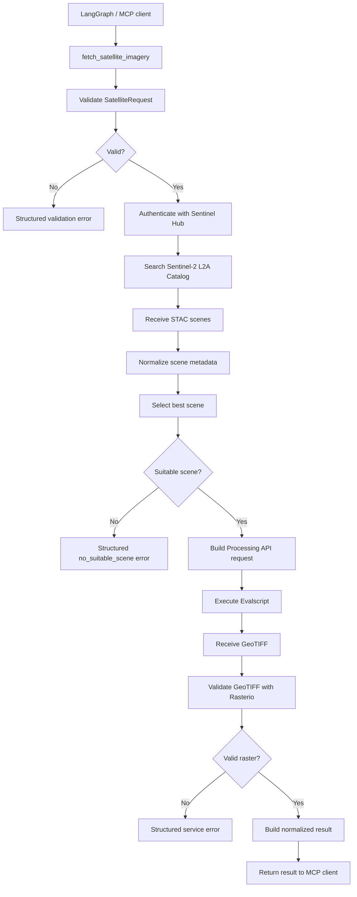
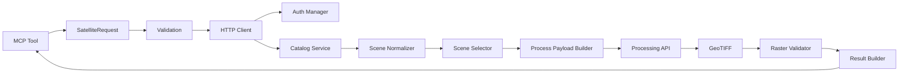
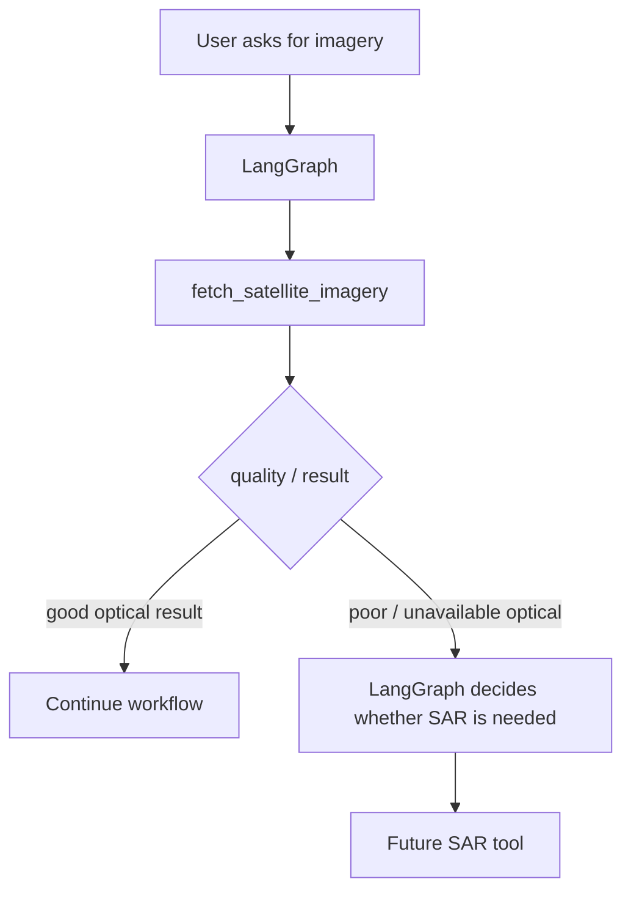
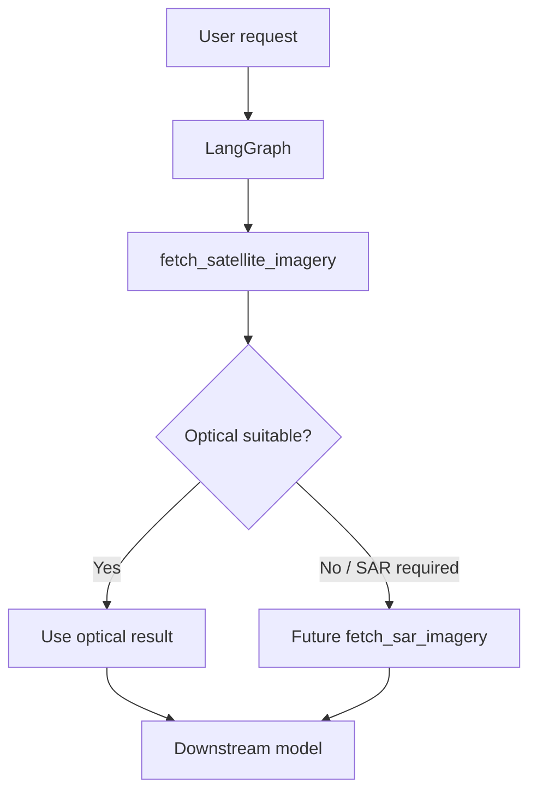

# SIH Satellite Imagery MCP Tool

## 1. Overview

**Tool name:** `fetch_satellite_imagery`  
**Provider:** Sentinel Hub / Copernicus Data Space access through Sentinel Hub APIs  
**Primary dataset implemented:** Sentinel-2 Level-2A (`sentinel-2-l2a`)  
**Output:** GeoTIFF raster + structured JSON metadata/result  
**Integration target:** MCP client / LangGraph agent

This tool is the satellite-data provider layer for the SIH project. Its job is to **discover suitable satellite observations, retrieve imagery, validate the raster, and return a normalized result**. It does not perform downstream interpretation, object detection, change interpretation, or final decision-making.

The intended separation is:

```text
User query
   ↓
LangGraph / Agent
   ↓
MCP tool: fetch_satellite_imagery
   ↓
SatelliteRequest validation
   ↓
Sentinel Hub authentication
   ↓
Catalog discovery
   ↓
Scene normalization + selection
   ↓
Sentinel Hub Processing API
   ↓
GeoTIFF
   ↓
Raster validation + metadata
   ↓
Structured result
   ↓
LangGraph / downstream model
```

Sentinel Hub's Catalog API is STAC-based and is used here to discover observations, while the Processing API generates imagery for a requested AOI and temporal period. citeturn968982search0turn968982search7

---

## 2. Current Capability — What this tool can actually fetch

### Supported satellite/data source

The implementation currently exposes:

| Capability | Current support |
|---|---|
| Satellite family | **Sentinel-2** |
| Product | **Sentinel-2 Level-2A** |
| Platform selection by user | No; the catalog chooses matching observations |
| Optical RGB | **Yes** |
| Multispectral bands | **Yes** |
| SAR / Sentinel-1 | **No** |
| Landsat | **No** |
| Sentinel-3 | **No** |
| DEM / elevation | **No** |
| LULC | **No** |
| Dedicated weather data | **No** |
| Dedicated cloud-mask output | **No** |
| NDVI / analytical indices | **No dedicated mode in the final tool** |

The current Sentinel-2 L2A catalog can return observations from the Sentinel-2 constellation. The tool does not expose a spacecraft selector; the returned catalog item contains platform/acquisition metadata. The implementation observed a Sentinel-2C item during execution, but the tool should be treated as **Sentinel-2 L2A collection access**, not as a hard-coded S2C-only service.

Sentinel-2 L2A exposes spectral bands including B01, B02, B03, B04, B05, B06, B07, B08, B8A, B09, B11 and B12, plus derived inputs such as AOT, SCL, SNW, CLD, CLP and CLM. B10 is excluded from Sentinel-2 L2A because it does not provide bottom-of-atmosphere information. citeturn968982search3

---

## 3. Image Types Available

### 3.1 Optical mode

Use:

```text
modality = "optical"
```

The tool returns a three-band RGB GeoTIFF using:

```text
B04 → Red
B03 → Green
B02 → Blue
```

The current Evalscript writes these three bands as `UINT16` values scaled by `10000`.

This mode is intended for visualization and standard optical image consumption.

### 3.2 Multispectral mode

Use:

```text
modality = "multispectral"
```

and provide a list such as:

```text
["B02", "B03", "B04", "B08"]
```

The Processing API returns one output band for every requested input band and the current implementation uses `FLOAT32` output.

This mode is intended for downstream analytical/ML workflows where multiple spectral channels are required.

Sentinel-2 L2A band resolutions differ: B02/B03/B04/B08 are 10 m; several red-edge and SWIR bands are 20 m; B01/B09 and some auxiliary layers are 60 m. Sentinel Hub can resample the selected inputs to the requested output grid. citeturn968982search3

### 3.3 What is *not* automatically produced

The tool does not automatically return:

- NDVI
- NDWI
- EVI
- cloud-mask raster
- SCL raster as a dedicated product
- SAR image
- optical + SAR pair
- temporal image pair

These should be implemented as separate capabilities rather than silently changing the contract of this tool.

---

## 4. Input Contract

The MCP-facing tool is:

```text
fetch_satellite_imagery(
    bbox,
    start_date,
    end_date,
    modality,
    bands,
    max_cloud_cover,
    width,
    height,
    crs
)
```

### Input table

| Input | Type | Required | Default | Meaning |
|---|---|---:|---:|---|
| `bbox` | `list[float]` | Yes | — | `[min_lon, min_lat, max_lon, max_lat]` |
| `start_date` | `str` | Yes | — | Start date, `YYYY-MM-DD` |
| `end_date` | `str` | Yes | — | End date, `YYYY-MM-DD` |
| `modality` | `str` | No | `optical` | `optical` or `multispectral` |
| `bands` | `list[str] \| None` | No | `None` | Required in multispectral mode; omit in optical mode |
| `max_cloud_cover` | `float` | No | `30.0` | Maximum catalog cloud-cover percentage, 0–100 |
| `width` | `int` | No | `512` | Output raster width; 1–4096 |
| `height` | `int` | No | `512` | Output raster height; 1–4096 |
| `crs` | `Literal["EPSG:4326"]` | No | `EPSG:4326` | Public interface uses WGS84 longitude/latitude |

### BBox format

The bounding box must always be supplied as:

```text
[min_lon, min_lat, max_lon, max_lat]
```

Example:

```json
[77.10, 28.50, 77.30, 28.70]
```

Interpretation:

```text
              max_lat
        ┌─────────────────┐
        │                 │
        │       AOI       │
        │                 │
        └─────────────────┘
 min_lon                max_lon
              min_lat
```

The public tool uses geographic longitude/latitude coordinates. Do not pass projected coordinates such as UTM values in the public `bbox`.

### Date format

Use ISO calendar dates:

```text
2025-01-01
```

not:

```text
01/01/2025
Jan 1 2025
```

The validation layer rejects invalid date formats and rejects a range where the start date is later than the end date.

---

## 5. How the Input Connects to the Tool

The agent/LangGraph layer should translate its own user-level understanding into the exact MCP schema.

Example user request:

> Get a cloud-limited Sentinel-2 image around Delhi for January 2025.

The agent should produce a tool call conceptually like:

```json
{
  "bbox": [77.10, 28.50, 77.30, 28.70],
  "start_date": "2025-01-01",
  "end_date": "2025-01-31",
  "modality": "optical",
  "bands": null,
  "max_cloud_cover": 30,
  "width": 512,
  "height": 512,
  "crs": "EPSG:4326"
}
```

The agent does **not** supply:

```text
client_id
client_secret
OAuth token
evalscript
Catalog URL
Processing URL
Retry settings
output directory
```

Those are implementation/infrastructure settings.

---

## 6. End-to-End Flow

### Flow chart



### Step-by-step explanation

**1. Tool call received** — LangGraph invokes `fetch_satellite_imagery` with an AOI, date range and output preferences.

**2. Request validation** — Pydantic checks bbox structure/ranges, dates, modality, band configuration, cloud threshold and raster dimensions.

**3. Authentication** — `SentinelHubAuth` obtains an OAuth access token and caches it for reuse while valid. Sentinel Hub explicitly recommends token reuse rather than requesting a token for every API request. citeturn968982search1

**4. Catalog discovery** — the Catalog API is searched for Sentinel-2 L2A observations intersecting the requested bbox and date interval.

**5. Scene normalization** — provider-specific STAC fields are converted into the tool's own normalized representation.

**6. Scene selection** — among returned candidates, the current deterministic rule prefers the lowest catalog cloud-cover value, with acquisition time used as a tie-breaker.

**7. Processing request** — the selected acquisition time and requested AOI are used to construct the Processing API request.

**8. Evalscript execution** — the Evalscript tells Sentinel Hub which bands to read and what raster values to return. Evalscript is a required part of a Process API request. citeturn968982search5turn968982search6

**9. GeoTIFF retrieval** — the Process API returns the generated TIFF bytes.

**10. Raster validation** — Rasterio checks that the file exists, is non-empty, is readable, has valid dimensions, contains bands, has a CRS and has spatial bounds.

**11. Result packaging** — the tool combines the output path, source scene metadata, request metadata, raster metadata and quality flags into one normalized result.

**12. MCP return** — the structured result is returned to LangGraph, where the agent can decide what to do next.

The Processing API is deliberately used over an AOI rather than requiring the application to manage individual satellite tiles; Sentinel Hub handles the processing/mosaicking complexity for the requested area and temporal interval. citeturn968982search7

---

## 7. Internal Architecture



### Component responsibilities

| Component | Responsibility |
|---|---|
| `SatelliteRequest` | Defines and validates tool inputs |
| `ToolConfig` | Holds provider/configuration information |
| `SentinelHubAuth` | OAuth authentication and token reuse |
| `SentinelHubHTTPClient` | Common HTTP requests, timeout and transient retries |
| `search_sentinel2_catalog` | Catalog discovery |
| `normalize_scene` | Converts STAC result to application metadata |
| `select_best_scene` | Deterministic scene selection |
| `build_evalscript` | Controls requested bands and output |
| `build_process_payload` | Creates Process API request |
| `process_satellite_imagery` | Executes retrieval and writes TIFF |
| `validate_raster` | Verifies downloaded raster |
| `build_success_result` | Creates normalized response |
| `fetch_satellite_imagery` | Orchestrates the complete core service |
| `mcp_fetch_satellite_imagery` | MCP-facing adapter |

---

## 8. APIs Used

### Authentication API

Current implementation uses:

```text
https://services.sentinel-hub.com/auth/realms/main/protocol/openid-connect/token
```

Authentication uses OAuth2 client credentials. Access tokens are cached and reused until near expiry. citeturn968982search1

### Catalog API

Current implementation uses:

```text
https://services.sentinel-hub.com/catalog/v1/search
```

The Catalog API implements STAC search and supports bbox, datetime, collections, limits and pagination. citeturn968982search0

### Processing API

Current implementation uses:

```text
https://services.sentinel-hub.com/process/v1
```

The Process API accepts a processing request and can return formats including `image/tiff`. citeturn968982search2turn968982search7

### Sentinel-2 collection

```text
sentinel-2-l2a
```

---

## 9. Sentinel-2 L2A Band Reference

The provider currently documents the following main L2A inputs: citeturn968982search3

| Band/input | Meaning | Native resolution |
|---|---|---:|
| B01 | Coastal aerosol | 60 m |
| B02 | Blue | 10 m |
| B03 | Green | 10 m |
| B04 | Red | 10 m |
| B05 | Vegetation red edge | 20 m |
| B06 | Vegetation red edge | 20 m |
| B07 | Vegetation red edge | 20 m |
| B08 | NIR | 10 m |
| B8A | Narrow NIR | 20 m |
| B09 | Water vapour | 60 m |
| B11 | SWIR | 20 m |
| B12 | SWIR | 20 m |
| AOT | Aerosol Optical Thickness | 10 m |
| SCL | Scene Classification Layer | 20 m |
| SNW | Snow probability | 20 m |
| CLD | Cloud probability | 20 m |
| CLP | Cloud probability | 160 m |
| CLM | Cloud mask | 160 m |
| B10 | Cirrus | **Not included in L2A** |

### Practical examples

True-colour optical:

```text
B04 + B03 + B02
```

Common multispectral ML input:

```text
B02 + B03 + B04 + B08
```

Red-edge enhanced input:

```text
B02 + B03 + B04 + B05 + B06 + B07 + B08A
```

SWIR-capable input:

```text
B02 + B03 + B04 + B08 + B11 + B12
```

The tool can request supported provider inputs in multispectral mode, but callers should only provide identifiers supported by the Sentinel-2 L2A collection.

---

## 10. Output Contract

A successful call returns a Python dictionary which, when exposed through MCP, is serialized as structured data.

Conceptual structure:

```json
{
  "status": "success",
  "data": {
    "file_path": "/content/sih_satellite_data/...tif",
    "file_name": "...tif",
    "format": "GeoTIFF"
  },
  "source": {
    "provider": "Sentinel Hub",
    "collection": "sentinel-2-l2a",
    "scene_id": "...",
    "acquisition_time": "2025-01-28T05:41:31Z"
  },
  "request": {
    "bbox": [77.10, 28.50, 77.30, 28.70],
    "start_date": "2025-01-01",
    "end_date": "2025-01-31",
    "modality": "optical",
    "bands": null,
    "max_cloud_cover": 30
  },
  "raster": {
    "width": 512,
    "height": 512,
    "band_count": 3,
    "dtype": "uint16",
    "crs": "EPSG:4326",
    "bounds": {
      "left": 77.1,
      "bottom": 28.5,
      "right": 77.3,
      "top": 28.7
    },
    "resolution": {
      "x": 0.000390625,
      "y": 0.000390625
    },
    "nodata": null
  },
  "quality": {
    "cloud_cover": 0.0,
    "valid": true
  },
  "flags": {
    "optical_quality_poor": false,
    "sar_recommended": false
  }
}
```

### What the downstream system gets

The downstream agent/model gets both:

1. **The raster file location** — where the GeoTIFF was saved.
2. **Machine-readable metadata** — what was requested, what was selected, what raster was produced, and basic quality information.

This allows LangGraph to make workflow decisions without needing to understand Sentinel Hub's raw STAC or HTTP responses.

---

## 11. Sample Successful Execution

The finalized notebook successfully produced a result with:

```text
Status: success

Image:
/content/sih_satellite_data/sentinel2_...tif

Scene:
S2C_MSIL2A_20250128T053131_N0511_R105_T43RGM_20250128T084454

Acquisition:
2025-01-28T05:41:31Z

Cloud cover:
0.0

Raster:
width: 512
height: 512
band_count: 3
dtype: uint16
crs: EPSG:4326
```

The corresponding raster covered the requested bbox `[77.1, 28.5, 77.3, 28.7]` and was validated successfully with Rasterio.

---

## 12. Error Output Contract

The MCP adapter converts exceptions into structured results rather than allowing raw traceback output to escape.

### Validation error

```json
{
  "status": "error",
  "error": {
    "type": "validation_error",
    "message": "..."
  }
}
```

### Service/API error

```json
{
  "status": "error",
  "error": {
    "type": "service_error",
    "message": "..."
  }
}
```

### Unexpected error

```json
{
  "status": "error",
  "error": {
    "type": "unexpected_error",
    "message": "..."
  }
}
```

### No suitable imagery

The core function can return:

```json
{
  "status": "error",
  "error": {
    "type": "no_suitable_scene",
    "message": "No suitable Sentinel-2 L2A scene was found for the requested AOI, time range and cloud threshold."
  }
}
```

This distinction is important for LangGraph. "No imagery exists" is different from "the provider failed".

---

## 13. HTTP and Retry Behaviour

The shared HTTP client retries only transient situations:

```text
429
500
502
503
504
```

It also retries network-level request failures up to the configured retry count.

Default configuration:

```text
max_retries = 3
timeout = 60 seconds
```

For `429 Too Many Requests`, the client honors a numeric `Retry-After` response value when supplied; otherwise it uses bounded exponential backoff.

Permanent/client-side errors such as `400`, `401`, `403` and `404` are not blindly retried.

---

## 14. File Format Details

### Primary output format: GeoTIFF

The Processing API output is requested as:

```text
image/tiff
```

GeoTIFF is used because it preserves geospatial information required by downstream geospatial/ML processing.

### Raster metadata returned

The validator extracts:

```text
width
height
band_count
dtype
CRS
bounds
resolution
nodata
```

### Optical datatype

Current optical output:

```text
3 bands
UINT16
```

The Evalscript multiplies Sentinel-2 reflectance samples by `10000` before writing them to the `UINT16` raster.

### Multispectral datatype

Current multispectral output:

```text
N bands
FLOAT32
```

where `N` equals the number of requested bands.

### Filename pattern

Files are saved using a unique filename containing scene ID, requested date range, modality and UTC creation timestamp.

Example pattern:

```text
sentinel2_<scene_id>_<start>_<end>_<modality>_<UTC timestamp>.tif
```

---

## 15. Storage and File-Path Considerations

The notebook currently writes files to:

```text
/content/sih_satellite_data
```

That is a **Google Colab runtime path** and should not be treated as permanent project storage.

For a real deployment, replace this with a persistent/server-side storage location or object storage system such as the storage architecture selected by the SIH team.

The MCP response currently returns a filesystem path. A remote LangGraph deployment must be able to access that path, or the tool should later be changed to return a durable object-storage URI/download reference.

This is an important deployment consideration: **a `/content/...` path is valid inside Colab but is not automatically visible to another machine or container.**

---

## 16. Environment Requirements

### Development environment

The implementation was developed in:

```text
Google Colab
Python 3.x
```

The notebook currently installs:

```text
requests
rasterio
shapely
pyproj
pydantic
fastmcp
```

### Runtime requirements

A production runtime needs:

- Python 3.x
- network access to Sentinel Hub services
- valid Sentinel Hub OAuth client credentials
- GDAL-compatible environment for Rasterio
- FastMCP for MCP exposure
- persistent output storage

### Credentials

Required:

```text
SENTINEL_CLIENT_ID
SENTINEL_CLIENT_SECRET
```

Never commit these values to Git, source files or tool arguments.

---

## 17. Google Colab vs Standalone MCP Server

This distinction is important.

### Colab notebook

The notebook currently reads credentials using:

```python
from google.colab import userdata

CLIENT_ID = userdata.get("SENTINEL_CLIENT_ID")
CLIENT_SECRET = userdata.get("SENTINEL_CLIENT_SECRET")
```

That is appropriate for the Colab development notebook.

### Standalone server

The actual MCP server should **not depend on Google Colab**.

The standalone `server.py` should load credentials from environment variables or a proper secret manager.

Conceptually:

```text
Environment / Secret Manager
        ↓
server.py
        ↓
ToolConfig
        ↓
SentinelHubAuth
```

A typical local setup is:

```bash
export SENTINEL_CLIENT_ID="..."
export SENTINEL_CLIENT_SECRET="..."
```

or use the secret-management mechanism selected by the project's deployment environment.

---

## 18. Standalone MCP Server Entry Point

The final server file should contain the MCP startup guard:

```python
if __name__ == "__main__":
    mcp.run()
```

The Colab notebook intentionally does **not** need to run this blocking server loop.

Typical deployment structure:

```text
project/
│
├── server.py
├── requirements.txt
├── README.md
└── .env.example
```

A production-oriented code split can later become:

```text
project/
│
├── server.py
├── config.py
├── auth.py
├── http_client.py
├── models.py
├── catalog.py
├── processing.py
├── raster.py
├── tools.py
├── requirements.txt
└── README.md
```

The current notebook is the implementation/reference source; splitting it into modules is recommended for maintainability when moving beyond the prototype notebook.

---

## 19. MCP Interface

The public MCP tool is named:

```text
fetch_satellite_imagery
```

The server defines it using FastMCP and exposes the following schema:

```text
bbox
start_date
end_date
modality
bands
max_cloud_cover
width
height
crs
```

FastMCP uses the Python function signature/type annotations/docstring to expose the tool schema to the MCP client. The MCP layer therefore represents the boundary between the external agent and the internal satellite service.

---

## 20. What LangGraph Should Do vs What This Tool Should Do

### This tool owns

```text
Input validation
Authentication
Catalog search
Scene selection
Image retrieval
Raster validation
Metadata extraction
Structured errors
```

### LangGraph owns

```text
Which tool to call
When to call another tool
Conditional workflows
SAR fallback decisions
Multi-step reasoning
Final response generation
```

For example:



The satellite tool reports facts such as cloud-cover metadata; the graph should own the higher-level decision that another tool is required.

---

## 21. Security Considerations

### Never expose credentials

Do not add:

```text
client_id
client_secret
access_token
```

to MCP tool parameters.

### Never log secrets

The current notebook deliberately prints only whether credentials/token are present, not their values.

### Keep provider credentials server-side

```text
Agent
  ↓
MCP tool
  ↓
Server-side secrets
  ↓
Sentinel Hub
```

not:

```text
Agent
  ↓
API key in tool input
```

---

## 22. Current Limitations

These are intentional scope boundaries, not missing documentation.

### Sensor scope

Only Sentinel-2 L2A is implemented as a dataset in this tool.

### Modality scope

Public modality values are:

```text
optical
multispectral
```

SAR is not implemented here.

### AOI scope

The public interface accepts a WGS84 bbox. Polygon/GeoJSON AOIs are not currently exposed.

### Scene-selection scope

Selection is currently deterministic and primarily cloud-cover based.

### Cloud quality scope

`eo:cloud_cover` is scene/tile metadata; it should not be interpreted as a guaranteed pixel-perfect cloud percentage over the exact requested AOI. citeturn968982search3

### Storage scope

The current notebook writes local filesystem paths. A production remote deployment should use persistent shared/object storage if downstream services are on another machine.

### Band validation scope

The tool requires bands for multispectral mode but does not yet maintain a hard-coded allow-list of Sentinel-2 band identifiers. Invalid identifiers will ultimately be rejected by the provider rather than by the local Pydantic model.

---

## 23. What Can Be Built on Top of This Tool

This tool is intentionally the first retrieval primitive for a larger satellite-data service.

Future compatible components can include:

```text
fetch_sar_imagery
fetch_elevation
fetch_lulc
fetch_cloud_mask
fetch_multitemporal_pair
fetch_multimodal_pair
get_weather_context
```

A future SAR + optical workflow could then be orchestrated as:



The important architectural principle is that the existing tool does not need to know that SAR exists in order to remain useful.

---

## 24. Setup Checklist

### Before running the notebook

```text
☐ Create Sentinel Hub OAuth client
☐ Add SENTINEL_CLIENT_ID to Colab Secrets
☐ Add SENTINEL_CLIENT_SECRET to Colab Secrets
☐ Install required Python packages
☐ Run configuration cells
```

### Before moving to standalone server

```text
☐ Replace Colab userdata credential loading
☐ Load credentials from environment/secret manager
☐ Move implementation into server.py/modules
☐ Keep the @mcp.tool definition
☐ Add if __name__ == "__main__": mcp.run()
☐ Replace /content storage with persistent/shared storage
☐ Create requirements.txt
☐ Verify the MCP client can reach the server
```

---

## 25. Recommended `requirements.txt`

For the current implementation, the dependency set is:

```text
requests
rasterio
shapely
pyproj
pydantic
fastmcp
```

For reproducible deployment, pin versions after the project environment has been validated, for example:

```text
requests==<validated-version>
rasterio==<validated-version>
shapely==<validated-version>
pyproj==<validated-version>
pydantic==<validated-version>
fastmcp==<validated-version>
```

Do not copy unvalidated version numbers into production solely from this README.

---

## 26. Final Tool Contract — One-Page Summary

```text
TOOL
fetch_satellite_imagery

PROVIDER
Sentinel Hub

DATASET
Sentinel-2 L2A

INPUT
bbox
start_date
end_date
modality
bands
max_cloud_cover
width
height
crs

SUPPORTED MODES
optical
multispectral

OPTICAL OUTPUT
B04/B03/B02
3-band UINT16 GeoTIFF

MULTISPECTRAL OUTPUT
Requested supported Sentinel-2 inputs
N-band FLOAT32 GeoTIFF

MAX DIMENSIONS
4096 × 4096

PRIMARY OUTPUT FILE
GeoTIFF (.tif)

METADATA
scene ID
acquisition time
cloud cover
bbox
CRS
width
height
band count
dtype
resolution
nodata

STATUS VALUES
success
error

ERROR TYPES
validation_error
service_error
unexpected_error
no_suitable_scene

AUTHENTICATION
OAuth2 client credentials
cached/reused access token

INTEGRATION
FastMCP → LangGraph

NOT INCLUDED
SAR
weather
DEM
LULC
NDVI
multitemporal pairs
multimodal pairs
```

---

## 27. References

- Sentinel Hub Authentication documentation. citeturn968982search1
- Sentinel Hub Catalog API / STAC search and pagination. citeturn968982search0
- Sentinel Hub Processing API. citeturn968982search2turn968982search7
- Sentinel-2 L2A bands and resolutions. citeturn968982search3
- Sentinel Hub Evalscript / Evalscript V3. citeturn968982search5turn968982search6
