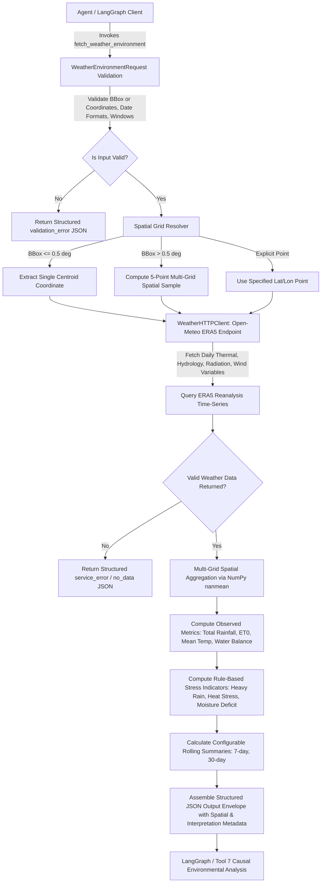

# Tool 4: fetch_weather_environment (Meteorological & Environmental Context)

## 1. Overview & Purpose

**`fetch_weather_environment`** is a dedicated environmental intelligence tool built for Model Context Protocol (MCP) clients and LangGraph autonomous agents. Its primary responsibility is to provide **factual meteorological observations and derived environmental stress indicators** from the **ECMWF ERA5 / ERA5-Land Atmospheric Reanalysis model** via Open-Meteo.

### The Explanatory Role: Bridging "What" and "Why"
Satellite imagery from Tools 1, 2, and 3 captures **what is happening on the ground** (e.g., NDVI drop, vegetation browning, surface water expansion). **Tool 4 provides the environmental context that explains why it is happening**:
- **Moisture Deficit vs. Harvesting:** Did vegetation drop due to seasonal harvesting or due to a severe moisture deficit ($\text{Precipitation} \ll \text{ET0}$ with sustained heat $> 35^\circ\text{C}$)?
- **Flood Causation:** Did water bodies expand due to upstream dam release or due to an extreme localized precipitation event?
- **Atmospheric Stress:** Is crop chlorophyll degradation driven by high vapor pressure deficit and persistent heat stress?

---

## 2. Data Provider & Spatial Representativeness

- **Primary Provider:** [Open-Meteo](https://open-meteo.com/) Historical Climate Reanalysis API
- **Underlying Datasets:** **ECMWF ERA5 & ERA5-Land Global Reanalysis**
- **Model Grid Resolution:** $\sim 0.1^\circ \times 0.1^\circ$ (approximately $9\text{ km} \times 11\text{ km}$ at mid-latitudes).
- **Spatial Distinction:** Reanalysis values represent spatial averages over meteorological grid cells. The tool explicitly documents this spatial representativeness so downstream LLMs do not assume point-level or $10\text{ m}$ satellite-level spatial precision.

---

## 3. Security & API Credential Configuration

> [!NOTE]
> **This tool does NOT require an API key or authentication credentials.**

- **Provider:** [Open-Meteo](https://open-meteo.com/)
- **Access Model:** Public Open-Access Atmospheric Reanalysis API (`https://archive-api.open-meteo.com/v1/archive`).
- **Authentication:** None required. Operates out-of-the-box for non-commercial research and open-source applications.

## 4. Environment & Dependencies

### Python Runtime:
- Python 3.10, 3.11, 3.12, or 3.13

### Required Libraries:
```bash
pip install requests numpy pydantic fastmcp
```

| Package | Purpose in Tool |
| :--- | :--- |
| `requests` | High-performance HTTP communication with Open-Meteo Reanalysis API |
| `numpy` | Time-series aggregation, rolling statistics, and anomaly calculations |
| `pydantic` | Strict input coordinate bounding, date parsing, and window validation |
| `fastmcp` | Standardized Model Context Protocol (MCP) server integration |

---

## 4. End-to-End Architectural Flow Diagram



---

## 5. Input Schema & Parameter Specifications

| Field | Type | Required | Default | Valid Range / Constraints | Description |
| :--- | :--- | :---: | :---: | :--- | :--- |
| `bbox` | `list[float]` | Optional* | `null` | Exactly 4 floats: `[min_lon, min_lat, max_lon, max_lat]` | Spatial bounding box in WGS84. (*Either `bbox` or `latitude`+`longitude` required). |
| `latitude` | `float` | Optional* | `null` | `-90.0` to `90.0` | Exact latitude point coordinate. |
| `longitude` | `float` | Optional* | `null` | `-180.0` to `180.0` | Exact longitude point coordinate. |
| `start_date` | `str` | **Yes** | — | `YYYY-MM-DD` | Start of temporal analysis window. |
| `end_date` | `str` | **Yes** | — | `YYYY-MM-DD` | End of temporal analysis window. Must satisfy `start_date <= end_date`. |
| `rolling_windows` | `list[int]`| No | `[7, 30]` | Positive integers $\ge 1$ | Sub-period rolling window lengths in days for recent trend analysis. |

---

## 6. Variables & Scientific Definitions

### 1. Thermal & Temperature Variables:
- `temperature_2m_mean`: Daily average 2-meter air temperature ($^\circ\text{C}$).
- `temperature_2m_min` / `temperature_2m_max`: Daily diurnal temperature extremes ($^\circ\text{C}$).
- `apparent_temperature_mean`: Perceived thermal comfort combining temperature, humidity, and wind ($^\circ\text{C}$).
- `soil_temperature_0_to_7cm_mean`: Topsoil temperature ($^\circ\text{C}$) influencing seed germination and root respiration.

### 2. Hydrology & Moisture Variables:
- `precipitation_sum`: Total daily precipitation ($\text{mm}$).
- `et0_fao_evapotranspiration`: Cumulative reference crop evapotranspiration ($\text{mm}$) according to the FAO-56 Penman-Monteith equation.
- `soil_moisture_0_to_7cm_mean`: Volumetric soil water content in the root zone ($\text{m}^3/\text{m}^3$).
- **`water_balance_mm` (Moisture Balance):**
  $$\text{water\_balance} = \sum \text{precipitation\_sum} - \sum \text{et0\_fao\_evapotranspiration}$$

### 3. Atmospheric & Solar Radiation:
- `shortwave_radiation_sum`: Total daily downwelling solar energy ($\text{MJ}/\text{m}^2$).
- `wind_speed_10m_max`: Maximum 10-meter wind speed ($\text{km/h}$).
- `wind_gusts_10m_max`: Maximum peak wind gust ($\text{km/h}$).

---

## 7. Output Philosophy: Separation of Observation vs. Inference

The output is structured to clearly separate **measured physical data** from **derived stress indicators**:

### 1. Observed Physical Metrics:
Directly summed or averaged from meteorological observations without subjective interpretation.

### 2. Environmental Stress Indicators:
- `heavy_rainfall_detected`: `true` if $\text{max\_daily\_rainfall} \ge 25.0\text{ mm}$ or $\text{total\_rainfall} \ge 100.0\text{ mm}$.
- `heat_stress_detected`: `true` if any day reaches $\text{max\_temp} \ge 35.0^\circ\text{C}$ or overall mean $\ge 32.0^\circ\text{C}$.
- `cold_stress_detected`: `true` if any day drops to $\text{min\_temp} \le 4.0^\circ\text{C}$ (frost risk).
- `moisture_deficit_detected`: `true` if $\text{water\_balance\_mm} < 0.0\text{ mm}$ (rule-based indicator; not a climatological drought diagnosis).
- `water_deficit_intensity`: Classified objectively as `"none"` ($\ge 0\text{ mm}$), `"moderate"` ($-50\text{ to } 0\text{ mm}$), or `"severe"` ($< -50\text{ mm}$).

---

## 8. Output Contract & Data Structure

```json
{
  "status": "success",
  "source": {
    "provider": "Open-Meteo",
    "dataset": "ERA5 & ERA5-Land Reanalysis",
    "model_grid_resolution_deg": 0.1,
    "spatial_representativeness": "Meteorological reanalysis grid cell (approx 9-11 km). Not equal to satellite pixel resolution."
  },
  "spatial_context": {
    "requested_bbox": [77.1, 28.5, 77.3, 28.7],
    "weather_coordinates": [
      {
        "latitude": 28.58,
        "longitude": 77.19,
        "elevation_m": 224.0
      }
    ],
    "grid_points_count": 1,
    "aggregation_method": "centroid",
    "is_centroid_based": true
  },
  "request": {
    "start_date": "2025-01-01",
    "end_date": "2025-01-31",
    "days_count": 31
  },
  "observed_metrics": {
    "total_rainfall_mm": 5.4,
    "max_daily_rainfall_mm": 3.8,
    "mean_temperature_c": 13.8,
    "min_temperature_c": 4.2,
    "max_temperature_c": 23.1,
    "mean_apparent_temperature_c": 12.9,
    "mean_soil_temperature_0_to_7cm_c": 14.5,
    "mean_soil_moisture_0_to_7cm_m3_m3": 0.265,
    "et0_total_mm": 54.2,
    "water_balance_mm": -48.8,
    "mean_solar_radiation_mj_m2": 13.2,
    "max_wind_speed_kmh": 21.5,
    "max_wind_gusts_kmh": 42.1
  },
  "environmental_indicators": {
    "heavy_rainfall_detected": false,
    "heat_stress_detected": false,
    "cold_stress_detected": false,
    "moisture_deficit_detected": true,
    "water_deficit_intensity": "moderate",
    "interpretation_basis": "rule_based_moisture_deficit_indicator"
  },
  "interpretation_metadata": {
    "indicators_are_rule_based": true,
    "drought_diagnosis_supported": false,
    "note": "Indicators represent short-term meteorological rule-based conditions, not long-term climatological anomaly diagnostics."
  },
  "rolling_summaries": {
    "7_day_recent": {
      "rainfall_sum_mm": 0.0,
      "et0_sum_mm": 14.8,
      "water_balance_mm": -14.8,
      "mean_temperature_c": 15.2,
      "mean_soil_moisture": 0.245
    },
    "30_day_cumulative": {
      "rainfall_sum_mm": 5.4,
      "et0_sum_mm": 52.8,
      "water_balance_mm": -47.4,
      "mean_temperature_c": 13.7,
      "mean_soil_moisture": 0.266
    }
  },
  "time_series": [
    {
      "date": "2025-01-01",
      "temp_mean_c": 11.3,
      "temp_min_c": 7.8,
      "temp_max_c": 16.8,
      "apparent_temp_mean_c": 10.3,
      "precip_mm": 0.0,
      "et0_mm": 1.59,
      "soil_moisture_m3_m3": 0.291,
      "soil_temp_c": 12.5,
      "solar_radiation_mj_m2": 11.0,
      "wind_speed_max_kmh": 9.4
    }
  ]
}
```

---

## 9. Downstream AI & Tool 7 Integration Hooks

- **Tool 7 Causal Reasoning:** When Tool 7 detects a drop in vegetation index (Tool 5), it ingests Tool 4's `water_balance_mm` and `heat_stress_detected` to distinguish meteorological moisture deficit from anthropogenic land clearing.
- **Flood Confirmation:** Ingests `max_daily_rainfall_mm` to validate if sudden surface water detected in Sentinel-1 SAR (Tool 3) aligns with recorded storm precipitation events.

---

## 10. Error Output Schema

```json
{
  "status": "error",
  "error": {
    "type": "validation_error | no_data | service_error",
    "message": "Detailed actionable error message."
  }
}
```
