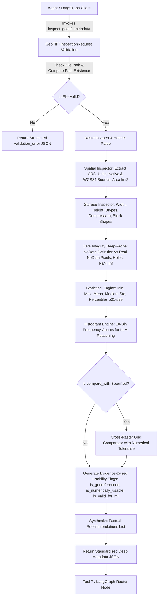

# Tool 6: inspect_geotiff_metadata (Universal Deep Raster QA & Inspector)

## 1. Overview & Purpose

**`inspect_geotiff_metadata`** is a universal geospatial raster intelligence and pre-flight Quality Assurance (QA) tool built for Model Context Protocol (MCP) clients and LangGraph autonomous agents. Its primary responsibility is to deeply inspect, validate, and extract structured metadata from **ANY incoming GeoTIFF file** (whether generated by internal tools or uploaded directly by external users).

### The Dual-Workflow Architecture:
```text
Workflow A: Automated Pipeline QA
Tool 1 / 2 / 3 / 5 ──► GeoTIFF ──► Tool 6 (Deep Inspection) ──► Tool 7 (Analytics)

Workflow B: User-Provided External GeoTIFF (Primary Entry Point)
User Upload ──► Existing GeoTIFF ──► Tool 6 (QA & Profiling) ──► Downstream AI Decision
```

---

## 2. Core Deep Probing Capabilities

### 1. Spatial & Coordinate Reference System (CRS) QA:
- **CRS Identification:** EPSG code, Proj4/WKT definition, and explicit verification of whether the coordinate system is **Geographic (`EPSG:4326`)** or **Projected (UTM, State Plane)**.
- **Unit Precision:** Clearly identifies resolution units as **degrees/pixel** or **meters/pixel** (strictly avoids reporting degrees as meters).
- **Dual Bounding Boxes:** Extracts spatial bounds in both the raster's native coordinate system and re-projected WGS84 coordinates (`min_lon, min_lat, max_lon, max_lat`).
- **Surface Extent:** Computes the approximate physical ground area coverage in $\text{km}^2$.

### 2. Raster Architecture & Physical Layout:
- Dimensions: Width, Height, Total Pixel Count, and Band Count.
- Storage Encoding: Per-band data types (`uint8`, `uint16`, `int16`, `float32`), internal block/tile shapes, and compression format (`DEFLATE`, `LZW`, `NONE`).
- Memory footprint: File size on disk in bytes.

### 3. Data Integrity & NoData Deep Probe:
The tool strictly differentiates metadata definitions from physical raster data conditions:
- `has_nodata_definition`: `true` if a NoData metadata tag exists.
- `contains_nodata_pixels`: `true` only if actual pixels equal the NoData value.
- `has_nodata_holes`: Detects whether interior NoData holes exist within valid data boundaries.
- `valid_pixel_fraction`: Exact percentage of non-masked, non-NaN numerical pixels.
- `has_nan` / `has_inf`: Identifies IEEE 754 floating-point anomalies.
- `empty_bands` / `constant_bands`: Identifies unreadable, zero-variance, or defective sensor channels.

### 4. Radiometric Distribution & Percentiles:
For each band, calculates:
- $\text{Min}, \text{Max}, \text{Mean}, \text{Median}, \text{Standard Deviation}$
- Exact statistical percentiles: $p_{01}, p_{05}, p_{25}, p_{50}, p_{75}, p_{95}, p_{99}$
- **10-Bin Compact Histogram:** Allows downstream LLMs to understand spectral balance without ingesting massive array payloads into token context.

### 5. Cross-Raster Grid Alignment & Compatibility:
When `compare_with` is provided, performs a numerical tolerance-based pixel-grid matching verification:
- Checks CRS equality, affine transform equality ($10^{-5}$ tolerance), matching dimensions, and identical spatial bounds.
- Evaluates `pixelwise_operation_ready` (`true/false`), ensuring that multi-temporal difference tools do not fail on misaligned grids.
- *(Note: `pixelwise_operation_ready` confirms geometric grid alignment; task-specific scientific comparability must be evaluated separately by the agent).*

---

## 3. Security & API Credential Configuration

> [!NOTE]
> **This tool operates entirely locally on local GeoTIFF files and does NOT require an API key or remote service credentials.**

## 4. Environment & Dependencies

### Python Runtime:
- Python 3.10, 3.11, 3.12, or 3.13

### Required Libraries:
```bash
pip install rasterio numpy pydantic fastmcp
```

---

## 4. End-to-End Architectural Flow Diagram



---

## 5. Input Schema & Parameter Specifications

| Field | Type | Required | Default | Valid Range / Constraints | Description |
| :--- | :--- | :---: | :---: | :--- | :--- |
| `file_path` | `str` | **Yes** | — | Valid local path to `.tif` | Absolute path to the primary GeoTIFF raster to inspect. |
| `compare_with` | `str` | No | `null` | Valid local path to `.tif` | Optional second GeoTIFF path to check grid/pixel-wise compatibility. |
| `calculate_statistics` | `bool` | No | `true` | `true`, `false` | Calculates per-band percentiles, mean, min, max, and std dev. |
| `calculate_histogram` | `bool` | No | `true` | `true`, `false` | Generates 10-bin frequency distribution histograms. |

---

## 6. Output Contract & Data Structure

```json
{
  "status": "success",
  "file": {
    "file_name": "sample_multispectral_output.tif",
    "file_path": "c:/Users/User/Desktop/Tools/Tool_2_fetch_multispectral_imagery/test_runs/sample_multispectral_output.tif",
    "file_size_bytes": 1572990,
    "driver": "GTiff"
  },
  "spatial": {
    "crs": "EPSG:4326",
    "is_geographic": true,
    "is_projected": false,
    "coordinate_units": "degrees",
    "resolution": {
      "x": 0.00078125,
      "y": 0.00078125,
      "unit": "degrees"
    },
    "bounds_native": {
      "left": 77.1,
      "bottom": 28.5,
      "right": 77.3,
      "top": 28.7
    },
    "bounds_wgs84": {
      "min_lon": 77.1,
      "min_lat": 28.5,
      "max_lon": 77.3,
      "max_lat": 28.7
    },
    "approx_area_km2": 432.48,
    "transform": [
      0.00078125,
      0.0,
      77.1,
      0.0,
      -0.00078125,
      28.7
    ]
  },
  "raster": {
    "width": 256,
    "height": 256,
    "total_pixels": 65536,
    "band_count": 8,
    "block_shapes": [[256, 256]],
    "compression": "NONE",
    "nodata_definition": null
  },
  "bands": [
    {
      "band_index": 1,
      "description": "Band_1",
      "dtype": "float32",
      "valid_pixel_count": 65536,
      "valid_pixel_fraction": 1.0,
      "nodata_pixel_count": 0,
      "nan_pixel_count": 0,
      "inf_pixel_count": 0
    }
  ],
  "statistics": {
    "Band_1": {
      "min": 0.0,
      "max": 0.642,
      "mean": 0.124,
      "median": 0.118,
      "std_dev": 0.045,
      "p01": 0.052,
      "p05": 0.068,
      "p25": 0.095,
      "p50": 0.118,
      "p75": 0.145,
      "p95": 0.208,
      "p99": 0.264
    }
  },
  "histograms": {
    "Band_1": {
      "bin_edges": [0.0, 0.064, 0.128, 0.192, 0.256, 0.32, 0.384, 0.448, 0.512, 0.576, 0.642],
      "counts": [2104, 38450, 21200, 3120, 510, 112, 30, 8, 1, 1]
    }
  },
  "integrity": {
    "has_nodata_definition": false,
    "contains_nodata_pixels": false,
    "has_nodata_holes": false,
    "has_nan": false,
    "has_inf": false,
    "empty_bands": [],
    "constant_bands": []
  },
  "compatibility": {
    "compared_with_file": "sample_optical_output.tif",
    "same_crs": true,
    "same_dimensions": true,
    "same_resolution": true,
    "same_bounds": true,
    "same_grid_alignment": true,
    "pixelwise_operation_ready": true,
    "note": "pixelwise_operation_ready confirms spatial grid alignment; scientific compatibility must be verified by task requirements."
  },
  "quality": {
    "is_readable": true,
    "is_georeferenced": true,
    "is_numerically_usable": true,
    "is_valid_for_ml": true,
    "ml_readiness_scope": "general numerical/raster processing compatibility; task-specific model constraints must be validated separately."
  },
  "recommendations": [
    "Raster is georeferenced in EPSG:4326 (degrees).",
    "Contains 8 band(s) with dimensions 256x256 pixels.",
    "Raster passes data integrity checks and is ready for numerical analysis and ML workflows.",
    "Geometric pixel-wise grid operations with 'sample_optical_output.tif' are fully aligned and supported."
  ]
}
```

---

## 7. Downstream AI & Tool 7 Integration Hooks

- **Pre-Flight Validation Gatekeeper:** Before executing Tool 7 change detection or flood modeling, LangGraph invokes Tool 6 on input rasters to verify that `quality.is_valid_for_ml == true` and `compatibility.pixelwise_operation_ready == true`.
- **External Asset Profiler:** Ingests user-uploaded rasters to extract CRS, bounds, and band counts without requiring prior metadata.

---

## 8. Error Output Schema

```json
{
  "status": "error",
  "error": {
    "type": "validation_error | service_error",
    "message": "Detailed actionable error message."
  }
}
```
